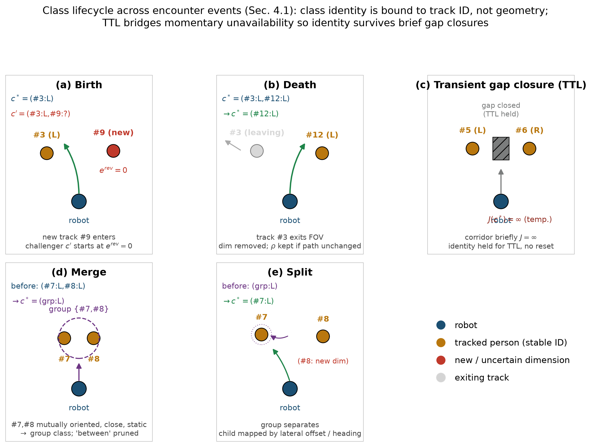
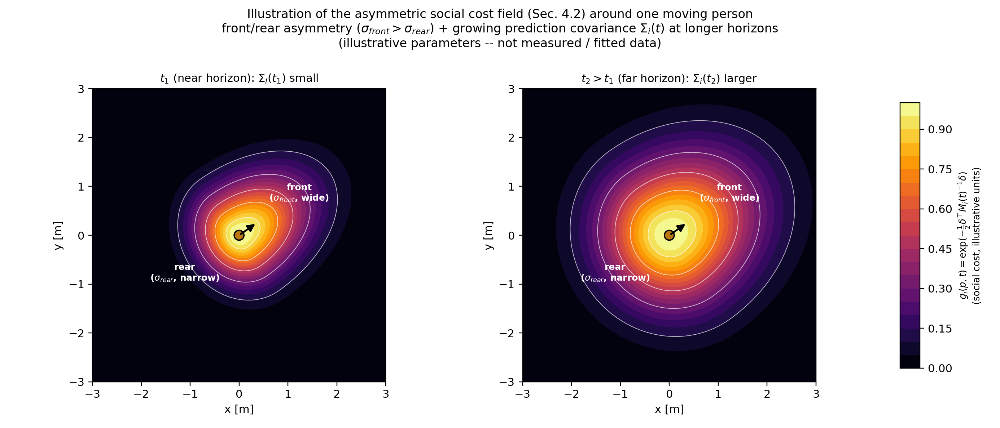
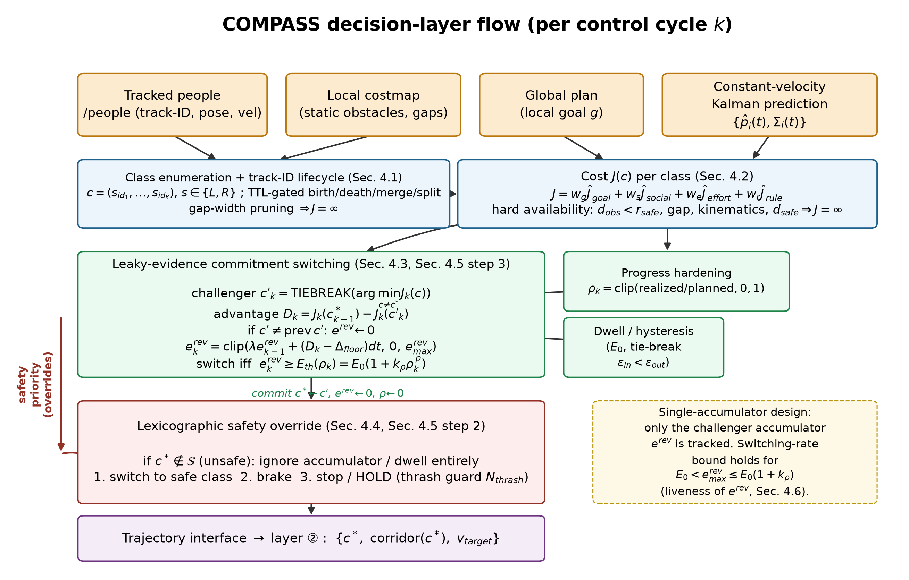
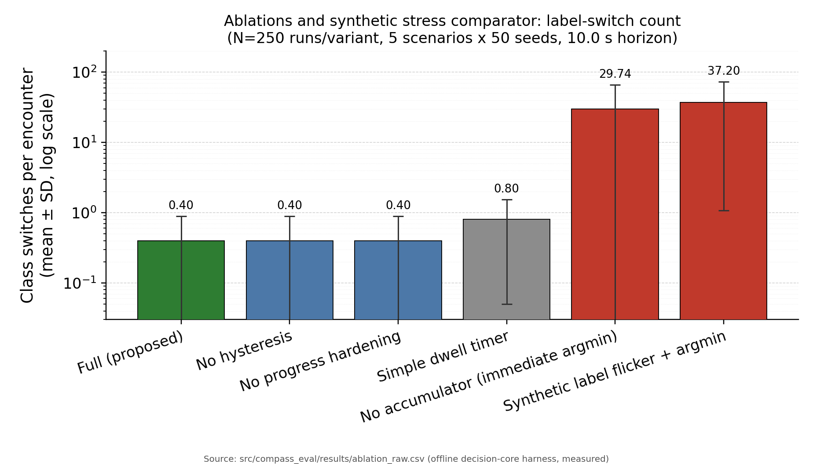

# COMPASS: Temporally Consistent Topological Passing Decisions for Socially Aware Robot Navigation

Jungmo Kang\
`kangjmo91@gmail.com`

-----

## Abstract

In crowded pedestrian environments where service robots share space with people, local path planners re-decide, at every control cycle, which side — left or right — to pass a person on. This paper shows that when this re-decision is made greedily, the passing direction oscillates across cycles (dithering) or the robot freezes, and proposes a decision-layer planner that treats **temporal consistency** of passing decisions as a first-class design objective. There are three key elements. First, the passing relationship with a person is represented as a topological `class`, whose identity is bound to the person's track ID so that cross-cycle correspondence (spawn, removal, merge, split) is stabilized. Second, we introduce a commitment switching rule that unifies the switching margin, dwell, and point of no return into a single **leaky evidence accumulation** equation, with safety layered on top lexicographically. Third, we formalize five properties — anti-oscillation, switching-rate bound, safety dominance, maneuver completion, and deadlock escape — and among these, anti-oscillation (P1) is stated as a probabilistic claim: an **upper bound on the expected switching rate per unit time** (and the conditional expected time to switch) when the challenger advantage `D_k` has zero mean and bounded variance. Here the switching-rate bound is expressed via a per-cycle variance-based tuning coefficient `θ* ≈ 2·Δ_floor/(σ_D²·dt)`, explicitly incorporating the time discretization `dt`. The contribution comprises both design and measured verification. Building on a complete decision rule and five formal properties (P1–P5), we **measure** the decision layer's behavioral consistency, legibility, and cyclic latency using an offline harness that drives the actual decision core (5 scenarios × 50 seeds; §5.3, §5.4): removing the leaky evidence accumulator causes roughly 98 oscillations per encounter under ambiguous ties, whereas the proposed method commits within ≤1 (R1 ablation); worst-case cyclic latency at K=3 (8 classes) is p99 58.6 µs with a maximum of 651.3 µs, only about 1.30% of the 20 Hz cycle budget (50 ms), leaving ample real-time margin (R3); and a sensitivity analysis of progress hardening's ρ-drive rate identifies a freezing threshold of `v_lat ∈ (0.20, 0.35) m/s` (R5). Physical-simulation-based performance metrics (success rate, minimum social distance, collisions), external baselines, and user studies are not measured in this paper; they are specified as a pre-registered protocol and presented as a planned evaluation (§5.6). The name COMPASS abbreviates *COMmitment-based PASSing for Social navigation*.

**Keywords:** social navigation, topological path planning, temporal consistency, human-robot interaction, ROS2

-----

## 1. Introduction

Autonomous serving, delivery, and guide robots are no longer confined to isolated industrial spaces; they now operate in corridors, lobbies, and sidewalks where people move freely. The central difficulty of such shared spaces is not static-obstacle avoidance but **interactive passing decisions** with people who continuously change position and intent. In narrow-corridor head-on encounters, situations where the robot overtakes a person or a person overtakes the robot, and crossing-style traversals, the robot must continually judge "which side to pass on, whether to proceed or yield, whether to stop."

Widely used local planners (the `DWA` family, `MPPI`, `TEB`) re-optimize a cost function at every control cycle. This greedy re-optimization is natural in static environments, but in ambiguous configurations where the costs of the two passing directions are similar, minor sensor noise or a small movement by the person alone can flip the choice from one cycle to the next. As a result, the robot dithers side to side (oscillation) or, unable to commit to either side, comes to a stop (the freezing robot problem, [Trautman & Krause 2010]). Oscillation is not only inefficient — it also prevents people from reading the robot's intent, undermining both safety and trust.

The central insight of this paper is that the root cause of this problem is not inaccurate perception or prediction but a **structural defect: the decision policy has no temporal inertia**. Accordingly, rather than investing in a more sophisticated human predictor, we impart explicit temporal consistency to the passing decision itself. The intuition mirrors human walking behavior: once a person decides which way to step aside, they tend to hold that direction, changing it only for a clear reason, and stopping immediately when it becomes dangerous. This "tendency to maintain a once-chosen passing direction" has been discussed in the social-navigation literature as social momentum ([Mavrogiannis et al. 2022]), and this paper embodies it as a formal rule at the decision layer.

The contributions of this paper are as follows.

1. **ID-indexed representation of topological `class` and cross-cycle correspondence.** By binding the identity of a passing direction to a person's track ID rather than to a flickering geometric gap, we consistently identify "the corridor chosen last cycle" at every cycle. The spawning, removal, merging, and splitting of `class`es caused by people entering, leaving, clustering, and separating are handled via explicit lifecycle rules and TTLs.
2. **A unified commitment switching rule with a lexicographic safety override.** The switching margin (hysteresis), dwell (persistence), and progress hardening (point of no return) are folded into a single leaky evidence accumulation equation, with safety placed lexicographically above it. This achieves commitment that is "not rushed, yet not reckless."
3. **Formalization of properties and offline empirical validation.** We state anti-oscillation (P1), switching-rate bound (P2), safety dominance (P3), maneuver completion (P4), and deadlock escape (P5) as propositions. P1 is presented as an upper bound on the expected switching rate per unit time (and the conditional expected time to switch) when `D_k` is a stochastic process with zero mean and bounded variance; its tuning coefficient, on a per-cycle variance basis, is `θ* ≈ 2·Δ_floor/(σ_D²·dt)`, and the per-unit-time switching-rate bound includes a factor of `1/dt`. P4 is proven, on top of the progress `ρ` dynamics and a lower bound on the lateral progress rate, via a reachable-upper-bound containment condition on the **challenger accumulator `e^rev`**. Verification is split into two tiers. The decision layer's behavioral consistency, legibility proxy, and cyclic latency (R1, R3, R5) are **measured** using an offline harness that drives the actual decision core, and reported in Chapter 5 (§5.3, §5.4); performance metrics requiring physical simulation or a real robot, along with external baselines (R2) and user studies (R4), are left as planned evaluations (§5.6) specified via a pre-registered protocol.

-----

## 2. Related Work

**Local planners and trajectory optimization.** `DWA` ([Fox et al. 1997]) selects a velocity command from a dynamic window at every cycle but, being memoryless, is vulnerable to oscillation. `TEB` ([Rösmann et al. 2017]) maintains several topological alternatives in parallel and partially mitigates the issue via switching costs, but temporal consistency is a side effect rather than an explicit design goal. `MPPI` ([Williams et al. 2017]) produces smooth solutions via sampling but does not treat the discrete structure of social passing decisions as first class. Unlike these, this paper places the temporal consistency of the passing-`class` choice itself at the core.

**Social navigation and proxemics.** The Social Force Model ([Helbing & Molnár 1995]) and `ORCA`/`RVO` ([van den Berg et al. 2011]) model human reactivity and reciprocity to mitigate freezing. Proxemics costs ([Hall 1966]; the asymmetric Gaussian of [Kirby 2010]) quantify personal space as a cost field. While these provide rich human models, they do not treat the oscillation of the robot's decision itself as a measurement target or design goal. This paper adopts such cost fields as input but addresses decision consistency on top of them.

**HRI navigation — intent-aware and social momentum.** Intent-aware navigation that estimates human intent and reflects it in planning ([Trautman et al. 2015]; the IGP family, which addresses cooperative driving amid crowds) addresses cooperative driving amid crowds. In particular, social momentum ([Mavrogiannis et al. 2022]) offers the perspective that the robot accumulates and maintains "social momentum" toward a passing direction to break mutual deadlocks, and the commitment accumulation equation of this paper can be viewed as formalizing this intuition as a single scalar of evidence. Metrics for human comfort and social appropriateness are undergoing standardization in social-navigation surveys ([Mavrogiannis et al. 2023]; [Gao & Huang 2022]; [Francis et al. 2023]), and this paper takes the axes of decision oscillation and legibility as its quantitative target among these.

**Pedestrian trajectory prediction.** Learning-based multimodal predictors — Social-LSTM ([Alahi et al. 2016]), Social-GAN ([Gupta et al. 2018]), Trajectron++ ([Salzmann et al. 2020]) — predict a person's future trajectory as a distribution. This paper adopts a Kalman constant-velocity prediction over a short horizon instead (assumptions and limitations in Chapters 3 and 6), but these predictors can be incorporated into this decision layer as a **replaceable input module**. That is, this contribution is orthogonal to the choice of predictor: as more sophisticated prediction becomes available, only the mean-trajectory and covariance input need be replaced.

**Topological path planning and passing-side consistency.** H-signature-based enumeration of homotopy classes ([Bhattacharya et al. 2012]) rigorously represents the topological identity of a path but focuses mainly on static-obstacle topology. The branch that extends this topological view to moving-pedestrian environments is closest to this paper. Dynamic Channel ([Cao et al. 2019]) is a real-time crowd-navigation framework that searches a triangulated spatial graph, combining pedestrian dynamics with topological-corridor selection; it picks one topology per planning cycle but does not formalize the **temporal consistency** of that choice via an explicit commitment rule or switching-rate guarantee. Winding Through ([Mavrogiannis et al. RA-L 2023]) tracks the homotopy class the robot's path holds relative to each pedestrian and **penalizes changes to that class over time as a cost** — being motivated by suppressing passing-side switches, it is the closest prior work to this paper, but it operates as a soft topological-invariance cost internal to the planner and does not define a track-ID-indexed `class` lifecycle or a provable switching-rate bound. Topology-driven parallel trajectory optimization ([de Groot et al. 2024]) runs local MPC optimizers seeded in different homotopy classes in parallel for dynamic obstacles and commits to the best resulting trajectory each cycle, maintaining consistency of the chosen class — this treats homotopy consistency via parallel search at the trajectory-optimization layer, and does not provide an explicit accumulator-based commitment rule at the discrete decision layer nor a formal switching-rate guarantee for it. Unlike these, this paper places `class` correspondence over time (lifecycle) and the commitment rule itself as the object of formalization at the decision layer.

**Learning-based (IRL) approaches to socially compliant navigation.** The line of work that learns socially compliant costs and prediction models from pedestrian trajectory features via maximum-entropy inverse reinforcement learning ([Kuderer et al. 2012]; [Kretzschmar et al. 2016]) models human cooperative avoidance behavior as a trajectory distribution (including a mixture distribution over joint path choices), generating robot trajectories that conform to observed walking conventions. Their contribution is a learned cost/prediction model for trajectory generation; they do not address decision-layer rules or switching-rate bounds that specify how often a discrete passing decision may legitimately flip from cycle to cycle.

**F-formations and group awareness.** The spatial arrangement people form during conversation/interaction (F-formation) was formalized by Kendon ([Kendon 1990]), defining "groups that must not be split" via the concepts of o-space and p-space. In robot navigation, detecting and respecting F-formations has been treated as a core element of group-aware navigation ([Rios-Martinez et al. 2015] survey). Automatic F-formation detection itself is outside the scope of this paper and is assumed to be provided by an external perception module (details in 4.8). This paper extends the merge rule of 4.1 to interaction-based groups so as to avoid splitting F-formations (Section O2).

**Legible and predictable motion.** Legible/predictable motion ([Dragan et al. 2013]) presents the view that robot motion should reveal intent to an observer. The commitment mechanism of this paper renders motion legible by suppressing decision oscillation, thereby serving as a bridge between the two lines of work. The methodology for human validation of legibility is elaborated via the observer model in 4.7 and the user-study protocol in Chapter 5.

**In short**, the problem of temporal consistency on the passing side has already been recognized by prior work — a soft topological-invariance penalty ([Mavrogiannis et al. RA-L 2023]), per-homotopy-class parallel optimization with per-cycle commitment ([de Groot et al. 2024]; [Rösmann et al. 2017]), topological-corridor selection ([Cao et al. 2019]), and social momentum ([Mavrogiannis et al. 2022]) each provide a partial mechanism. However, these induce consistency only through soft costs or heuristics internal to the planner, and **do not formalize commitment itself**. This paper's gap claim is correspondingly narrow and specific: combining (i) an explicit lifecycle rule (spawn, removal, merge, split, TTL) that indexes the identity of the passing `class` to a person's track ID, (ii) a single leaky evidence accumulation switching rule with provable anti-oscillation and switching-rate bounds (P1, P2), and (iii) a lexicographic safety override on top of it (P3) — combining these three into a single decision layer and presenting them together with formal properties (P1–P5) is, to the authors' knowledge, done here for the first time, and this is the gap this paper fills.

-----

## 3. Problem Formulation

**Layer separation.** We separate social navigation into three layers. (i) The **decision layer** — the layer that determines discrete intents such as which side to pass on, and whether to yield, proceed, overtake, or stop. (ii) The **trajectory layer** — the layer that instantiates a given decision as a curvature-continuous (G2) trajectory. (iii) The **presentation layer** — the layer that visually reveals the planned trajectory to people (e.g., an AR overlay). The contribution of this paper lies entirely in the **decision layer**; the trajectory layer adopts an established, validated generator.

**Notation.** Let `k` denote the control cycle and `dt` the cycle interval. Let `𝒞_k` denote the set of candidate topological `class`es at cycle `k`, and let `J_k(c) ∈ ℝ⁺ ∪ {∞}` denote the representative trajectory cost of class `c` (∞ when unavailable). Let `c*_{k−1}` denote the previously committed `class`, and let `𝒮_k = { c ∈ 𝒞_k : Safe_k(c) }` denote the safe/available set. Prediction of person `i` is provided by a Kalman constant-velocity estimator, giving a mean trajectory `p̂_i(t)` and covariance `Σ_i(t)`, where `Σ_i(t)` grows with the prediction horizon.

**Assumptions and scope.** (a) Planar (2D) navigation. (b) A short prediction horizon [0, T] (typically 2–4 seconds). (c) Person tracking and data association are provided by an external module. (d) The trajectory generator, given a `class`, corridor, and target speed, is assumed capable of generating a trackable trajectory and of realizing a commanded **cross-track progress rate** of at least `v_lat,min > 0` (used in P4). Here `v_lat,min` is not the vehicle body's lateral (swerve) velocity but the per-unit-time progress rate of the cross-track coordinate toward the planned lateral offset; for non-holonomic drives (differential, Ackermann) it is realized as the product of forward speed and steering (curvature), while for holonomic drives it is realized as a direct lateral-velocity component. Hence `v_lat,min > 0` presupposes forward clearance and a positive forward speed. (e) Pedestrian passing conventions (e.g., right-side passing) are a locale setting and are not assumed to be a universal constant (Sections 4.2, 5).

**Objective.** We design a decision policy that guarantees safety at every cycle while ensuring that the passing decision `c*_k` does not oscillate unnecessarily, is legible to people, and preserves progress and social comfort.

-----

## 4. Method

### 4.1 Enumeration of topological classes and cross-cycle correspondence

**Enumeration.** We index the K relevant agents (typically 1–3) within the radius of influence and prediction horizon by track ID. The `class` label is defined as a vector of left/right passing signs over each relevant agent.

    c = (s_{id_1}, …, s_{id_K}),   s ∈ {L, R}

Among the up to `2^K` combinations, any combination whose corresponding corridor width is narrower than the sum of the robot's width and the safety margin is immediately pruned with `J = ∞`. This corridor-width comparison presupposes a **circular-footprint approximation** (treating the robot's width as an orientation-independent constant); for elongated rectangular footprints, the occupied area varies with orientation during rotation, making pruning and availability decisions conservative, which we discuss separately in Section 6 (cross-referenced as rectangular-footprint conservatism). The left/right sign of each `class` is computed from the winding sign (cross-product integral or H-signature integral) by which the representative path winds around the predicted human positions. Front/rear (temporal-axis) passing is not treated as a separate `class` but handled through the asymmetric social cost of Section 4.2. A more rigorous spatiotemporal homotopy extension is discussed as future work in Section 6. The combinatorial explosion of enumeration and the analytical bound on the number of effective `class`es after pruning are analyzed in Sections 4.6 and 5.4.

**Cross-cycle correspondence (key).** For "retain the previous c\*" to be meaningful, c\* must be re-identified every cycle. Because `class` identity is bound to track IDs rather than geometry, correspondence reduces to label matching such as "right of agent #7, left of agent #12," which rides for free on IDs already provided by the tracking module. Events triggered by human motion are closed by the following rules.

- **Creation** (a relevant agent enters, or a new corridor appears): a new `class` appears as a challenger but starts from evidence `e = 0`, so there is no immediate jump.
- **Extinction** (a relevant agent leaves): the corresponding dimension is removed from all labels. If c\* was distinguished solely by that person, it is absorbed into a coarser `class`; progress ρ is retained if the actual path is unchanged, and reset if it changes.
- **Temporary unavailability** (corridor closes, `J = ∞`): identity is retained but passage is momentarily blocked. If c\* is affected, the safety override takes over, and the identity is remembered for a short TTL so that a momentary flicker does not break the commitment.
- **Merge** (two people form one cluster): the two dimensions collapse into one, leaving only the sign shared by both sides, with "between" becoming ∞. The old c\* is mapped to the surviving coarser `class`. Merge decisions use not only spatial proximity but also interaction cues (mutual stillness, mutual orientation, sustained proximity); details are given in the O2 section (4.8).
- **Split** (a cluster separates): the reverse process — the old c\* is mapped to the child that is consistent with the robot's current lateral offset and heading.

*Figure 3. Schematic of the five lifecycle events of a topological class: (a) Creation — a new track appears as a challenger, starting from e^rev=0; (b) Extinction — when a track leaves, the corresponding dimension is removed (ρ is retained if the path is unchanged); (c) Temporary unavailability — even when a corridor momentarily becomes J=∞, identity is retained for a TTL to prevent a reset; (d) Merge — two people judged by interaction cues (mutual orientation, proximity, low speed) merge into a single group class; (e) Split — a group separates, mapped to the child class consistent with the robot's lateral offset and heading. This emphasizes that class identity is bound to human track IDs rather than geometry.*

This structure applies anti-oscillation at two layers: the TTL at the enumeration layer kills the flicker of "which `class`es exist," while the accumulator at the decision layer (4.3) kills the oscillation of "which `class` is chosen."

### 4.2 Cost function J(c)

The cost of each `class` is defined as a weighted sum integrated over the horizon [0, T] along the representative trajectory `τ_c`.

    J(c) = w_g·J_goal + w_s·J_social + w_e·J_effort + w_r·J_rule,     J(c) = ∞ if unavailable

- **Progress J_goal.** Distance from the local goal g at the end of the horizon: `J_goal = ‖p_r(T) − g‖`. This penalizes detour/stopping `class`es.
- **Asymmetric social cost J_social.** A proxemics cost field is laid over each person and integrated for intrusion.

      J_social = Σ_i ∫₀ᵀ g_i(p_r(t), t) dt
      g_i(p, t) = exp( −½ · δᵀ M_i(t)⁻¹ δ ),   δ = p − p̂_i(t)
      M_i(t) = R_i(t)·diag(σ_h², σ_s²)·R_i(t)ᵀ + Σ_i(t)

  Here the heading component σ_h is set to be front/rear asymmetric (σ_front for the front half-plane, σ_rear for the rear). This makes the cost of cutting in front of a person differ from that of passing behind them, so that the choice of passing side aligns with social norms. **`σ_rear` appears in two distinct mechanisms in this paper and must be distinguished. (i) As the base shape of the cost-field asymmetry, `σ_front > σ_rear` (the static shape in which the front personal-space region is wider than the rear), and (ii) as a contextual upward adjustment in the overtaking regime (a dynamic adjustment that deliberately raises the rear cost to suppress the surprise of a blind-spot approach) — these are distinct operating principles: the former induces yielding to the rear in head-on encounters, and the latter suppresses rear approach during overtaking/close passing.** In addition, the predictive covariance `Σ_i(t)` is added to the cost field, so that the personal-space ellipse widens further into the future and the robot gives wider berth accordingly. σ_s determines the lateral width. Which of σ_front or σ_rear applies to a given person is computed from that person's heading and the robot–person relative motion. That is, σ_front is applied in the head-on-encounter regime where the robot crosses the person's front half-plane, and σ_rear is applied in the overtaking regime where the robot enters the person's rear half-plane; half-plane assignment is determined by projecting δ into local coordinates referenced to the person's heading. **Here, the σ_rear regime switch (head-on encounter ↔ overtaking) is not driven by a separate variable but by the same variable as the rear half-plane projection judgment above (the sign of δ's local projection onto the person's heading) — that is, the selection of the cost-field asymmetry and the assignment to the overtaking regime are consistently derived from a single judgment.**

  **Parameter grounding and locale configurability (R5).** σ_front, σ_rear, σ_s, and the passing-side preference are not treated as universal constants but as **locale/culture configuration values**. The basic form of the asymmetric Gaussian proxemics is grounded in Kirby ([Kirby 2010]), and the forward-extended shape draws on Hall's personal-space zones ([Hall 1966]) and the social navigation survey ([Rios-Martinez et al. 2015]). However, we do not adopt the unconditional assumption that "passing behind is always preferable." Since approach from a person's blind spot (rear) can induce surprise or discomfort (per the surprise discussion in [Rios-Martinez et al. 2015]), this cost exposes σ_rear as a **context-dependent knob**, so that (i) rear yielding is preferred in head-on encounters, while (ii) the rear cost is raised during overtaking/close passing to suppress blind-spot entry. The passing-side preference is locale-dependent and configurable (e.g., some pedestrian environments are reported to favor the right, others the left, or a mix). For an experimental study showing that avoidance-side conventions in pedestrian crowds emerge through self-organization, see [Moussaïd et al. 2009]; however, since that is a single-population (Bordeaux, France) experimental/observational study and not a cross-cultural comparison, we do not extrapolate it as direct evidence that "the passing side varies by culture"; this paper takes the conservative choice of not fixing the passing side as a universal constant but separating it out as a `locale.keep_side ∈ {right, left, none}` setting. The design of the sensitivity analysis for these parameters is described in 5.5, and their measurement is left to the planned evaluation (5.6).

  

  *Figure 4. Illustrative visualization of the asymmetric social cost field of §4.2, g_i(p,t) = exp(-½ δᵀM_i(t)⁻¹δ) (a schematic based on the formula, not measured data). Left: near horizon t1 (small predictive covariance Σ_i(t1)); right: far horizon t2>t1 (Σ_i(t2) grows, expanding the personal-space ellipse). Both panels show the front/rear asymmetry σ_front > σ_rear (front personal space wider than rear), with half-plane assignment determined by projecting δ into local coordinates referenced to the person's heading.*

- **Effort/smoothness J_effort.** `J_effort = ∫₀ᵀ (α·κ² + β·a² + γ·κ̇²) dt`. The κ̇ (curvature rate) term induces G2 continuity, which directly benefits smooth tracking and the curvature display of the presentation layer.
- **Rule J_rule.** A soft penalty for pedestrian traffic conventions (preference per `locale.keep_side`) and lane keeping. The design of the sensitivity curve for the weight w_r is given in 5.5.

**Hard availability.** `J = ∞` if any of the following holds: static collision (`d_obs < r_safe`), insufficient corridor width, violation of kinematic limits, or violation of the hard safety distance `d_safe` from a predicted person. This is a dual structure in which soft discomfort is handled by J_social while physical/safety constraints are handled by hard availability.

**Normalization and time-invariance (A5).** If the margin `Δ_floor` and accumulator threshold `E_0` are expressed in cost units, they do not port well across scenarios, so each term is normalized to [0, 1] against a reference range. Specifically, for a term X ∈ {goal, social, effort, rule}, we normalize `Ĵ_X = (J_X − J_X^min) / (J_X^max − J_X^min)` and set `J = Σ_X w_X Ĵ_X`.

The property guaranteed by the recommended scheme (fixed pre-calibrated constants, below) is **time-invariance of the normalization map** — that is, because the normalization constants are fixed regardless of cycle, the meaning of the "dimensionless advantage" indicated by `Δ_floor` is preserved across cycles, and therefore the physical meaning of the margin expressed by the per-cycle `Δ_floor` remains constant. This is the property that the margin-dependent statements of P1 and P2 actually presuppose.

Here we clarify one distinction. The `J = Σ_X w_X Ĵ_X` immediately after normalization is invariant to the affine rescaling `J_X ↦ aJ_X + b` **with respect to the cost units chosen at calibration time**. However, this affine invariance is limited to the cost units at calibration time, and **under the fixed-constant scheme, it is broken if the cost units are rescaled after the fact, since the normalization constants do not transform along with the rescaling**. Invariance to cost-unit rescaling is automatically preserved only when the normalization constants co-transform with the units — that is, only under the per-cycle min–max statistics scheme. The property proved and exploited by the recommended scheme (time-invariance) is therefore distinct from the property the normalization map has with respect to the calibration unit (affine invariance), and the formal properties of this paper rely on the former (time-invariance). This makes the comparison between `Δ_floor` and `D_k` consistent across cycles (under the pre-calibrated units).

After normalization, `J` is dimensionless, so `D_k`, `Δ_floor`, and `E_0` are all dimensionless, and the product `Δ_floor·E_0` is likewise dimensionless. Accordingly, in this paper **`Δ_floor` is interpreted not as a "margin in cost units" but as a fraction of the normalized range [0,1] (a dimensionless switching margin)** (e.g., `Δ_floor = 0.05` requires a 5% advantage in the normalized cost range). This interpretation is consistent with all the dimensionless knobs in 4.3 (`E_0`, `e_max`, `k_ρ`).

**Choice of `J_X^min`·`J_X^max` (time-invariance vs. unit co-variance).** There are two options for the source of the normalization constants, with different implications.

- **(Recommended default) Pre-calibrated constants (fixed per scenario).** `J_X^min`·`J_X^max` are calibrated once per scenario, independent of the current cycle's candidate set, and then held fixed. In this case the normalization map is invariant across cycles, so the meaning of the "dimensionless advantage" indicated by `Δ_floor` remains constant over time (**time-invariance** — the property on which this paper's formal properties rely). Note, however, that as explained above, this scheme loses affine invariance if the cost units are rescaled after the fact, since the normalization constants do not co-transform; it presupposes that the calibration units are fixed and used as such. This paper adopts this as the **recommended default**.
- **(Optional) Per-cycle min–max statistics.** If `J_X^min`·`J_X^max` are computed over the current cycle's candidate set `𝒮_k`, the normalization map changes every cycle along with the candidate set. This scheme automatically preserves **affine scale invariance** because the normalization constants co-transform with cost-unit rescaling, but at the cost that the actual cost advantage indicated by the same `Δ_floor` value **drifts** across cycles. For example, if the candidate set becomes compressed in a given cycle (a narrower min–max range), the same `Δ_floor` will come to require a larger real cost advantage, so the switching margin that was intended to be fixed effectively becomes time-varying as a function of candidate-set fluctuation. This drift weakens the "fixed `Δ_floor` (time-invariant map)" assumption presupposed by the margin-related statements of P1 and P2, so if per-cycle statistics are used, their effect must be separately measured and bounded in 5.5.

In short, the two options trade off "time-invariance of the normalization map (recommended; but presupposes fixed calibration units)" against "affine invariance from cost-unit co-variance (optional; but accompanied by drift in margin meaning)," and this paper's formal properties (P1, P2) are stated presupposing pre-calibrated constants (a time-invariant map). This normalization is also the premise for the cross-scenario portability of the switching margin `Δ_floor` in 4.3.

### 4.3 Commitment switching rule

Let the challenger be `c′_k = argmin_{c ∈ 𝒮_k, c ≠ c*} J_k(c)`, and the challenger advantage `D_k = J_k(c*_{k−1}) − J_k(c′_k)`. We integrate the margin, dwell, and progress hardening into a single leaky-evidence-accumulation equation.

    e_k = clip( λ·e_{k−1} + (D_k − Δ_floor)·dt,  0,  e_max )
    Switching condition:  e_k ≥ E_th(ρ_k)
    E_th(ρ) = E_0 · (1 + k_ρ · ρ^p),   p ≥ 1
    ρ_k = clip( |realized cross-track progress| / |planned lateral offset of c*|, 0, 1 )

Here `Δ_floor` is the instantaneous margin (a dimensionless fraction of the normalized range per 4.2; advantage beyond this is dissipated by leak λ ∈ (0,1]), E_th is the persistence requirement (dwell), and `k_ρ·ρ^p` is progress hardening (point of no return). An equivalence relation gives intuition. If λ = 1 and the advantage is a constant `D̄ > Δ_floor`, then e grows as `(D̄ − Δ_floor)t`, switching at `t = E_th/(D̄ − Δ_floor)`; hence the larger the advantage, the faster the switch (proportional urgency), and as `E_th → 0⁺` this reduces to a pure margin, while a large E_th means a long dwell. When the challenge target changes (c′ changes), we reset `e ← 0`, and at the moment of switching/committing, we reset `e ← 0, ρ ← 0`.

Here, `Δ_floor` is a dimensionless switching margin under the normalization premise of 4.2, and its absolute meaning is held constant across cycles only when the normalization constants are fixed as pre-calibrated constants (time-invariance of the normalization map) (see the drift analysis in 4.2). If per-cycle min–max statistics are used, the effective margin of the same `Δ_floor` drifts with the candidate set, so care is needed in interpreting margin-dependent statements such as the safety dwell and the switching-rate lower bound.

The linear case (p = 1) hardens uniformly, while the superlinear case (p > 1) is a "point of no return"-emphasizing form that allows slack through the middle of the maneuver but locks sharply near the end.

**Challenger tie-breaking (R6).** If `c′_k = argmin` is not unique (two challengers' normalized costs are tied within numerical tolerance `ε`), the argmin can waver from cycle to cycle, and the `c′ ≠ prev_c′` reset becomes a new source of oscillation that disturbs the accumulator. To prevent this, when tied, we fix a single challenger by the following **deterministic priority order**.

1. **Prefer the previous challenger.** If the previous cycle's c′ (prev_c′) is in the current tied set, select it (temporal consistency of challenger identity). Because this priority rule applies only within a set of costs tied within the exit threshold `ε_out`, choosing prev_c′ costs no more than `ε_out` (the hysteresis exit threshold) relative to the optimal challenger — i.e., it does not sacrifice more than `ε_out` of optimality (consistent with the `ε_in < ε_out` entry/exit hysteresis in the paragraph below).
2. **Topological distance from c\*.** Otherwise, select the challenger with the **smaller** label Hamming distance (number of differing signs) from the current commitment c\* (preferring the adjacent `class` with lower switching cost).
3. **Deterministic lexicographic order.** If still tied, select the smallest by lexicographic order of `class` labels (ascending ID, with L < R at each position).

Because this rule is deterministic, `c′` does not waver across cycles within a tied configuration, eliminating the artificial oscillation caused by accumulator resets. Meanwhile, `e ← 0` fires only when `c′` genuinely changes (an advantage reversal, not a tie).

**Hysteresis at the tie boundary itself.** Because boundary chattering can also occur at the tie threshold `ε` itself (if the cost difference wobbles near `ε`, "tied ↔ untied" can flicker across cycles), we place entry/exit hysteresis on the `ε` boundary. That is, we separate the threshold `ε_in` at which two challengers **enter** a tied set from the untied state and the threshold `ε_out` at which they **exit** the tied set, with `ε_in < ε_out`, so that once a pair of challengers is bound as tied, they are only released as untied when their cost difference exceeds `ε_out`. This blocks the secondary oscillation in which the tiebreak's own activation/deactivation wobbles at the boundary.

**Conservatism trade-off of the safety dwell.** The safety dwell and progress hardening of 4.4 reduce oscillation by delaying switching, but at the cost of equally delaying the response when a genuinely better alternative appears. That is, increasing `Δ_floor`·`E_0`·`k_ρ` strengthens anti-oscillation but increases the delay of legitimate replanning (conservatism), and this trade-off's operating point is tuned via the sensitivity analysis of 5.5.

### 4.4 Safety override

Safety/availability is judged by `Safe_k(c) = [clearance ≥ d_safe] ∧ [TTC ≥ TTC_min] ∧ [kinematically feasible]`. If the committed c\* leaves the safe set, all accumulation and hardening from 4.3 are entirely disregarded (margin is zero in an emergency), and the system drops down the following ladder.

1. Switch to a safe alternative `class` (if one exists).
2. Otherwise, decelerate to buy time.
3. If still hazardous, stop and yield (stopping is always a safe fallback and a legible action).

**Hysteresis on the safety branch itself (R6).** If the safety ladder chatters at stage 1 (switching) — i.e., high-frequency repeated safety switches — this itself becomes a new source of oscillation. To prevent this, we also impose minimal hysteresis on the safety branch. (i) **Safety dwell.** During a brief protection window `T_safe_dwell` immediately following a safety switch, further safety switches are blocked; if the violation persists, the system falls straight through to stage 2 (deceleration). That is, "if a safety switch was just attempted and safety is immediately violated again," the system does not chatter at stage 1 again but transitions to **deceleration priority**. (ii) **Deceleration-priority condition.** If the number of safety switches within the preceding window exceeds a threshold (a partial threshold of N_thrash below), stage 1 is skipped and the system starts directly from stage 2. As a result, the safety branch descends monotonically as "switch → decelerate → stop," and chattering at stage 1 is structurally blocked.

**Thrash guard.** If safety-triggered switches occur `N_thrash` times within a window W (a genuinely ambiguous/deadlocked situation), flailing is stopped and the system drops into stop-and-wait (HOLD). This blocks the reciprocal-dance pathology caused by mutual ambiguity. On re-entry, the system commits to the new best `class` and resets e, ρ, and the dwell timer.

### 4.5 Integrated algorithm and trajectory interface

    State: c*, e, ρ, n_thrash (window W), prev_c′, t_safe_dwell, mode
    Each cycle k:
      1) {p̂_i(t), Σ_i(t)} ← Kalman constant-velocity;  𝒞 ← class enumeration (pruned)
         ∀c: J(c) ← ∫₀ᵀ (w_g Ĵ_goal + w_s Ĵ_social + w_e Ĵ_effort + w_r Ĵ_rule) dt   (∞ if unavailable)
         𝒮 ← { c : clearance≥d_safe ∧ TTC≥TTC_min ∧ feasible }
      2) [Safety] if c* ∉ 𝒮:
            n_thrash++
            if (safety dwell protection active) or (safety switches within window ≥ partial threshold):
                v_cmd ← max(0, v_cmd − a_brake·dt); if TTC<TTC_stop: mode←STOP   # deceleration priority
            elif 𝒮 ≠ ∅:
                c* ← argmin_{c∈𝒮} J(c); e←0; ρ←0; t_safe_dwell ← T_safe_dwell   # safety switch + dwell
            else:
                v_cmd ← max(0, v_cmd − a_brake·dt); if TTC<TTC_stop: mode←STOP
            if n_thrash ≥ N_thrash: mode ← HOLD
      3) [Discretionary] else:
            c′ ← TIEBREAK(argmin_{c∈𝒮,c≠c*} J(c), prev_c′, c*)   # R6 tiebreak (ε_in/ε_out hysteresis)
            D ← J(c*) − J(c′)
            if c′ ≠ prev_c′: e ← 0
            e ← clip(λ·e + (D − Δ_floor)·dt, 0, e_max)
            if e ≥ E_0(1 + k_ρ ρ^p): c* ← c′; e←0; ρ←0
            prev_c′ ← c′
      4) ρ ← clip(realized_lateral / planned_lateral(c*), 0, 1)   # realized/planned_lateral is cross-track progress
         return {c*, corridor(c*), v_target} → trajectory layer ②

*Figure 2. Control-cycle flowchart of the COMPASS decision layer. Inputs (tracked people /people, local costmap, global plan, Kalman constant-velocity predictions) flow into track-ID-based class enumeration (§4.1) and cost J(c) computation (§4.2), which feed the leaky-evidence-accumulation commitment switch based on the single-challenger accumulator e^rev (§4.3, §4.5 stage 3), combined with dwell and progress hardening to decide whether to switch, over which the lexicographic safety override (§4.4, §4.5 stage 2) is layered with top priority. The yellow box at bottom right summarizes that the switching dynamics close through the single-challenger accumulator e^rev alone, designed so that its reachable upper bound satisfies the two-sided condition E_0 < e^rev_max ≤ E_0(1+k_ρ) (§4.6).*

The implementation is a custom Nav2 controller (or planner) plugin in ROS2: gaps are obtained from the costmap/laser, and tracks/IDs are received from the person-tracking node. Corresponding state (labels, e, ρ, TTL, prev_c′, safety dwell) is maintained by the plugin across cycles.

### 4.6 Property analysis

We state five properties as propositions. P1 and P4 include proofs; P2, P3, and P5 are argued. This revision, per Reviewer A's comments, reformulates P1 as a probabilistic statement (an upper bound on switching rate/probability plus a conditional expectation) and P4 on the basis of ρ dynamics, a lower bound on the lateral-progress rate, and the **containment of the reachable upper bound of the single-challenger accumulator**.

**The single-challenger accumulator and notation (a premise for P4/O4 consistency).** The switching dynamics of this paper close over the **single** leaky-evidence accumulator of 4.3/4.5. Since this accumulator, by definition, always integrates the advantage evidence of the challenger `c′` seeking to overturn the current commitment `c*`, we denote it in the property analysis below as the **challenger accumulator** `e^rev` — it is **exactly the same single variable** as the accumulation equation of 4.3 and the state variable `e` of the 4.5 algorithm; the superscript rev merely denotes the role "evidence for a challenge that would reverse the current commitment" and is not a separate accumulator. We write the maximum value `e^rev` can reach as `e^rev_max` (the smaller of the leak equilibrium bound and the clip bound `e_max` when `λ < 1`; derived in P4).

The soundness of the switching dynamics is summarized by a single **two-sided condition** on the reachable upper bound of this single accumulator.

    E_0 < e^rev_max ≤ E_0(1 + k_ρ)

The lower bound (`e^rev_max > E_0`) is a **liveness** condition guaranteeing that discretionary switching is possible at all at `ρ = 0` (4.9), and the upper bound (`e^rev_max ≤ E_0(1+k_ρ)`) is the **P4 containment** condition that once the maneuver is sufficiently progressed (`ρ ≥ ρ̄`), challenge accumulation is trapped below the threshold and reversal is blocked. Since both requirements are a lower and upper bound on the same variable `e^rev_max`, they can be satisfied simultaneously without contradiction. The self-contradiction of v0.3 arose from imposing a separate "above-threshold headroom" requirement (`e_max > E_0(1+k_ρ)`) on the same upper bound, which collides head-on with this containment upper bound; as discussed in 4.9, we clarify that this headroom requirement was never itself a soundness condition and withdraw it.

**Proposition P1 (anti-oscillation — probabilistic form, R6).** Suppose the challenger advantage `D_k` is a stationary stochastic process with mean 0 and bounded variance `Var[D_k] ≤ σ_D²`, and `Δ_floor > 0`. Then the one-cycle expected increment of the challenger accumulator `e^rev_k` is bounded above by a negative quantity,

    E[ (D_k − Δ_floor)·dt ] = (E[D_k] − Δ_floor)·dt = −Δ_floor·dt < 0,

so `e^rev_k` is a leaky accumulation process with negative drift. Consequently, (i) in ambiguous configurations (mean advantage 0), switching is **rare**, and (ii) the expected switching rate per unit time (or switching probability per cycle) has an upper bound that decreases exponentially in `Δ_floor`.

*Proof (sketch).* With `λ = 1` (the most conservative case), `e^rev_k = Σ_{j≤k} (D_j − Δ_floor)dt`, and starting from the 0-absorbing barrier (the clip lower bound), a positive threshold `E_0` must be reached for a switch to occur. Since the expected increment is `−Δ_floor·dt < 0`, `{e^rev_k}` is an accumulation process with negative drift and a 0-absorbing barrier.

Here we note that the "lower bound on the expected hitting time" statement up through v0.2 was inaccurate. **In a purely negative-drift accumulation process with a 0-absorbing barrier, the expectation of the unconditional first-hitting time `T_hit` to a threshold `E_0` is in fact infinite** (because the negative drift traps the process at the 0-absorbing barrier, and sample paths that never reach the threshold occur with positive probability, so `E[T_hit] = ∞`). Hence a statement of the form "the expected switching time has a finite lower bound" is vacuous. The core claim of P1 ("switching is rare in ambiguous configurations") is precisely captured by one of the following two forms.

(a) **Conditional expected hitting time.** Conditioning on the event that a switch actually occurs, the conditional expectation `E[T_hit | hit]` grows longer as variance is smaller or the margin is larger. Intuitively, for a switch to occur, variance must generate enough cumulative fluctuation, on the order of `E_0`, to overcome the negative drift, so the smaller the variance `σ_D²`, the rarer such paths are and the longer they take on average.

(b) **(Recommended) Exponential upper bound on switching rate/probability.** By analogy with the Cramér–Lundberg inequality of risk theory, the probability that a negative-drift accumulation process starting from `e^rev_0 = 0` crosses the threshold `E_0` within one cycle (or unit time) is exponentially bounded above. For stationary, weakly correlated increments, there exists an adjustment coefficient `θ* > 0` such that the per-cycle switching probability `P_switch` is bounded as

    P_switch ≤ exp(−θ* · E_0),   θ* ≈ 2·Δ_floor / (σ_D²·dt)   (small-drift, quasi-Gaussian approximation)

and the expected switching rate per unit time is bounded, on the order of

    r_switch ≲ (1/dt)·exp( −2·Δ_floor·E_0 / (σ_D²·dt) ),

by a similarly exponential upper bound. Here, so that the adjustment coefficient `θ*` has the units of an inverse of `e`, the variance scale should be matched either to the **per-cycle variance `σ_D²·dt²`** (the variance of the increment `(D_k−Δ_floor)dt`) or, equivalently, to the **per-unit-time variance `σ_D²·dt`** — this normalization explicitly restores the `1/dt` factor in `θ*` and the switching-rate bound (which was missing in v0.3). That is, switching becomes exponentially rarer as the margin `Δ_floor` or threshold `E_0` grows, the variance `σ_D²` shrinks, and the cycle time `dt` shortens. If `λ < 1`, the leak adds further negative drift, increasing the adjustment coefficient `θ*` and strengthening the bound.

Thus the extreme-cycle oscillation that memoryless argmin exhibits near a symmetric point is **probabilistically** suppressed, and switching occurs only exponentially rarely, when the variance of `D_k` temporarily grows large enough to push the accumulation over the threshold. ∎

*Remark 1 (deterministic special case).* If `|D_k| ≤ Δ_floor` for all k, the increment is always ≤ 0, so `e^rev_k ≡ 0` and the switching probability is exactly 0 (the v0.1 statement). This probabilistic form relaxes that strong assumption to mean 0 and bounded variance, and as `σ_D² → 0` in the bound of (b) above, `P_switch → 0`, continuously recovering the deterministic case.

*Remark 2 (IID assumption and autocorrelation).* The Cramér–Lundberg-type bound above, and the standard first-hitting results, are typically derived under the **IID assumption** on the increments `D_k`. However, `D_k` in this paper is a stationary process that allows autocorrelation due to the temporal correlation of human motion and prediction. We handle this gap in two ways. (i) Under a weak-correlation/mixing condition (e.g., `D_k` is a stationary process that mixes geometrically), a block approximation shows the same exponential form holds with an effective variance and effective adjustment coefficient. (ii) Even otherwise, we interpret the constant `θ*` in the bound above (or, equivalently, the effective variance that replaces σ_D²) as absorbing the autocorrelation structure, and this paper claims only the qualitative form "exponential decay in Δ_floor·E_0," not the exact constant. **In this case, for autocorrelated `D_k`, the variance scale that should be substituted into `θ*`'s bound formula in place of `σ_D²` is not the marginal variance at a single time point but the process's long-run variance `Σ_k Cov(D_0, D_k)` (the asymptotic variance of the sum of increments) — positive autocorrelation inflates this long-run variance relative to the marginal variance, making `θ*` smaller (loosening the bound), while negative autocorrelation acts in the opposite direction. The operational estimation of this long-run variance is connected to the measurement target of 5.5.** **Also, introducing a leak `λ < 1` turns the simple integral accumulation into an OU/AR(1)-type first-hitting problem; the constants (adjustment coefficient, stationary variance) change, but the exponential tail with respect to the threshold `E_0` is preserved.** Estimation of the exact effective variance is designed in 5.5 and is a measurement target of the planned evaluation (5.6).

*Remark 3 (λ·E_th interaction).* The interaction of λ and E_th (the leak makes reaching the threshold depend not on the simple integral of D but on its temporal **shape** — a short, strong advantage pulse accumulates before leaking away and easily crosses the threshold, whereas a long, weak advantage is offset by leaking and falls short of the threshold) is further analyzed in the O4 section (4.9).

**Proposition P2 (switching-rate bound).** If the challenger advantage is bounded, `D_k ≤ D_max`, then the interval between two consecutive discretionary switches is bounded below by `Δt_switch ≥ E_th(ρ) / (D_max − Δ_floor)` (assuming `D_max > Δ_floor`). At `ρ = 0`, `E_th(0) = E_0`, so the bound is `E_0/(D_max − Δ_floor)`; at `ρ > 0`, progress hardening gives `E_th(ρ) = E_0(1+k_ρρ^p) ≥ E_0`, so the bound **grows** to `E_th(ρ)/(D_max − Δ_floor)` (reversal becomes harder as the maneuver progresses).

*Argument.* Immediately after a discretionary switch, `e^rev = 0`, and the maximum one-cycle increment is `(D_max − Δ_floor)dt`. For `e^rev` to reach `E_th(ρ) ≥ E_0`, at least `E_th(ρ) / ((D_max − Δ_floor)dt)` cycles are required, giving the above lower bound. The upper clip `e_max` can only delay or block threshold attainment, never advance it, so this interval bound holds regardless of the clip's size (the headroom-withdrawal argument of 4.9). Hence switching frequency is bounded and behavior is legible. (Whereas P1 probabilistically guarantees the **rarity** of switching in ambiguous configurations, P2 deterministically guarantees an **upper bound on switching frequency** in arbitrary configurations. Note that, per the drift analysis of 4.2, the `Δ_floor` in this bound has a meaning that is constant across cycles only when the normalization constants are fixed as pre-calibrated constants.)

**Proposition P3 (safety dominance).** In any cycle in which `c* ∉ 𝒮`, the safety ladder fires regardless of accumulator state or progress.

*Argument.* Because stage 2 (safety) of the algorithm is evaluated before stage 3 (discretionary) with lexicographic priority, commitment inertia can never delay the safety response in any case when a safety violation occurs. The safety-branch hysteresis of 4.4 does not delay the safety **response itself**; it only determinizes the form of the response as a monotone descent of "decelerate → stop" rather than "chattering at the switch stage."

**Proposition P4 (maneuver completion — ρ dynamics and containment of the challenger accumulator, R6).** Suppose there is no safety intervention, the challenger advantage is bounded (`D_k ≤ D_max`), and the trajectory layer realizes the commanded cross-track progress rate at at least `v_lat,min > 0`, as in Assumption 3(d). Then, once the progress `ρ` of an initiated maneuver reaches the containment threshold `ρ̄` (derived below), reversal to the opposite `class` is blocked, and the maneuver completes within finite time thereafter without reversal. In the pre-lock region (`ρ < ρ̄`), a sustained challenger advantage can still cross `E_th(ρ)` and trigger a discretionary switch — this is not a defect but a legitimate switching window intentionally left open by the liveness lower bound `e^rev_max > E_0` (e.g., the one legitimate switch per encounter measured in `clean_commit` in 5.3), in which case the algorithm restarts with `e^rev ← 0`·`ρ ← 0`, and this guarantee applies identically to the new commitment. That is, what P4 excludes is reversal after locking (`ρ ≥ ρ̄`).

*Proof.* First we define the dynamics of ρ. Let progress be `ρ_k = clip(L_real,k / L_plan, 0, 1)`, where `L_real,k` is the cumulative realized cross-track progress and `L_plan = |planned lateral offset of c*|`. The one-cycle realized progress is `ΔL_k = v_lat,k · dt`, and by assumption `v_lat,k ≥ v_lat,min` (per Assumption 3(d), `v_lat,k` is not the vehicle's lateral body-frame velocity but the progress rate along the cross-track coordinate, realized in non-holonomic drives as the product of forward speed and steering). However, since ρ can stagnate or decrease if the robot is pushed by environmental change or the corridor narrows, we **do not assume monotone increase** and instead use a lower bound on the non-negative net increment. Letting `b_k ≥ 0` denote retreat due to disturbance (`b_k` covers the **non-negative decrement of net progress** due to disturbance — it collects all unplanned retreats that erode cross-track progress, such as being pushed, corridor narrowing, or momentary reversal, into a single non-negative term), `L_real,k = L_real,k−1 + v_lat,k dt − b_k`. Under the condition that the disturbance is bounded (`Σ_k b_k ≤ B < L_plan`, i.e., cumulative retreat does not consume the entire planned displacement), the lower bound on net progress is

    L_real,K ≥ K·v_lat,min·dt − B,

so after `K ≥ (L_plan + B)/(v_lat,min·dt)` cycles, `L_real,K ≥ L_plan`, i.e., `ρ → 1` is reached.

Meanwhile, for locking (blocking reversal to the opposite `class`) to hold, the progress-hardening threshold `E_th(ρ) = E_0(1 + k_ρ ρ^p)` must exceed the **maximum value reachable by the challenger accumulator `e^rev`**. The challenger accumulator increases by at most `(D_max − Δ_floor)dt` per cycle, decreases via the leak `λ`, and is clipped at `e_max`. Hence, under `λ < 1` (leak present), the reachable maximum of the challenger accumulator is the smaller of the leak-integral equilibrium bound and the clip bound, namely

    e^rev_max = min( e_max, (D_max − Δ_floor)·dt / (1 − λ) )

(the geometric series `Σ_{j≥0} λ^j (D_max−Δ_floor)dt = (D_max−Δ_floor)dt/(1−λ)` is the leak equilibrium bound, and the clip further caps it at `e_max`). Only under the pure-integrator assumption `λ = 1` does the leak-equilibrium term diverge to infinity, so that the reachable bound simplifies to the clip bound `e_max`. Below, for generality, we write `e^rev_max` as the reachable bound. The **containment condition** is thus

    E_th(ρ̄) = E_0(1 + k_ρ ρ̄^p) > e^rev_max     (P4 containment condition)

and solving for ρ̄ gives

    ρ̄ = ( (e^rev_max/E_0 − 1) / k_ρ )^{1/p}

as the progress threshold at which locking takes effect. The **existence condition** for ρ̄ to lie in (0,1] is that the right-hand side lie in (0,1], i.e., `E_0 < e^rev_max ≤ E_0(1 + k_ρ)`.

**Non-vacuity of containment.** Note that the lower bound `e^rev_max > E_0` in the above existence condition is **effectively equivalent to "whether discretionary switching is possible at all."** If the reachable bound `e^rev_max` of the challenger accumulator is below `E_0`, then `e^rev` cannot even reach the threshold `E_th(0) = E_0` at `ρ=0`, so **no discretionary switch can ever occur**, and consequently the entire switching dynamics addressed by P1 and P2 becomes inert. That is, even though containment holds (since nothing ever switches), it is not "the maneuver was locked" but rather a degeneracy of "there was never any switching capability to begin with," and the guarantee loses its meaning. The designer must therefore preserve a region of `(λ, e^rev_max)` that **simultaneously** satisfies containment (upper bound `e^rev_max ≤ E_0(1+k_ρ)`) and switchability (lower bound `e^rev_max > E_0`); concrete guidance for this is given in the knob tuning of 5.5.

Combined with the non-vacuity lower bound above, this containment condition organizes into the two-sided condition `E_0 < e^rev_max ≤ E_0(1 + k_ρ)` stated at the start of 4.6 — the lower bound is switching liveness at `ρ = 0`, and the upper bound is the existence of the containment threshold `ρ̄ ≤ 1`. Since both are a lower and upper bound on the same variable `e^rev_max`, they can be satisfied simultaneously; the separate "above-threshold headroom" requirement (`e_max > E_0(1+k_ρ)`) that produced the self-contradiction in v0.3 is withdrawn and re-derived in 4.9. Design is done by adjusting the leak-equilibrium term (via `λ`) and the clip bound `e_max` so as to place `e^rev_max` in the interval `(E_0, E_0(1+k_ρ)]`, ensuring that the containment threshold `ρ̄ ≤ 1` exists (design guidance is given in the knob tuning of 5.5).

Once ρ is sufficiently large (`ρ̄ ≤ ρ ≤ 1`), switching to the opposite `class` is blocked, so with reversal to the opposite direction blocked, ρ reaches 1 along the lower bound above, and the maneuver completes; the number of cycles to completion is finitely bounded by `K ≤ (L_plan + B)/(v_lat,min·dt)`. ∎

*Remark (non-monotonicity within the locked region).* The above containment does not release once locked, as long as the progress `ρ` increases monotonically; however, if the disturbance retreat `b_k` exceeds `v_lat,min·dt` in a given cycle enough to make ρ behave non-monotonically (ρ rises above ρ̄ and then retreats back below ρ̄), containment can be temporarily released along that path. Precisely, then, **containment is valid only within the interval where `ρ ≥ ρ̄` holds, and it is released if ρ retreats below ρ̄.** For locking to be permanent, in addition to the cumulative-retreat boundedness condition in the proof above (`Σ_k b_k ≤ B < L_plan`), it is also necessary that, once ρ crosses ρ̄, it is realized as never retreating below it again; disturbance paths that fail to satisfy this are handed off to P3/P5 (the safety/availability layer).

*Remark.* If the disturbance is unbounded, so that `Σ_k b_k` exceeds `L_plan` (the corridor is permanently blocked), this is no longer a "maneuver completion" situation but a loss of safety/availability, and P3/P5 (the safety ladder, HOLD) take over. That is, P4 is a completion guarantee that holds as long as availability is maintained, and responsibility for loss of availability rests with the safety layer.

**Proposition P5 (deadlock escape).** In a situation where mutual ambiguity causes safety-triggered switches to repeat, the thrash guard sends the system to HOLD (stop-and-wait) after a finite number of oscillations, terminating the situation without freezing/dance.

*Argument.* Safety-triggered switches are counted within window W and forced into HOLD upon reaching `N_thrash`. The safety-branch hysteresis of 4.4 (deceleration priority) further suppresses high-frequency switching within the window, so the number of safety switches within the window is itself reduced, mitigating chattering before the HOLD stage. Hence infinite oscillation is impossible, and the system converges to the stop state, a safe and legible termination.

### 4.7 An observer model of legibility and an operational definition of time-to-legible (R4)

To make the legibility claim measurable, we must define "when does an observer become confident of the passing side." This paper operationalizes time-to-legible using a **Bayesian observer model**.

Let the hypothesis space be the passing side `H ∈ {L, R}`; the observer performs a Bayesian update of the posterior `P(H | o_{0:t})` from the robot's observable motion cues (lateral offset, heading, curvature, the trajectory `o_{0:t}` up to time t).

    P(H | o_{0:t}) ∝ P(o_{0:t} | H) · P(H),

where the likelihood `P(o_{0:t} | H)` is given by an expected motion model under each hypothesis (e.g., the standard trajectory distribution for yielding to that side). **This likelihood motion model is treated as an observer-side prior, independent of this paper's decision policy.** That is, the observer model does not see the robot's internal cost `J` or accumulator state, and assigns the likelihood for each hypothesis solely from the externally observable kinematic trajectory. This is to prevent the evaluation metric from circularly favoring the very policy under evaluation by copying it; the likelihood model is fixed (following the observer-inference perspective of the legible-motion literature [Dragan et al. 2013]) as a generic "lateral avoidance trajectory distribution." **This likelihood motion model is also applied identically to the proposed method and all baselines, so the legibility proxy metric is an unbiased evaluation that does not favor either side — that is, all policies' trajectories are scored equally under the same observer prior.** **time-to-legible** is defined as the earliest time at which the posterior exceeds a threshold `p*` (e.g., 0.9) and remains so thereafter.

    t_legible = min{ t : P(H* | o_{0:τ}) ≥ p*  ∀τ ∈ [t, t+Δ_hold] },

where `H*` is the actually realized passing side and `Δ_hold` is a hold window excluding transient overshoots. This definition applies identically to both (i) an automatically computable **proxy metric** (obtained by running the observer model over simulation logs) and (ii) a **user study** asking human perception (protocol in 5.6). A policy that oscillates fails to stabilize its posterior above the threshold, making `t_legible` late or undefined, whereas a policy that commits fixes the posterior early, advancing `t_legible` — this is the measurable core of this paper's legibility claim, and the measured values of the proxy metric are reported in 5.3. Observer-model parameters (the likelihood motion model, `p*`, `Δ_hold`) are configuration values, and their sensitivity (5.5) and correlation with human judgment are left to the user-study protocol of the planned evaluation (5.6).

**Limitation of the population-independence assumption of the likelihood model.** This model fixes the likelihood motion model as a single generic "lateral avoidance trajectory distribution," but since intent attribution in fact depends on an observer's culture, age, and familiarity with robots, and legibility is itself a social construct, this assumption of assigning the same likelihood to all observer populations is only an approximation and has the limitation that it cannot capture population-specific variation in legibility (quantifying this limitation is possible only with human data from the 5.6 user study).

### 4.8 Handling clusters, F-formations, and vulnerable pedestrians (O2)

**Interaction-based groups (F-formation).** If the merge rule of 4.1 is based on spatial proximity alone, a group of people conversing can be seen as "just two nearby people," opening a corridor between them and splitting the group. To prevent this, we extend merge/group judgment with **interaction cues**. If two people i, j satisfy (i) sustained mutual proximity over some duration, (ii) mutual orientation (headings pointed toward a common o-space center, per Kendon's F-formation), and (iii) low relative velocity (walking together or standing in conversation), we bind them as a **social group**, and the handling of the `class` that splits between them (passing between the two) follows one of two approaches, chosen by the following criterion. In situations with a strong social norm under which passing between a group should never be geometrically permitted (e.g., a clearly identified stationary conversation group, or a group including a vulnerable pedestrian), the `class` in question is **excluded from availability** (`J = ∞`); in situations where the norm is weaker or group-detection confidence is low enough that excluding availability would be excessively conservative, it is instead suppressed with a **large soft penalty**, leaving room as a fallback if all other corridors are blocked. That is, exclusion from availability expresses "never split," while the soft penalty expresses "avoid splitting where possible, but allow it as a last resort."

**F-formation detection is assumed to be an external module.** This paper does not claim F-formation detection itself as a contribution, and assumes that group composition and o-space estimates are provided by an external perception module. Primary literature on automatic F-formation detection includes the graph-cut-based GCFF ([Setti et al. 2015]) and subsequent cluster-based detectors, and this decision layer takes their output (group membership, o-space center/radius) as input. Group boundaries (o-space) follow the definitions of [Kendon 1990] and [Rios-Martinez et al. 2015]. This incorporates the social norm "do not split an interacting group" into the decision layer. Simple clusters (accidental proximity without interaction) are handled as coarse `class`es under the existing merge rule as before. However, when a route is chosen that goes **around** a group without splitting it, the social cost asymmetry depending on which side is taken (the side that blocks the conversational sightline of the F-formation's o-space versus the side that does not) is outside the scope of this paper and is noted as future work (Section 6).

**Accommodation of vulnerable pedestrians.** When vulnerable pedestrians — children, the elderly, wheelchair users, etc. — are identified (assuming an external perception module provides attribute tags), for that person we (i) widen the proxemics width σ to secure a larger social distance, (ii) raise the passing-side commitment threshold `E_0` and dwell to pass more conservatively (less hastily), and (iii) raise the safety distance `d_safe` and `TTC_min`. Additionally, near vulnerable pedestrians we further raise the cost of rear/blind-spot passing (raising σ_rear) to reduce surprise.

**Bounding the freezing side-effect of conservative defaults.** However, if the above conservative knobs (especially raising `E_0`/dwell) are increased without limit, the robot may delay passing excessively, causing a freezing side-effect. Accordingly, this policy applies vulnerable-pedestrian conservatism **only within a finite bound**, and if the resulting inability to commit to any corridor persists for a certain duration, this is treated as a deadlock and **handed off to P5's HOLD (stop-and-wait)**. That is, the conservative default is responsible only for "more cautious passing," and the boundary at which it transitions into freezing is caught by P5, which terminates it in a safe, legible stop.

**Policy under misclassification and ethical limitations.** Because the estimation of vulnerable-pedestrian attributes may be uncertain or misclassified, this decision layer adopts a **conservative default under uncertainty**. That is, if attribute confidence is below a threshold, the person is provisionally treated as a vulnerable pedestrian and the above conservative knobs (σ, E_0, dwell, d_safe, TTC_min raised) are applied — the principle being that "losses in safety and comfort due to misclassification should be biased toward the conservative side." However, since attribute classification itself may carry bias, privacy, and stigmatization concerns, this paper does not claim classifier design or fairness as a contribution and explicitly states this as an ethical limitation (Section 6). Determination of concrete margin values and their effects is left to user/field evaluation, i.e., the planned evaluation (5.6).

### 4.9 λ vs. simple dwell timer, and analysis of e_max saturation (O4)

**λ (leaky accumulation) vs. simple dwell timer.** A simple dwell timer is a rule that "switches if the challenger has held the advantage continuously for `T_dwell`," looking only at the **continuous persistence** of the advantage. In contrast, the leaky accumulation `e_k = clip(λe_{k−1} + (D_k − Δ_floor)dt, 0, e_max)` looks at the **time integral of the advantage together with a leak**. The analytical differences between the two rules are as follows.

- **Handling of intermittent advantage.** A simple dwell timer resets the moment the advantage is interrupted even once, which can permanently block a legitimate switch in an ambiguous configuration where the advantage holds "almost always but occasionally breaks." Leaky accumulation treats an interruption only as a leak (not a reset), so if the advantage is sufficient on average, the accumulation crosses the threshold and switching occurs. That is, leaky accumulation replaces the simple dwell's **brittle reset** with smooth decay.
- **Shape dependence.** As the core of O4, threshold attainment under leaky accumulation depends not on the simple integral of the advantage but on its **temporal shape**. A strong advantage arriving as a pulse shorter than the time constant `τ_leak = −dt/ln λ` (λ<1) accumulates before it can leak away and triggers a switch, while a weak advantage spread over a duration longer than `τ_leak` is offset by leaking and falls short of triggering a switch. The simple dwell timer has no such notion of a time constant, only a single axis of "continuous duration."
- **Coincidence in the special case.** If `λ = 1` (no leak) and the advantage is a constant `D̄`, leaky accumulation becomes a **linear integrator** that switches at `t = E_th/(D̄ − Δ_floor)`, which, expressed in terms of time-to-threshold, is equivalent to a dwell timer. That is, a simple dwell timer is the special case of leaky accumulation in the `λ → 1`, constant-advantage limit. The reason for introducing λ < 1 is precisely to obtain the shape-dependence above (the ability to forget old, weak evidence).

This quantitative comparison (switch count and legibility for λ leaky accumulation vs. a simple dwell) is **measured** in the ablation of 5.1 as a "simple dwell" variant (separate from the immediate argmin without the accumulator term) (Table 1 and Table 2 of 5.3). In particular, the above first-item prediction — that the simple dwell's reset brittleness under intermittent advantage blocks legitimate switching — is indeed observed (0 switches for the simple dwell versus 1 switch for the proposed method in `intermittent`; detailed interpretation in 5.3).

**The role of e_max saturation.** The upper clip `e_max` serves two roles. (i) **Prevention of windup.** If a strong advantage persists for a long time, e can grow unboundedly, causing integrator windup in which e stays above the threshold for a long time even after the advantage disappears. `e_max` bounds the accumulation, so when the advantage disappears, the leak acts quickly starting from `e_max`, restoring responsiveness. (ii) **Post-switch symmetry.** Combined with the `e ← 0` reset immediately after switching, `e_max` prevents an "already sufficiently decided" advantage from accumulating further and prematurely advancing the next switch.

**Withdrawal of the headroom condition and its re-derivation as a liveness condition.** v0.3 required that "if `e_max` is too small, it saturates before reaching `E_th` in P2's switching argument and blocks switching, so `e_max > max_ρ E_th(ρ) = E_0(1 + k_ρ)` (above-threshold headroom) is a soundness condition," but this revision **withdraws this headroom condition**. That requirement was wrong on two counts. (i) What P2 guarantees is a **lower bound** on the switching interval (an upper bound on switching rate), and this lower bound holds regardless of the clip — saturation can only delay or block threshold attainment, never advance it, so the switching-rate bound does not break even if `e_max` becomes smaller (the P2 argument). (ii) Requiring `e^rev_max > E_0(1+k_ρ)` would make `e^rev_max > E_th(ρ)` hold for all `ρ ∈ [0,1]`, so that the containment threshold `ρ̄ ≤ 1` could never exist, colliding head-on with P4's containment — this is the actual substance of the v0.3 self-contradiction.

What saturation actually threatens is not the switching-rate bound but **switchability itself**. If the reachable bound falls short of even the `ρ = 0` threshold (`e^rev_max ≤ E_0`), no discretionary switch can ever occur, and the entire switching dynamics becomes inert (the non-vacuity discussion of P4). Hence the correct form of the soundness that the old headroom condition was trying to capture is the **liveness** condition of the challenger accumulator:

    e^rev_max > E_0     (liveness condition — discretionary switching possible at ρ = 0)

which, combined with the P4 containment upper bound, becomes the single two-sided condition `E_0 < e^rev_max ≤ E_0(1 + k_ρ)` (4.6). That is, the precise formalization of the design intent is that switching is possible at `ρ = 0` (lower bound) and reversal is blocked once the maneuver has sufficiently progressed (`ρ ≥ ρ̄`) (upper bound); since both requirements are a lower and upper bound on the same reachable bound `e^rev_max = min(e_max, (D_max−Δ_floor)dt/(1−λ))`, they can be satisfied simultaneously without conflict. The sensitivity analysis sweeping `e_max`·`λ`·`k_ρ` around this condition is designed in 5.5; the measurement of the progress-hardening-related axis (ρ-driven rate) is given in 5.3, and measurement of the remaining axes is left to the planned evaluation (5.6).

-----

## 5. Experiments

This section **reports as results only what was actually measured**. The behavioral consistency, legibility, and per-cycle latency of the decision layer are **measured** with an offline harness that drives the actual decision core, and are presented in 5.3 (R1 ablation · R5 ρ-sweep) and 5.4 (R3 latency); the harness setup and metrics are given in 5.1–5.2, and the sensitivity-analysis design is given in 5.5. Performance metrics that require physical simulation or a real robot, the external baselines (R2), and the user study (R4) were not measured and are therefore not presented as results; their protocols are specified in full, as a preregistration, in 5.6 **Planned Evaluation**. No measured value is fabricated.

### 5.1 Offline decision-layer harness — setup and variants

The measurements in this section are obtained by driving the **actual decision core** (`DecisionCore`) with the `compass_eval` offline harness across 5 reproducible encounter scenarios × 50 seeds × 6 variants (dt = 0.05 s = 20 Hz, horizon 10 s; CPU AMD Ryzen 5 5500GT). All figures are computed deterministically from the decision stream, and the raw data (`compass_eval/results/ablation_raw.csv`) are released. What this harness measures is the decision layer's behavioral consistency, legibility proxies, and per-cycle latency; performance metrics that require physical simulation (success rate, collision rate, minimum social distance, lateral jerk) and the external baselines (R2) / user study (R4) are separated into the Planned Evaluation (5.6).

The scenarios are ambiguous tie (`near_tie`), transient spike (`transient_spike`), mid-course reversal (`mid_reversal`), clean advantage (`clean_commit`), and intermittent advantage (`intermittent`). The variants (internal ablations) are the proposed method (full) and −hysteresis (Δ_floor = 0), −progress hardening (k_ρ = 0), −accumulator (immediate argmin), **simple dwell (a continuous 0.6 s dwell timer in place of leaky accumulation; O4 comparison)**, and −class correspondence (stagnation using gap alone). The −safety-override variant is equivalent to the proposed method in offline scenarios that contain no safety event (its effect lies in the collision regime), so it is excluded from this measurement set; its evaluation belongs to the physical-simulation evaluation (5.6).

Legibility (time-to-legible) is computed by applying the §4.7 Bayesian observer (ε = 0.2, p\* = 0.9, right-censored) to the decision stream, and the illegibility rate is the fraction of trials in which the posterior never stabilizes above p\* by the end of the trial (right-censored).

### 5.2 Metrics

- **Headline (directly tied to the contribution):** decision-switch count per encounter (excluding safety-justified switches — here "safety-justified" is determined by the §4.4 safety-branch log, i.e., a safety-triggered switch fired by `c* ∉ 𝒮` at stage 2 of the §4.5 algorithm; only switches marked by this log are excluded from the headline aggregate), lateral-command sign-change rate or decision entropy, legibility metrics (time-to-legible and illegibility rate (right-censoring rate) computed with the observer model of 4.7, plus the human judgments that the Planned Evaluation's (5.6) user study will provide).
- **Delineation of what is measurable now.** Of the headline items above, those computable from the decision stream (switch count, sign-change rate, decision entropy, t-legible, illegibility rate) are measured in this section (5.3). Lateral jerk, which requires trajectory realization, and standard (safety/efficiency) metrics (success rate, minimum social distance, etc.), which depend on physical simulation, have their definitions and reporting protocols placed in the Planned Evaluation (5.6).

### 5.3 Results — behavioral consistency and legibility (offline harness, measured)

**Table 1. Aggregate behavioral consistency and legibility (mean ± SD across all scenarios, N = 250) — all columns measured.** Performance metrics that depend on physical simulation (social distance, collision, success rate, lateral jerk) are not yet measured and are therefore not included in this table; their definitions and protocols are in 5.6.

| Variant | Switches/encounter↓ | Sign-change rate (/s)↓ | Decision entropy (bits)↓ | t-legible (s)↓ | Illegibility rate |
| :- | :- | :- | :- | :- | :- |
| Full (proposed) | **0.40±0.49** | **0.040±0.049** | **0.018±0.022** | **2.50±3.86** | 50/250 |
| −Hysteresis | 0.40±0.49 | 0.040±0.049 | 0.018±0.022 | 2.39±3.84 | 49/250 |
| −Progress hardening | 0.40±0.49 | 0.040±0.049 | 0.018±0.022 | 2.50±3.86 | 50/250 |
| −Accumulator (argmin) | 29.74±36.70 | 2.974±3.670 | 0.420±0.374 | 3.61±4.65 | 74/250 |
| Simple dwell (O4) | 0.80±0.75 | 0.080±0.075 | 0.034±0.031 | 2.26±3.90 | 50/250 |
| −Class correspondence | 37.20±36.12 | 3.720±3.612 | 0.515±0.401 | 3.62±4.66 | 73/250 |

**Table 2. Switches/encounter by scenario (mean ± SD, N = 50/cell)** — the view in which oscillatory regression is most evident.

| Variant | near_tie | transient_spike | mid_reversal | clean_commit | intermittent |
| :- | :- | :- | :- | :- | :- |
| Full (proposed) | 0.00±0.00 | 0.00±0.00 | 0.00±0.00 | 1.00±0.00 | 1.00±0.00 |
| −Hysteresis | 0.00±0.00 | 0.00±0.00 | 0.00±0.00 | 1.00±0.00 | 1.00±0.00 |
| −Progress hardening | 0.00±0.00 | 0.00±0.00 | 0.00±0.00 | 1.00±0.00 | 1.00±0.00 |
| −Accumulator (argmin) | 98.16±7.85 | 2.00±0.00 | 13.44±3.48 | 0.00±0.00 | 35.12±2.40 |
| Simple dwell (O4) | 0.00±0.00 | 2.00±0.00 | 1.00±0.00 | 1.00±0.00 | 0.00±0.00 |
| −Class correspondence | 98.12±6.37 | 2.00±0.00 | 46.00±4.75 | 0.00±0.00 | 39.88±4.11 |

*Figure 1. Class-switch count per encounter by variant (mean ± SD, log scale; N = 250 per variant, 5 scenarios × 50 seeds, 10.0 s horizon). Removing the leaky evidence accumulator (immediate argmin) or removing class correspondence (track-ID stagnation) yields 29.74 and 37.20 oscillations per encounter, respectively, whereas the proposed method (full) maintains commitment with 0.40. Removing −hysteresis or −progress hardening alone shows no observed regression in this scenario set, indicating that the primary oscillation-suppression mechanism is the accumulator itself. Raw data: `src/compass_eval/results/ablation_raw.csv` (measured, not fabricated).*

**Interpretation — strongly confirmed findings.** (i) **Oscillation control (core claim).** Removing the leaky accumulator (immediate argmin) or removing class correspondence causes about 98 oscillations per encounter in the ambiguous-tie scenario, whereas the proposed method maintains commitment at 0 (Figure 1). The two distributions do not overlap in range (proposed method entirely 0 vs. argmin 98.2±7.9), so the separation is categorical (formal nonparametric tests and effect sizes will be reported together with the physical performance metrics in the Planned Evaluation, 5.6). (ii) **Spurious-input suppression.** In the transient-spike scenario, the proposed method has 0 switches (spike ignored), while argmin has 2 (entering and returning). (iii) **Rapid commitment.** In the clean-advantage scenario, the proposed method has 1 switch, with t-legible 2.37 s. (iv) **Legibility.** The oscillatory variants are frequently illegible because the posterior fails to stabilize (argmin and −class illegibility 73–74/250; `near_tie` t-legible 7.9 s vs. 0.05 s for the proposed method).

**Interpretation — findings that diverged from the prior hypothesis (correction by measurement).** −Hysteresis (Δ_floor = 0) and −progress hardening (k_ρ = 0) showed **no observed regression** relative to the proposed method in these scenarios. Because the leaky accumulator's threshold `E_0` and leakage already reject zero-mean noise, the primary oscillation-suppression mechanism in this operating regime is not Δ_floor or k_ρ but the **accumulator** itself. In other words, the earlier revision's preregistered hypothesis that "−hysteresis → switch-count blowup" does not hold under the leaky-accumulator design, and this is a **hypothesis correction** provided by the ablation measurements. Also, in `intermittent`, the **proposed method is right-censored (illegible) in all 50/50 trials** — a switch does occur once, but it happens almost at the end of the horizon, so the posterior for the realized-passing side never stabilizes by the end (a parameter-sensitivity signal indicating that, under the default knobs, commitment under intermittent advantage is slow). In the same scenario, simple dwell (O4) never completes the justified switch because intermittent advantage keeps resetting the timer (0 switches), but because it remains in the initial `class`, it is immediately legible to the observer (0/50 censored, t-legible 0.05 s) — a case where the legibility figure alone masks the switching failure. Simple dwell's total censoring (50/50) occurs not in `intermittent` but in `mid_reversal` (after the mid-course switch, the posterior fails to re-stabilize by the end of the horizon), whereas in the same scenario the proposed method maintains commitment (0 switches) and is immediately legible with 0/50 censoring.

**ρ-rate sensitivity and freezing (directly relevant to R5).** The effect of progress hardening depends strongly on the ρ drive rate. Measuring in `clean_commit` while raising the lateral progress rate `v_lat` from 0.05 to 0.50 m/s, the proposed method always commits (50/50, t-legible ≈ 2.4 s) for v_lat ≤ 0.20 m/s, but **switching is blocked (0/50) for v_lat ≥ 0.35 m/s**. This is because a rapidly saturating ρ raises E_th to E_0(1+k_ρ), blocking even justified switches; we measured that the **freezing threshold lies in the interval v_lat ∈ (0.20, 0.35) m/s**. This is a side effect of the core's simplification of approximating lateral progress by forward speed (`v_lat=|v_cmd|`), and it is both an R5 sensitivity finding that the non-blocking region for the default knobs is narrow, and grounds for a future correction via separating out lateral speed (`compass_eval/results/R5_rho_sweep.md`).

**Reproduction.** All figures above are regenerated via `colcon build --packages-select compass_eval` followed by `compass_eval ablation|latency|rho_sweep`, with outputs in `compass_eval/results/`. Because the distributions are likely non-normal, when reporting the Planned Evaluation's (5.6) physical performance metrics we will present nonparametric tests such as the Mann-Whitney U test together with effect sizes, per-seed variance, and confidence intervals.

### 5.4 Real-time performance and enumeration-complexity analysis (R3 — measured)

**Enumeration complexity (analytical bound).** `class` enumeration has a worst case of `2^K` combinations, but the number of relevant agents is bounded by the influence radius and prediction horizon, typically `K ≤ 3` (hence `2^K ≤ 8`). Furthermore, the pruning in 4.1 (immediately assigning `J = ∞` to combinations with insufficient passage width) removes a large number of geometrically incompatible sign combinations. In a narrow corridor, the number of simultaneously passable `class`es is bounded by a constant determined by corridor topology. Here, the **explicit enumeration width** `2^{K_cap} ≤ 8`, fixed by `K_cap` and the corridor topology, is an analytical upper bound; the distribution of the actual effective number of classes `|𝒮_k|` after pruning requires a real costmap and is therefore a measurement target of the Planned Evaluation (5.6) — asserting that it is a small constant (e.g., ≤ 4) is a hypothesis, not a guarantee. That is, the per-cycle computation of cost evaluation is `O(|𝒮_k|·T/dt)`, and the exponential term `2^K` is effectively removed by the bound on K and by pruning. In congested situations where K temporarily grows, only the top-ranked relevant agents by influence are kept as explicit dimensions, and the rest are absorbed into a coarse `class` (merged), keeping K fixed at its upper bound.

**K_cap operating rule.** To limit the number of explicit dimensions under congestion, relevant agents are ranked by an **influence score** (based on proximity, approach speed, and TTC), and only the top `K_cap` are retained as explicit `class` dimensions; `K_cap` is a configuration knob with a **default value of 3**. Agents beyond `K_cap` are absorbed into a coarse `class` (the merge rule of 4.1) and dropped from the explicit dimensions, but they are still taken into account in the safety-availability determination (`d_safe`, `TTC_min`). This fixes the explicit enumeration width at an upper bound of `2^{K_cap} ≤ 8`.

**Real-time budget analysis.** The per-cycle decision loop consists of (i) prediction update, (ii) `class` enumeration and pruning, (iii) cost integration over `|𝒮_k|` representative trajectories, and (iv) accumulator, tie-breaking, and safety determination. Of these, (iii) is the dominant term at `O(|𝒮_k|·T/dt)`. We **measured** the worst-case per-cycle latency with `compass_eval latency` at the target operating frequencies (10–20 Hz) (a conservative upper bound treating all `2^K` classes as safe with no pruning; CPU AMD Ryzen 5 5500GT with Radeon Graphics, 20000 iterations per condition; the measured target is the full `DecisionCore::step`, i.e., enumeration + cost integration + safety determination + decision). At K=1 (2 classes), p99 2.6 µs, max 153.6 µs; at K=2 (4 classes), p99 7.9 µs, max 356.1 µs; at K=3 (8 classes), p99 58.6 µs, max 651.3 µs — even at K=3, which has the largest budget occupancy by worst-case maximum, this amounts to only about 1.30% (651.3 µs / 50 ms) of the 20 Hz cycle budget (50 ms), leaving ample real-time margin. Note, however, that this is the worst case for explicit enumeration plus cost integration; the actual effective `|𝒮_k|` distribution after pruning depends on the real costmap and remains for the Planned Evaluation (5.6). Latency growth as K increases is bounded by the K_cap upper-bound fix described above.

### 5.5 Sensitivity analysis design (R5)

The sensitivity of the proxemics and convention parameters is designed as follows. Among these, the ρ-drive-rate (v_lat) axis of progress hardening has already been measured in 5.3 (freezing threshold v_lat ∈ (0.20, 0.35) m/s); measurement of the remaining axes remains for the Planned Evaluation (5.6).

- **σ_front / σ_rear / σ_s sweep.** Each parameter is grid-searched over the range [0.5×, 2×] of its baseline value, recording the headline and standard metrics to produce sensitivity surfaces. In particular, we confirm whether increasing σ_rear reduces the frequency of rear/blind-spot passing (targeting O2·C3).
- **Traffic-side (locale.keep_side) reversal.** We measure the performance degradation in environments where the right-preference assumption is false (left-hand traffic cultures) or set to `none` (targeting the C-questions). A separate performance-sensitivity curve is drawn against the w_r weight.
- **Observer-model parameters (p*, Δ_hold).** We check metric stability against changes in the threshold and hold interval of time-to-legible.
- **e_max·λ·k_ρ.** We check switching-rate, windup, and lockup behavior in regions that violate or satisfy the challenger accumulator's two-sided conditions (liveness `e^rev_max > E_0` — 4.9; existence of the containment threshold `e^rev_max ≤ E_0(1+k_ρ)`, `ρ̄ ≤ 1` — P4). In particular, we measure how `λ` shifts the containment threshold `ρ̄` via the reachable upper bound `e^rev_max = min(e_max, (D_max−Δ_floor)dt/(1−λ))`. **Knob-tuning guidance (simultaneously satisfying containment vs. switchability).** As discussed in the non-vacuity argument of 4.6, if the leak-equilibrium upper bound `(D_max−Δ_floor)dt/(1−λ)` falls below `E_0`, the reachable upper bound never reaches `E_0`, so no discretionary switch is possible and the P1·P2 switching dynamics become vacuous. For example, with `D_max=0.5, Δ_floor=0.05, dt=0.05, λ=0.7`, the leak-equilibrium upper bound is `(0.5−0.05)·0.05/(1−0.7) ≈ 0.075`, which is smaller than `E_0=0.3` — so in the region of short `dt`, small `Δ_floor`, and `λ<1`, switching capability can unintentionally vanish. Accordingly, this sweep explicitly marks the `λ`, `e_max` combinations whose reachable upper bound falls within `(E_0, E_0(1+k_ρ)]`, so that a designer can identify the `(λ, e_max)` region that simultaneously satisfies containment (`e^rev_max ≤ E_0(1+k_ρ)`) and switchability (`e^rev_max > E_0`).
- **Source of normalization constants (A5).** We compare a pre-calibrated constant (recommended, time-invariant map) against a per-cycle min-max statistic (affine-invariant, unit-covariant, but subject to margin drift), measuring how the effective margin drift of `Δ_floor` upon changes in the candidate set affects the switching rate and anti-oscillation metrics when the candidate set changes (verification of the drift analysis in 4.2).

Reporting is mandatory for nonparametric tests (e.g., Mann-Whitney U), effect sizes, stated seed/trial counts, and per-seed variance and confidence intervals.

### 5.6 Planned Evaluation

This section specifies, as a preregistered protocol, **all evaluations that this paper has not yet measured** — the physical simulation and real-robot setup, physical performance metrics, scenarios, the external baselines (R2) and their independent tuning protocol, and the legibility user study (R4). This paper reports no measured values for any of these items (every [TBD] appears only in this section and in the Section 6 limitations), and by fixing and publishing the protocol before results exist, it forecloses post-hoc tuning and confirmation bias.

**Physical simulation and real-robot setup.** Simulation combines Gazebo/Isaac with a reactive pedestrian model (PedSim-family, social-force-based agents) and is repeated across many seeds. Making people reactive is critical to avoiding freezing artifacts. Real-robot validation is performed on a service-robot platform (BungP) with real corridor-encounter cases, together with a demonstration of the presentation layer's FSD-style AR trajectory overlay. **However, this AR overlay demo is an output of the presentation layer, separate from the decision layer that is this paper's contribution; it is presented only as a qualitative demo and is not included in the quantitative evaluation below (separation of the decision-layer contribution from the presentation-layer demo).** The number of seeds, number of trials, and environment diversity are left as [TBD] but must be stated explicitly when reported. All quantitative comparisons are required to report per-seed variance and confidence intervals (or bootstrap intervals).

**Controlling simulator circularity (O1, B2).** If J_social's social-force-based cost and the pedestrian simulator (PedSim/social force) share the same assumptions, the proposed method may overfit to the simulator's reaction model. To control for this, we (i) also replace the pedestrian model with a **different family** than J_social (e.g., ORCA-based, replay-based) to cross-check the robustness of results, (ii) separately report the sim-to-real gap using real-robot encounter cases, and (iii) conduct actual pedestrian-participation experiments where possible. These results are [TBD]; only the design is fixed in this section.

**Definition of physical performance metrics (standard metrics).** Success rate, integral of minimum social distance/proxemics intrusion, number of near-misses, number of stops/freezing rate, path length, time taken, average speed, human-side disturbance (speed change and detour amount of the reactive person), and lateral jerk, which requires trajectory realization. These are to be filled in as the performance columns corresponding to the measured columns in Table 1, together with the headline metrics of 5.2; no figures are reported before measurement ([TBD]).

**Scenarios.** 4 encounter types × corridor width (narrow/wide) — head-on confrontation, robot overtaking a person, person overtaking the robot (where the correct behavior for the robot is to hold its lane), and crossing. Additional diagnostic scenarios — symmetric ambiguous configuration (left/right cost tie, targeting P1), sensor noise/gap flicker (targeting anti-oscillation), narrowing corridor (targeting yield/stop via availability pruning), **challenger-tie configuration (targeting R6 tie-breaking)**, **F-formation group encounter (targeting O2: whether the group is not split)**, and **vulnerable-pedestrian proximity (targeting O2: whether passing is conservative)**.

**External baselines (R2).** DWB (Nav2's default local planner, a memoryless oscillation baseline), TEB (multi-homotopy + switching cost), MPPI, a social-force-based planner, and ORCA/RVO for congestion. (The internal ablation baselines have already been measured in 5.1.)

**Independent tuning protocol for external baselines (R2).** To avoid the "weakened baseline" criticism, each external baseline is tuned by the following procedure. (i) Tuning is performed by a party **independent** of the authors of the proposed method (or by a preregistered automated tuning script). (ii) Each method is optimized under the **same scenario set and the same evaluation-metric weighting** (e.g., success rate prioritized, social distance as tiebreaker), with the same tuning budget (number/time of parameter searches). (iii) The scenarios used for tuning and the scenarios used for evaluation are **separated** (tuning-set / test-set split). (iv) The final parameter values used and the search ranges are fully disclosed in the appendix. **(v) The proposed method itself is also subject to the same tuning protocol (same tuning budget, same tuning/test split, independent party) — that is, the proposed method is not separately hand-tuned, and every method under comparison undergoes the same procedure symmetrically.** The comparison results produced by this protocol are [TBD]; this section fixes only the procedure.

**Legibility user-study protocol (R4).** To validate the observer-model proxy of 4.7 with human data, a perceptual experiment is designed as follows (results [TBD]).

- **Stimuli.** Videos of the same encounter scenario driven by the proposed method vs. a comparison method (especially a memoryless baseline) are presented, truncated at time points **before** the passing side becomes apparent.
- **Task.** Participants are asked, at each truncation point, "which side do you think the robot will pass you on," and both the **accuracy of the response and the time to respond (human time-to-legible)** are recorded.
- **Hypothesis.** A committing policy allows participants to predict the passing side (i) earlier and (ii) more accurately than a memoryless policy.
- **Analysis.** We report the correlation between the Bayesian observer proxy `t_legible` of 4.7 and human response times, quantifying the validity of the proxy metric. **Samples for which `t_legible` is undefined** (cases where the posterior never stably exceeds `p*` by the end of the video, so the passing side is never legible, occurring particularly for oscillatory policies) are treated not as missing but as **right-censored** data. That is, such a sample's `t_legible` is treated as censored at the video length `T_clip` and aggregated within a survival-analysis framework (e.g., Kaplan-Meier estimation, log-rank test), rather than being excluded from a simple average or replaced with an arbitrarily large value.
- **Ecological-validity limitation.** While the video-truncation stimulus approach is reasonable for control and reproducibility, legibility judgments from **third-person observation** through a screen may differ from judgments in an actual **first-person encounter** with the robot — an ecological-validity limitation. Accordingly, the results of this protocol are reported as primary evidence, while validation with real pedestrians in first-person encounters must be filled in by a separate experiment and is currently experiment-gated ([TBD]).
- **Ethics and sample.** The number of participants N, recruitment and consent procedures, repeated-measures design, and nonparametric tests are preregistered.

All measured values from the user study (accuracy, timing, correlation, p-values) are [TBD]; this item fixes only the operational definitions and procedures.

-----

## 6. Conclusion and Limitations

This paper proposes a decision-layer planner for social navigation that treats the temporal consistency of passing decisions as a first-class objective, combining an ID-indexed, cross-cycle-correspondent representation of `class` with a leaky-evidence-accumulation-based commitment switching rule and a lexicographic safety override. We formalize five properties (P1–P5) and prove P1 as a probabilistic statement — an upper bound on the expected switching rate per unit time (and the conditional expected switching time) when challenger advantage has zero mean and bounded variance, with the tuning coefficient given by the per-cycle-variance-based `θ* ≈ 2·Δ_floor/(σ_D²·dt)` and the per-unit-time switching-rate bound including a factor of `1/dt` — and prove P4 on top of the dynamics of progress `ρ`, a lower bound on lateral progress rate, and a **containment condition on the challenger accumulator `e^rev`** (ρ̄). In particular, this revision clarifies that the switching dynamics close over the **single-challenger accumulator** of 4.3/4.5, and, with the two-sided condition on its reachable upper bound `E_0 < e^rev_max ≤ E_0(1+k_ρ)` — the lower bound being liveness of discretionary switching and the upper bound being P4 containment — withdraws the "above-threshold headroom" requirement that produced the self-contradiction in v0.3, re-deriving it instead as a liveness condition. On the empirical side, using an offline harness that drives the actual decision core, we measured anti-oscillation behavior (about 98 oscillations per encounter in the ambiguous-tie scenario when the accumulator is removed, vs. 0 for the proposed method), legibility proxies (t-legible, right-censoring rate), and real-time performance (K=3 p99 58.6 µs, about 1.30% of the 20 Hz budget) (§5.3, §5.4), and also obtained, by measurement, grounds for a design improvement in the form of progress hardening's freezing threshold (v_lat ∈ (0.20, 0.35) m/s).

**Limitations.** (i) The planar (2D) assumption means multi-level or sloped environments are not handled. (ii) Constant-velocity Kalman prediction is strong in the short term but has limits under abrupt intent changes or multi-modal crowds (a learning-based predictor can be substituted as an interchangeable input, Section 2). (iii) Front/rear passing is handled only as cost and is not separated into distinct `class`es. (iv) The empirical scope of this paper is limited to the decision layer. Behavioral consistency, the legibility proxy, and per-cycle latency (R1, R3, R5) were **measured** with an offline harness driving the actual decision core (§5.3, §5.4), but performance metrics requiring physical simulation (success rate, collision, minimum social distance), the external baselines (R2), and the user study (R4) have not yet been measured because the environments have not been built ([TBD]); their protocols have been fixed as a preregistration in the Planned Evaluation (§5.6). Meanwhile, the ablations showed that the leaky accumulator is the primary oscillation-suppression mechanism (removing −hysteresis or −hardening alone produced no regression in this regime), and revealed that the ρ drive rate has a freezing threshold (v_lat ∈ (0.20, 0.35) m/s). The current contribution is therefore the completed design of the decision rule and formal properties together with **offline empirical validation of decision-layer consistency**; physical performance, external comparison, and human-data validation are to be filled in subsequently according to the protocol of §5.6.

**Generalization limits (P4, actuation, sensing).** P4's guarantee of maneuver completion depends on `v_lat,min > 0` in Assumption 3(d), which presupposes the following. (i) **Actuation type.** For nonholonomic drives (differential, Ackermann), cross-track progress is realized only as the product of forward speed and steering, so `v_lat,min > 0` requires **positive forward speed and forward clearance**. That is, if the robot stops or the front is blocked, the lateral progress rate becomes 0, breaking P4's premise, and the safety layer (P3, P5) takes over. For holonomic (omnidirectional) drives, direct lateral motion is possible even while stationary, relaxing this premise. (ii) **Footprint.** The corridor-width and pruning analysis in this paper assumes a circular footprint approximation; a rectangular footprint (an elongated body) has an occupied area that varies with orientation during rotation, which can make corridor-availability determination and the realization of `v_lat,min` more conservative. (iii) **Dependence on forward speed.** As noted in (i), `v_lat,min > 0` depends on forward speed, so in congested environments with frequent low-speed or stopped intervals, the upper bound `K` on maneuver-completion time increases. (iv) **Sensor modality.** This design receives person tracking, F-formation, and vulnerable-pedestrian attributes from external modules; 2D-laser-based tracking has weak heading and attribute estimation, whereas depth/RGB-D-based tracking is richer. The quality of σ_front/σ_rear regime determination and of group/attribute recognition therefore depends on sensor modality, and the guarantees of this paper's decision layer hold on the premise that these inputs are of adequate quality.

**Ethical limitations.** The vulnerable-pedestrian handling of 4.8 relies on external attribute classification, which carries risks of bias, privacy, and stigma. This paper specifies only a policy of choosing conservative defaults under uncertainty and does not claim the fairness of the classifier itself as a contribution, and it explicitly notes that a separate ethics and privacy review is needed for real deployment.

**Future work.** Carrying out the Planned Evaluation (§5.6) — physical-simulation performance metrics, independently tuned comparison against the external baselines (R2), and validating time-to-legible against human data via the user study (R4) — is the top priority; beyond that, we propose extending front/rear passing into explicit `class`es via spatiotemporal (x, y, t) homotopy, and combining the approach with learning-based prediction.

-----

## Acknowledgments

AI tools assisted with translation from the Korean manuscript and with editing; the author verified all technical content and takes full responsibility. An open-source implementation of COMPASS (the decision core, the Nav2 controller plugin, the Gazebo testbed, and the `compass_eval` offline evaluation harness) is available at https://github.com/kjungmo/compass.

## References

1. Fox, Burgard, Thrun. The Dynamic Window Approach to Collision Avoidance. *IEEE Robotics & Automation Magazine*, 4(1), pp. 23–33, 1997.
2. Rösmann, Hoffmann, Bertram. Integrated online trajectory planning and optimization in distinctive topologies (TEB). *Robotics and Autonomous Systems*, 88, pp. 142–153, 2017.
3. Williams, Wagener, Goldfain, Drews, Rehg, Boots, Theodorou. Information Theoretic MPC for Model-Based Reinforcement Learning. *ICRA*, pp. 1714–1721, 2017.
4. Helbing, Molnár. Social Force Model for Pedestrian Dynamics. *Phys. Rev. E*, 51, pp. 4282–4286, 1995.
5. van den Berg, Guy, Lin, Manocha. Reciprocal n-Body Collision Avoidance (RVO/ORCA). *Robotics Research: The 14th International Symposium (ISRR)*, pp. 3–19, 2011.
6. Hall. *The Hidden Dimension* (proxemics). Doubleday, 1966.
7. Kirby. Social Robot Navigation (asymmetric Gaussian proxemic cost). PhD thesis, CMU-RI-TR-10-13, Carnegie Mellon University, 2010.
8. Bhattacharya, Likhachev, Kumar. Topological constraints in search-based robot path planning (H-signature / homotopy class). *Autonomous Robots*, 33(3), pp. 273–290, 2012.
9. Dragan, Lee, Srinivasa. Legibility and Predictability of Robot Motion. *HRI*, pp. 301–308, 2013.
10. Trautman, Krause. Unfreezing the Robot: Navigation in Dense, Interacting Crowds. *IROS*, 2010.
11. Macenski, Martín, White, Clavero. The Marathon 2: A Navigation System (Nav2 / ROS2 Navigation). *Proc. IEEE/RSJ Int. Conf. on Intelligent Robots and Systems (IROS)*, pp. 2718–2725, 2020.
12. Mavrogiannis, Alves-Oliveira, Thomason, Knepper. Social Momentum: Design and Evaluation of a Framework for Socially Competent Robot Navigation. *ACM Transactions on Human-Robot Interaction (THRI)*, 11(2), Article 14, 2022.
13. Mavrogiannis, Baldini, Wang, Zhao, Trautman, Steinfeld, Oh. Core Challenges of Social Robot Navigation: A Survey. *ACM Transactions on Human-Robot Interaction (THRI)*, 12(3), Article 36, 2023.
14. Gao, Huang. Evaluation of Socially-Aware Robot Navigation. *Frontiers in Robotics and AI*, 8, Article 721317, 2022.
15. Francis, Pérez-D'Arpino, Li, Xia, Alahi, Alami, et al. Principles and Guidelines for Evaluating Social Robot Navigation Algorithms. *arXiv:2306.16740* (survey), 2023.
16. Alahi, Goel, Ramanathan, Robicquet, Fei-Fei, Savarese. Social LSTM: Human Trajectory Prediction in Crowded Spaces. *CVPR*, pp. 961–971, 2016.
17. Gupta, Johnson, Fei-Fei, Savarese, Alahi. Social GAN: Socially Acceptable Trajectories with Generative Adversarial Networks. *CVPR*, pp. 2255–2264, 2018.
18. Salzmann, Ivanovic, Chakravarty, Pavone. Trajectron++: Dynamically-Feasible Trajectory Forecasting with Heterogeneous Data. *ECCV*, pp. 683–700, 2020.
19. Kendon. *Conducting Interaction: Patterns of Behavior in Focused Encounters* (F-formation). Cambridge University Press, 1990.
20. Rios-Martinez, Spalanzani, Laugier. From Proxemics Theory to Socially-Aware Navigation: A Survey. *International Journal of Social Robotics*, 7, pp. 137–153, 2015.
21. Trautman, Ma, Murray, Krause. Robot navigation in dense human crowds: Statistical models and experimental studies of human–robot cooperation. *IJRR*, 34(3), pp. 335–356, 2015.
22. Setti, Russell, Bassetti, Cristani. F-formation detection: Individuating free-standing conversational groups in images (GCFF). *PLoS ONE*, 10(5), e0123783, 2015.
23. Moussaïd, Helbing, Garnier, Johansson, Combe, Theraulaz. Experimental study of the behavioural mechanisms underlying self-organization in human crowds (a study of pedestrian avoidance-side behavioral convention formation based on laboratory/field observation of a single population (Bordeaux, France, N=40); not a cross-cultural comparative study). *Proc. R. Soc. B*, 276, pp. 2755–2762, 2009.
24. Mavrogiannis, Balasubramanian, Poddar, Gandra, Srinivasa. Winding Through: Crowd Navigation via Topological Invariance. *arXiv:2109.05084*; *IEEE Robotics and Automation Letters (RA-L)*, 8(1), pp. 121–128, 2023.
25. de Groot, Ferranti, Gavrila, Alonso-Mora. Topology-Driven Parallel Trajectory Optimization in Dynamic Environments. *arXiv:2401.06021*; *IEEE Transactions on Robotics (T-RO)*, 41, pp. 110–126, 2024.
26. Kuderer, Kretzschmar, Sprunk, Burgard. Feature-Based Prediction of Trajectories for Socially Compliant Navigation. *Robotics: Science and Systems (RSS)*, 2012.
27. Kretzschmar, Spies, Sprunk, Burgard. Socially Compliant Mobile Robot Navigation via Inverse Reinforcement Learning. *IJRR*, 35(11), pp. 1289–1307, 2016.
28. Cao, Trautman, Iba. Dynamic Channel: A Planning Framework for Crowd Navigation. *ICRA*, pp. 5551–5557, 2019.
