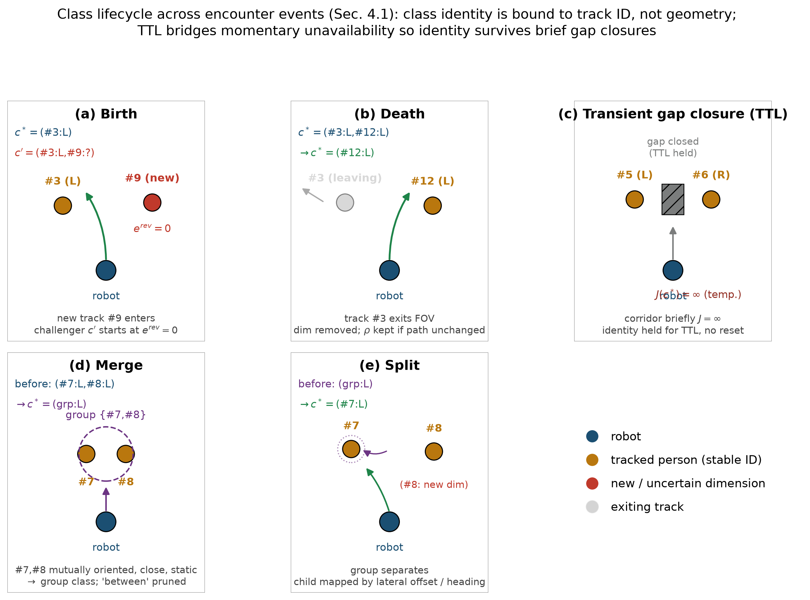
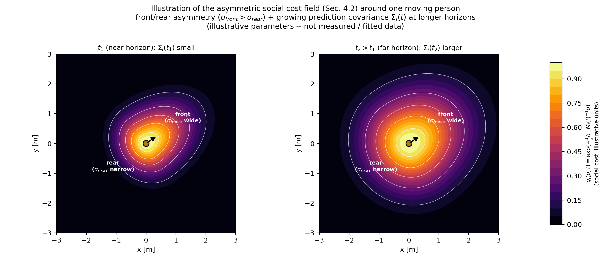
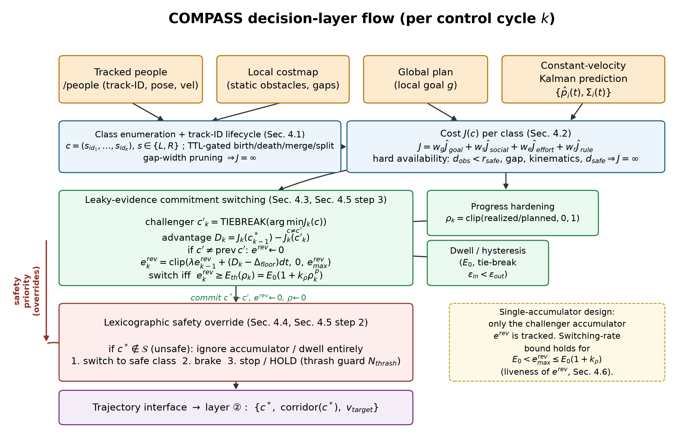
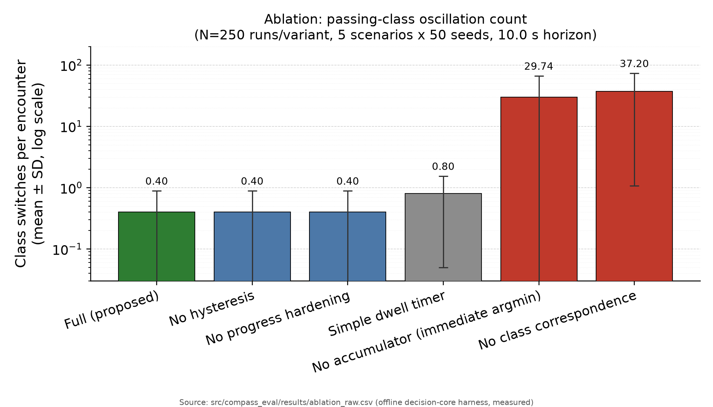

# COMPASS: 서비스 로봇 사회적 주행의 통과 결정 시간 일관성 — 위상 class·누수 증거 누적 커밋 전환 (COMmitment-based PASSing for Social navigation)
*(영문 가제: COMPASS — COMmitment-based PASSing for Social Navigation: Temporally Consistent Topological Passing Decisions for Socially-Aware Robot Navigation)*

상태: 개정 **v0.8** — arXiv v1 대비 독자 대면 정리: 초록 압축, 내부 정리용 표기 제거, `Nav2` 통합을 구현 그대로(`nav2_core::Controller` 플러그인) 확정하고 인터페이스 표·재현성 부록을 추가. 결정 계층의 일관성·가독성 프록시·주기 지연은 오프라인 하니스 **실측**으로 제시(§5.3·§5.4)하고, 물리 성과 지표·외부 비교군·사용자 실험은 사전 등록 프로토콜의 **계획된 평가**(§5.6)로 분리합니다. 측정값 날조 없음 — 인용 수치는 전부 `src/compass_eval/results/`의 커밋 산출물로 소급됩니다.

-----

## 초록 (Abstract)

혼잡한 보행 환경의 서비스 로봇은 사람을 좌·우 어느 쪽으로 지나갈지 매 제어 주기마다 다시 결정하며, 이 재결정이 탐욕적이면 모호한 구성에서 통과 방향이 주기 간에 진동하거나 로봇이 얼어붙습니다(freezing). 본 논문은 통과 결정의 **시간 일관성(temporal consistency)** 을 1급 설계 목표로 삼는 결정 계층 플래너 COMPASS를 제안합니다. 통과 관계를 사람 track ID에 묶인 위상 `class`로 표현해 주기 간 대응을 안정화하고, 전환 마진·드웰·복귀 불가점을 단일 **누수 증거 누적(leaky evidence accumulation)** 식에 통합한 커밋 전환 규칙 위에 안전을 사전식(lexicographic)으로 얹습니다. 반진동·전환율 상한·안전 지배·기동 완수·교착 탈출의 다섯 속성(P1–P5)을 정형화하며, 반진동(P1)은 도전자 우위가 평균 0·유계 분산일 때 조정 계수 `θ* ≈ 2·Δ_floor/(σ_D²·dt)`의 확률적 전환율 상한으로 제시합니다. 실제 결정 코어를 구동하는 오프라인 하니스(5 시나리오×50 시드) 실측에서, 누수 증거 누적기를 제거하면 모호 동률에서 조우당 약 98회 진동하는 반면 제안은 ≤1회로 커밋하고, 주기 지연은 K=3(8 `class`)에서 p99 58.6 µs·최대 651.3 µs로 20 Hz 예산(50 ms)의 약 1.30 %에 그쳐 결정 코어 기준 실시간 여유가 충분하며, 가독성 프록시와 freezing 임계 `v_lat ∈ (0.20, 0.35) m/s`를 함께 보고합니다. 물리 성과 지표·외부 비교군·사용자 실험은 측정하지 않았으며, 사전 등록 프로토콜로 §5.6의 계획된 평가에 명세합니다.

**키워드:** 사회적 내비게이션, 위상 경로 계획, 시간 일관성, 휴먼-로봇 상호작용, ROS2

-----

## 1. 서론 (Introduction)

자율 서빙·배송·안내 로봇은 더 이상 격리된 산업 공간이 아니라 사람이 자유롭게 움직이는 복도, 로비, 보도에서 운용됩니다. 이런 공유 공간의 핵심 난점은 정적 장애물 회피가 아니라, 끊임없이 위치와 의도를 바꾸는 사람과의 **상호작용적 통과 결정**입니다. 좁은 통로에서의 정면 대치, 로봇이 사람을 추월하거나 사람이 로봇을 추월하는 상황, 교차로식 횡단 등에서 로봇은 "어느 쪽으로, 앞으로 갈지 뒤로 양보할지, 멈출지"를 끊임없이 판단해야 합니다.

널리 쓰이는 로컬 플래너(`DWA` 계열, `MPPI`, `TEB`)는 매 제어 주기마다 비용 함수를 재최적화합니다. 이 탐욕적 재최적화는 정적 환경에서는 자연스럽지만, 두 통과 방향의 비용이 비슷한 모호한 구성에서는 미세한 센서 노이즈나 사람의 작은 움직임만으로 선택이 주기 간에 뒤집힙니다. 그 결과 로봇은 좌우로 떨거나(진동) 어느 쪽도 확신하지 못해 멈춰 섭니다(freezing robot problem, [Trautman & Krause 2010]). 진동은 비효율적일 뿐 아니라, 로봇의 의도를 사람이 읽지 못하게 만들어 안전과 신뢰를 동시에 해칩니다.

본 논문의 핵심 통찰은, 이 문제의 근본 원인이 인지나 예측의 부정확성이 아니라 **결정 정책에 시간적 관성이 없다는 구조적 결함**이라는 점입니다. 따라서 우리는 더 정교한 사람 예측기에 투자하는 대신, 통과 결정 자체에 명시적 시간 일관성을 부여합니다. 직관은 사람의 보행과 같습니다. 사람은 한 번 비킬 방향을 정하면 어지간해서는 그 방향을 유지하고, 명백한 이유가 있을 때만 바꾸며, 위험하면 즉시 멈춥니다. 이러한 "한 번 정한 통과 방향을 유지하려는 경향"은 사회적 내비게이션 문헌에서 social momentum으로 논의되어 왔으며([Mavrogiannis et al. 2022]), 본 논문은 이를 결정 계층의 정형 규칙으로 구체화합니다.

본 논문의 기여는 다음과 같습니다.

1. **위상 `class`의 ID-색인 표현과 주기 간 대응.** 통과 방향의 정체를 깜빡이는 기하(gap)가 아니라 사람 track ID에 묶음으로써, "직전에 고른 통로"를 매 주기 일관되게 식별합니다. 사람의 진입·이탈·군집·분리로 인한 `class`의 생성·소멸·병합·분할을 명시적 생애주기 규칙과 TTL로 처리합니다.
2. **통합 커밋 전환 규칙과 안전 사전식 오버라이드.** 전환 마진(히스테리시스), 드웰(지속성), 진행 경화(복귀 불가점)를 하나의 누수 증거 누적식에 녹이고, 안전을 그 위에 사전식 최상위로 둡니다. 이로써 "재촉당하지 않되 무모하지 않은" 커밋을 달성합니다.
3. **속성의 정형화와 오프라인 실증.** 반진동(P1), 전환율 상한(P2), 안전 지배(P3), 기동 완수(P4), 교착 탈출(P5)을 명제로 진술합니다. P1은 `D_k`가 평균 0·유계 분산을 갖는 확률 과정일 때의 단위시간당 기대 전환율 상한(및 조건부 기대 전환 시간)으로 제시하며, 그 조정 계수는 주기당 분산 기준으로 `θ* ≈ 2·Δ_floor/(σ_D²·dt)`이고 단위시간당 전환율 상한은 `1/dt` 인자를 포함합니다. P4는 진행도 `ρ`의 동역학과 횡 진행률 하한 위에서, **도전 누적기 `e^rev`**의 도달 상한 봉쇄 조건으로 증명합니다. 검증은 두 층으로 나뉩니다. 결정 계층의 행동 일관성·가독성 프록시·주기 지연은 실제 결정 코어를 구동하는 오프라인 하니스로 **실측**해 5장에 보고하며(§5.3·§5.4), 물리 시뮬레이션·실로봇이 필요한 성과 지표와 외부 비교군·사용자 실험은 사전 등록 프로토콜로 명세한 계획된 평가(§5.6)로 남깁니다.

-----

## 2. 관련 연구 (Related Work)

**로컬 플래너와 궤적 최적화.** `DWA`([Fox et al. 1997])는 동적 윈도우에서 속도 명령을 매 주기 선택하나 메모리가 없어 진동에 취약합니다. `TEB`([Rösmann et al. 2017])는 여러 위상 대안을 병렬로 유지하고 전환 비용으로 일부 완화하지만, 시간 일관성은 부수적 효과이지 명시적 설계 목표가 아닙니다. `MPPI`([Williams et al. 2017])는 샘플링 기반으로 부드러운 해를 내지만 사회적 통과 결정의 이산 구조를 1급으로 다루지 않습니다. 본 논문은 이들과 달리 통과 `class` 선택의 시간 일관성 자체를 핵심에 둡니다.

**사회적 내비게이션과 proxemics.** Social Force Model([Helbing & Molnár 1995])과 `ORCA`/`RVO`([van den Berg et al. 2011])는 사람의 반응성·상호성을 모델링해 freezing을 완화합니다. proxemics 비용([Hall 1966]; [Kirby 2010]의 비대칭 가우시안)은 개인 공간을 비용장으로 정량화합니다. 이들은 사람 모델은 풍부하나, 로봇 결정의 진동 자체를 측정 대상이나 설계 목표로 삼지 않습니다. 본 논문은 이 비용장을 입력으로 채택하되, 그 위에서 결정의 일관성을 다룹니다.

**HRI 내비게이션 — 의도 인지와 social momentum.** 사람의 의도를 추정해 계획에 반영하는 의도 인지 내비게이션([Trautman et al. 2015]; 군중 속 협조 주행을 다루는 IGP 계열)은 군중 속 협조 주행을 다룹니다. 특히 social momentum([Mavrogiannis et al. 2022])은 로봇이 통과 방향에 대한 "사회적 운동량"을 축적·유지함으로써 상호 교착을 깨는 관점을 제시하며, 본 논문의 커밋 누적식은 이 직관을 단일 스칼라 증거로 형식화한 것으로 볼 수 있습니다. 인간 쾌적성·사회적 적절성 지표는 사회적 내비게이션 서베이([Mavrogiannis et al. 2023]; [Gao & Huang 2022]; [Francis et al. 2023])에서 표준화가 진행 중이며, 본 논문은 그 가운데 결정 진동·가독성 축을 정량 대상으로 삼습니다.

**보행자 궤적 예측.** 학습 기반 다중 모드 예측인 Social-LSTM([Alahi et al. 2016]), Social-GAN([Gupta et al. 2018]), Trajectron++([Salzmann et al. 2020])는 사람의 미래 궤적을 분포로 예측합니다. 본 논문은 단기 지평선에서 칼만-등속 예측을 채택하되(가정 및 한계는 3·6장), 이들 예측기는 본 결정 계층에 **교체 가능한 입력 모듈**로 결합될 수 있습니다. 즉 본 기여는 예측기 선택과 직교하며, 더 정교한 예측이 가용해지면 평균 궤적·공분산 입력만 대체하면 됩니다.

**위상·topological 경로 계획과 통과 측 일관성.** H-signature 기반 homotopy class 열거([Bhattacharya et al. 2012])는 경로의 위상적 정체를 엄밀하게 표현하나, 주로 정적 장애물 위상에 초점을 둡니다. 이 위상 관점을 움직이는 보행자 환경으로 확장한 갈래가 본 논문과 가장 가깝습니다. Dynamic Channel([Cao et al. 2019])은 삼각분할 공간 그래프를 탐색해 보행자 동역학과 위상 통로(topological corridor) 선택을 결합한 실시간 군중 주행 프레임워크로, 매 계획 주기 하나의 위상을 고르지만 그 선택의 **시간 일관성**을 명시적 커밋 규칙이나 전환율 보장으로 정형화하지는 않습니다. Winding Through([Mavrogiannis et al. RA-L 2023])는 로봇 경로가 각 보행자에 대해 갖는 위상(homotopy) class를 추적하고 그 class의 시간에 따른 **변경 자체를 비용으로 벌점화**합니다 — 통과 측 전환을 억제한다는 문제 의식에서 본 논문에 가장 근접한 선행 연구이나, 이는 플래너 내부의 소프트 위상 불변(topological invariance) 비용으로 작동하며 track-ID 색인 `class` 생애주기나 증명 가능한 전환율 상한을 정의하지 않습니다. topology-driven 병렬 궤적 최적화([de Groot et al. 2025])는 동적 장애물에 대해 서로 다른 homotopy class에 시드된 로컬 MPC 최적화기들을 병렬로 돌리고 매 주기 최선의 결과 궤적에 커밋해 선택 class의 일관성을 유지합니다 — homotopy 일관성을 궤적 최적화 계층의 병렬 탐색으로 다루는 접근이며, 이산 결정 계층의 명시적 누적기 기반 커밋 규칙과 그에 대한 정형 전환율 보장은 제공하지 않습니다. 본 논문은 이들과 달리 시간 축의 `class` 대응(생애주기)과 커밋 규칙 자체를 결정 계층의 정형화 대상으로 둡니다.

**사회 순응 내비게이션의 학습 기반 흐름(IRL).** 최대 엔트로피 역강화학습으로 보행자 궤적 특징에서 사회 순응 비용·예측 모델을 학습하는 흐름([Kuderer et al. 2012]; [Kretzschmar et al. 2016])은 사람의 협조적 회피 행동을 궤적 분포(공동 경로 선택의 혼합 분포 포함)로 모델링해, 관측된 보행 관습에 정합하는 로봇 궤적을 생성합니다. 이들의 기여는 궤적 생성을 위한 학습된 비용·예측 모델이며, 이산 통과 결정이 주기 간 얼마나 자주 뒤집혀도 되는지를 규정하는 결정 계층 규칙이나 전환율 상한은 다루지 않습니다.

**F-formation과 그룹 인지.** 사람들이 대화·상호작용 시 형성하는 공간적 배치(F-formation)는 Kendon([Kendon 1990])이 정식화하였고, o-space·p-space 개념으로 "가르면 안 되는 그룹"을 규정합니다. 로봇 내비게이션에서 F-formation 검출·존중은 그룹 인지 주행의 핵심 요소로 다루어져 왔습니다([Rios-Martinez et al. 2015] 서베이). F-formation 자동 검출 자체는 본 논문의 범위 밖이며, 외부 인지 모듈이 제공한다고 가정합니다(상세는 4.8). 본 논문은 4.1의 병합 규칙을 상호작용 기반 그룹으로 확장하여 F-formation을 가르지 않도록 처리합니다(4.8 절).

**가독적·예측가능 운동.** Legible/predictable motion([Dragan et al. 2013])은 로봇 운동이 관찰자에게 의도를 드러내야 한다는 관점을 제시합니다. 본 논문의 커밋 메커니즘은 결정의 진동을 억제함으로써 운동을 가독적으로 만들며, 이 점에서 두 흐름을 잇는 다리 역할을 합니다. 가독성의 인간 검증 방법론은 4.7의 관찰자 모델과 5장의 사용자 실험 프로토콜로 구체화합니다.

**요컨대**, 통과 측의 시간 일관성이라는 문제 자체는 선행 연구가 이미 인지하고 있습니다 — 위상 불변 소프트 벌점([Mavrogiannis et al. RA-L 2023]), homotopy class별 병렬 최적화와 주기별 커밋([de Groot et al. 2025]; [Rösmann et al. 2017]), 위상 통로 선택([Cao et al. 2019]), social momentum([Mavrogiannis et al. 2022])이 각기 부분적 기제를 제공합니다. 그러나 이들은 일관성을 플래너 내부의 소프트 비용이나 휴리스틱으로 유도할 뿐, **커밋 자체를 정형화하지는 않습니다**. 본 논문의 공백 주장(claim)은 그만큼 좁고 구체적입니다: (i) 통과 `class`의 정체를 사람 track ID에 색인한 명시적 생애주기 규칙(생성·소멸·병합·분할·TTL), (ii) 증명 가능한 반진동·전환율 상한(P1·P2)을 갖는 단일 누수 증거 누적 전환 규칙, (iii) 그 위의 사전식 안전 오버라이드(P3) — 이 셋을 하나의 결정 계층으로 결합하고 형식적 속성(P1–P5)과 함께 제시한 것은, 저자들이 아는 한 본 논문이 처음이며, 이것이 본 논문이 메우는 공백입니다.

-----

## 3. 문제 정의 (Problem Formulation)

**계층 분리.** 우리는 사회적 주행을 세 계층으로 분리합니다. (i) **결정 계층** — 어느 쪽으로 지나갈지, 양보·진행·추월·정지 등의 이산 의도를 정하는 층. (ii) **궤적 계층** — 정해진 결정을 곡률 연속(G2) 궤적으로 구체화하는 층. (iii) **표현 계층** — 계획된 궤적을 사람에게 시각적으로 드러내는 층(예: AR 오버레이). 본 논문의 기여는 전적으로 **결정 계층**에 있으며, 궤적 계층은 검증된 기존 생성기를 채택합니다.

**표기.** 제어 주기를 k, 주기 간격을 dt로 둡니다. 주기 k에서 후보 위상 `class`의 집합을 `𝒞_k`, 각 `class` c의 대표 궤적 비용을 `J_k(c) ∈ ℝ⁺ ∪ {∞}`로 둡니다(비가용 시 ∞). 직전 커밋 `class`를 `c*_{k−1}`로, 안전·가용 집합을 `𝒮_k = { c ∈ 𝒞_k : Safe_k(c) }`로 둡니다. 사람 i의 예측은 칼만-등속(constant-velocity Kalman) 추정으로 평균 궤적 `p̂_i(t)`와 공분산 `Σ_i(t)`를 제공하며, `Σ_i(t)`는 예측 지평선이 길어질수록 증가합니다.

**가정과 스코프.** (a) 평면(2D) 주행. (b) 단기 예측 지평선 [0, T](전형적으로 2–4초). (c) 사람 추적과 데이터 연관은 외부 모듈이 제공합니다. (d) 궤적 생성기는 주어진 `class`·통로·목표 속도를 받아 추종 가능한 궤적을 생성하며, 명령된 **경로 횡(cross-track) 진행률**을 최소 `v_lat,min > 0` 이상으로 실현할 수 있다고 가정합니다(P4에서 사용). 여기서 `v_lat,min`은 차체의 측방(swerve) 속도가 아니라 계획된 횡 오프셋을 향한 cross-track 좌표의 단위시간당 진행률이며, 비홀로노믹 구동(차동·Ackermann)에서는 전진 속도와 조향(곡률)의 곱으로 실현되고 홀로노믹 구동에서는 직접적 측방 속도 성분으로 실현됩니다. 따라서 `v_lat,min > 0`은 전방 여유와 양의 전진 속도를 전제합니다. (e) 보행 통행 관습(예: 우측 통행)은 로캘 설정값이며, 보편 상수로 가정하지 않습니다(4.2·5장).

**목표.** 매 주기 안전을 보장하면서, 통과 결정 `c*_k`가 불필요하게 진동하지 않고, 사람에게 읽히며, 진행과 사회적 쾌적성을 유지하도록 하는 결정 정책을 설계합니다.

-----

## 4. 방법 (Method)

### 4.1 위상 class 열거와 주기 간 대응

**열거.** 영향 반경·예측 지평선 안의 관련자 K명(전형적으로 1–3명)을 track ID로 색인합니다. `class` 라벨은 각 관련자에 대한 좌/우 통과 부호의 벡터로 정의합니다.

    c = (s_{id_1}, …, s_{id_K}),   s ∈ {L, R}

최대 `2^K`개의 조합 중, 대응하는 통로 폭이 로봇 폭과 안전 여유의 합보다 좁은 조합은 즉시 `J = ∞`로 가지치기합니다. 이 통로 폭 비교는 **원형 풋프린트 근사**를 전제로 하며(로봇 폭을 방위 무관 상수로 취급), 긴 차체의 직사각형 풋프린트는 회전 시 점유 면적이 방위에 따라 달라져 가지치기·가용성 판정이 보수화되므로 6장에서 별도로 논합니다(직사각형 풋프린트 보수화와 교차 참조). 각 `class`의 좌/우 부호는 대표 경로가 예측 사람 위치를 감는 winding 부호(외적 적분 또는 H-signature 적분)로 산출합니다. 앞/뒤(시간 축) 통과는 별도 `class`로 두지 않고 4.2의 비대칭 사회 비용으로 처리합니다. 더 엄밀한 시공간 homotopy 확장은 6장에서 향후 과제로 논합니다. 열거의 조합 폭발과 가지치기 후 유효 `class` 수에 대한 해석적 한계는 5.4에서 분석합니다.

**주기 간 대응(핵심).** "직전 c\*를 유지한다"가 의미를 가지려면 매 주기 c\*를 재식별해야 합니다. `class` 정체를 기하가 아니라 track ID에 묶었으므로, 대응은 "관련자 #7의 오른쪽, #12의 왼쪽"이라는 라벨 매칭으로 환원되며, 이는 추적 모듈이 이미 제공하는 ID에 무비용으로 올라탑니다. 사람의 움직임이 유발하는 사건은 다음 규칙으로 닫습니다.

- **생성**(관련자 진입·새 통로 출현): 새 `class`가 도전자로 등장하되 증거 `e = 0`에서 시작하므로 즉각적 점프가 없습니다.
- **소멸**(관련자 이탈): 해당 차원이 모든 라벨에서 제거됩니다. c\*가 그 사람으로만 구분되던 경우 거친 `class`로 흡수되며, 실제 경로가 변하지 않으면 진행도 ρ를 유지하고 변하면 리셋합니다.
- **일시 비가용**(통로 닫힘, `J = ∞`): 정체는 유지하되 잠시 통과 불가. c\*이면 안전 오버라이드가 받고, 짧은 TTL 동안 정체를 기억해 순간적 깜빡임이 커밋을 깨지 않게 합니다.
- **병합**(두 사람이 한 군집): 두 차원이 하나로 합쳐져 양측 동일 부호만 남고 "사이"는 ∞가 됩니다. 옛 c\*를 살아남는 거친 `class`로 사상합니다. 병합 판정은 공간 근접뿐 아니라 상호작용 단서(상대 정지·상호 지향·근접 지속)를 함께 쓰며, 상세는 4.8 절에 둡니다.
- **분할**(군집의 분리): 역과정으로, 로봇의 현재 횡 오프셋·헤딩과 정합하는 자식으로 옛 c\*를 사상합니다.

*그림 1. 위상 class 생애주기 다섯 사건의 개략도: (a) 생성 — 새 track이 도전자로 등장하며 e^rev=0에서 시작, (b) 소멸 — track 이탈 시 해당 차원 제거(경로 불변 시 ρ 유지), (c) 일시 비가용 — 통로가 잠시 J=∞가 되어도 TTL 동안 정체를 유지해 리셋을 막음, (d) 병합 — 상호작용 단서(상호 지향·근접·저속)로 판정된 두 사람이 하나의 그룹 class로 합쳐짐, (e) 분할 — 그룹이 갈라지며 로봇의 횡 오프셋·헤딩에 정합하는 자식 class로 사상됨. class 정체는 기하가 아니라 사람 track ID에 묶여 있음을 강조합니다.*

이 구조는 반진동을 두 층에서 겁니다. 열거 층의 TTL이 "어떤 `class`가 존재하는가"의 깜빡임을 죽이고, 결정 층의 누적기(4.3)가 "어느 `class`를 고르는가"의 진동을 죽입니다.

### 4.2 비용 함수 J(c)

각 `class`의 비용은 대표 궤적 `τ_c` 위에서 지평선 [0, T] 동안 적분한 가중합으로 정의합니다.

    J(c) = w_g·J_goal + w_s·J_social + w_e·J_effort + w_r·J_rule,     비가용 시 J(c) = ∞

- **진행 J_goal.** 지평선 끝에서 로컬 목표 g까지의 거리: `J_goal = ‖p_r(T) − g‖`. 우회·정지 `class`에 불이익을 줍니다.
- **비대칭 사회 비용 J_social.** 각 사람 주위에 proxemics 비용장을 깔고 침범을 적분합니다.

      J_social = Σ_i ∫₀ᵀ g_i(p_r(t), t) dt
      g_i(p, t) = exp( −½ · δᵀ M_i(t)⁻¹ δ ),   δ = p − p̂_i(t)
      M_i(t) = R_i(t)·diag(σ_h², σ_s²)·R_i(t)ᵀ + Σ_i(t)

  여기서 헤딩 성분 σ_h는 앞/뒤 비대칭(앞 반평면이면 σ_front, 뒤이면 σ_rear)으로 설정합니다. 이로써 사람 앞을 가로채는 비용과 뒤로 지나가는 비용이 달라져 통과 측 선택이 사회 규범과 정합합니다. **`σ_rear`는 본 논문에서 두 가지 서로 다른 메커니즘에 등장하므로 구분이 필요합니다. (i) 비용장 비대칭의 기본 형상으로서 `σ_front > σ_rear`(앞 개인 공간이 뒤보다 넓다는 정적 형상)와, (ii) 추월 레짐에서의 맥락적 상향(사각 진입의 놀람을 억제하기 위해 후방 비용을 의도적으로 높이는 동적 조정)은 서로 다른 작동 원리이며, 전자는 정면 조우의 후방 양보를 유도하고 후자는 추월·근접 통과에서 후방 접근을 억제합니다.** 또한 예측 공분산 `Σ_i(t)`가 비용장에 더해져, 먼 미래일수록 개인 공간 타원이 넓어지고 로봇은 더 멀찍이 비킵니다. 측면 폭은 σ_s가 정합니다. 어느 사람에 대해 σ_front를 적용할지 σ_rear를 적용할지는 그 사람의 헤딩과 로봇–사람 상대 운동으로부터 산출합니다. 즉 로봇이 사람의 전방 반평면을 가로지르는 정면 조우 레짐에서는 σ_front를, 사람의 후방 반평면으로 진입하는 추월 레짐에서는 σ_rear를 적용하며, 반평면 귀속은 δ를 사람 헤딩 기준 국소 좌표로 사영해 판정합니다. **이때 σ_rear 레짐 전환(정면 조우↔추월)은 별도 변수로 구동되지 않고, 위 후단 반평면 사영 판정과 동일한 변수(δ의 사람-헤딩 국소 사영 부호)로 구동됩니다 — 즉 비용장 비대칭의 선택과 추월 레짐 귀속은 단일 판정에서 일관되게 파생됩니다.**

  **파라미터 근거와 로캘 설정 가능성.** σ_front, σ_rear, σ_s 및 통행 측 선호는 보편 상수가 아니라 **로캘·문화 설정값**으로 둡니다. 비대칭 가우시안 proxemics의 기본형은 Kirby([Kirby 2010])에서, 전방 확장 형상은 Hall의 개인 공간 구획([Hall 1966])과 사회적 내비게이션 서베이([Rios-Martinez et al. 2015])에서 근거를 얻습니다. 단, "후방 통과가 항상 더 바람직하다"는 무조건적 가정은 채택하지 않습니다. 사람의 사각(뒤)에서의 접근은 놀람·불편을 유발할 수 있으므로([Rios-Martinez et al. 2015]의 surprise 논의), 본 비용은 σ_rear를 **맥락 의존 노브**로 노출하여 (i) 정면 조우에서는 후방 양보를 선호하되 (ii) 추월·근접 통과에서는 후방 비용을 높여 사각 진입을 억제하도록 합니다. 통행 측 선호는 로캘 의존적이며 설정 대상입니다(예: 일부 보행 환경은 우측, 일부는 좌측 또는 혼재가 보고됨). 보행 군중에서 회피측 행동 관습이 자기조직화로 형성됨을 보인 실험 연구로는 [Moussaïd et al. 2009]를 참조하되, 이는 단일 모집단(프랑스 보르도) 실험·관찰 연구이지 문화 간 비교 연구가 아니므로 "통행 측이 문화마다 다르다"의 직접 근거로 확대 해석하지 않습니다; 본 논문은 통행 측을 보편 상수로 고정하지 않고 `locale.keep_side ∈ {right, left, none}` 설정으로 분리하는 보수적 선택을 택합니다. 이들 파라미터의 민감도 분석 설계는 5.5에 기술하며, 그 측정은 계획된 평가(5.6)에 남습니다.

  

  *그림 2. §4.2 비대칭 사회 비용장 g_i(p,t) = exp(-½ δᵀM_i(t)⁻¹δ)의 예시적 시각화 (실측이 아닌 수식 기반 삽화입니다). 좌: 근접 지평선 t1 (예측 공분산 Σ_i(t1) 작음), 우: 원거리 지평선 t2>t1 (Σ_i(t2) 커져 개인 공간 타원이 확장됨). 두 패널 모두 σ_front > σ_rear의 앞/뒤 비대칭(전방 개인 공간이 후방보다 넓음)을 보여주며, 반평면 귀속은 δ를 사람 헤딩 기준 국소 좌표로 사영해 판정합니다.*

- **노력·평활도 J_effort.** `J_effort = ∫₀ᵀ (α·κ² + β·a² + γ·κ̇²) dt`. κ̇(곡률 변화율) 항이 G2 연속을 유도해 부드러운 추종과 표현 계층의 곡률 표시에 직결됩니다.
- **규범 J_rule.** 보행 통행 관습(`locale.keep_side`에 따른 선호)과 차선 유지에 대한 소프트 벌점. 가중치 w_r에 대한 민감도 곡선 설계는 5.5에 둡니다.

**하드 가용성.** 정적 충돌(`d_obs < r_safe`), 통로 폭 부족, 운동학 한계 위반, 예측 사람과의 하드 안전 거리 `d_safe` 위반 중 하나라도면 `J = ∞`. 부드러운 불편은 J_social이, 물리·안전 제약은 하드 가용성이 담당하는 이원 구조입니다.

**정규화와 시불변성.** 마진 `Δ_floor`와 누적기 임계 `E_0`가 비용 단위로 표현되면 시나리오 간 이식이 어려우므로, 각 항을 기준 범위로 [0, 1] 정규화합니다. 구체적으로 항 X ∈ {goal, social, effort, rule}에 대해 `Ĵ_X = (J_X − J_X^min) / (J_X^max − J_X^min)`로 정규화하고 `J = Σ_X w_X Ĵ_X`로 둡니다.

여기서 권장 방식(아래 사전 보정 고정 상수)이 보장하는 성질은 **정규화 사상의 시불변성**, 즉 정규화 상수가 주기에 무관하게 고정되므로 `Δ_floor`가 가리키는 "무차원 우위"의 의미가 주기 간 보존되고 따라서 주기당 `Δ_floor`가 표현하는 마진의 물리적 의미가 일정하게 유지된다는 점입니다. 이것이 P1·P2의 마진 의존 진술이 실제로 전제하는 성질입니다.

여기서 한 가지를 분명히 분리합니다. 정규화 직후의 `J = Σ_X w_X Ĵ_X`는 **보정 시점에 선택한 비용 단위**에 대해 아핀 재척도 `J_X ↦ aJ_X + b`에 불변입니다. 그러나 이 아핀 불변성은 보정 시점의 비용 단위에 한정된 성질이며, **고정 상수 방식에서는 비용 단위를 사후에 재척도하면 정규화 상수가 함께 변환되지 않으므로 깨집니다**. 비용 단위 재척도에 대한 불변성은 정규화 상수가 단위와 함께 공변(co-transform)하는 경우 — 즉 주기별 min-max 통계량 방식에서만 — 자동으로 보존됩니다. 따라서 권장 방식이 증명·활용하는 성질(시불변성)과 정규화 사상이 보정 단위에 대해 갖는 성질(아핀 불변성)은 서로 다른 속성이며, 본 논문의 정형 속성은 전자(시불변성)에 의존합니다. 이로써 `Δ_floor`와 `D_k`의 비교가 (사전 보정 단위 하에서) 주기 간 일관됩니다.

정규화 후에는 `J`가 무차원이므로 `D_k`, `Δ_floor`, `E_0` 모두 무차원이고, 곱 `Δ_floor·E_0` 역시 무차원입니다. 따라서 본 논문에서 **`Δ_floor`는 "비용 단위의 마진"이 아니라 정규화 범위 [0,1]의 한 분수(무차원 전환 마진)**로 해석합니다(예: `Δ_floor = 0.05`는 정규화 비용 범위의 5% 우위를 요구). 이 해석은 4.3의 모든 무차원 노브(`E_0`, `e_max`, `k_ρ`)와 정합합니다.

**`J_X^min`·`J_X^max`의 선택(시불변성 vs 단위 공변).** 정규화 상수의 출처에는 두 가지 선택지가 있으며, 그 함의가 서로 다릅니다.

- **(권장 기본값) 사전 보정 상수(시나리오 고정).** `J_X^min`·`J_X^max`를 현재 주기 후보 집합과 무관하게 시나리오 단위로 한 번 보정해 고정합니다. 이 경우 정규화 사상이 주기 간 불변이므로 `Δ_floor`가 가리키는 "무차원 우위"의 의미가 시간에 걸쳐 일정하게 유지됩니다(**시불변성** — 본 논문의 정형 속성이 의존하는 성질). 단, 위에서 밝혔듯 이 방식은 비용 단위를 사후 재척도하면 정규화 상수가 함께 변환되지 않아 아핀 불변성을 잃으므로, 보정 단위를 고정해 사용하는 것을 전제합니다. 본 논문은 이를 **권장 기본값**으로 채택합니다.
- **(옵션) 주기별 min-max 통계량.** `J_X^min`·`J_X^max`를 현재 주기 후보 집합 `𝒮_k` 위에서 산출하면 정규화 사상이 후보 집합과 함께 주기마다 바뀝니다. 이 방식은 비용 단위 재척도에 대해 정규화 상수가 함께 공변하므로 **아핀 척도 불변성**을 자동으로 보존하나, 대가로 동일한 `Δ_floor` 값이 가리키는 실제 비용 우위가 주기 간에 **표류**합니다. 예컨대 후보 집합이 한 주기에 압축(min-max 폭 축소)되면 같은 `Δ_floor`가 더 큰 실비용 우위를 요구하게 되어, 고정 의도였던 전환 마진이 후보 집합 변동에 따라 사실상 시변(time-varying)해집니다. 이 표류는 P1·P2의 마진 관련 진술이 전제하는 "고정 `Δ_floor`(시불변 사상)" 가정을 약화시키므로, 주기별 통계량을 쓸 경우 그 효과를 5.5에서 별도로 측정·한정해야 합니다.

요컨대 두 선택지는 "정규화 사상의 시불변성(권장; 단 보정 단위 고정 전제)"과 "비용 단위 공변에 따른 아핀 불변성(옵션; 단 마진 의미 표류 동반)"의 교환이며, 본 논문의 정형 속성(P1·P2)은 사전 보정 상수(시불변 사상)를 전제로 진술됩니다. 이 정규화는 4.3 전환 마진 `Δ_floor`의 시나리오 간 이식 가능성을 위한 전제이기도 합니다.

### 4.3 커밋 전환 규칙

도전자를 `c′_k = argmin_{c ∈ 𝒮_k, c ≠ c*} J_k(c)`, 도전자 우위를 `D_k = J_k(c*_{k−1}) − J_k(c′_k)`로 둡니다. 마진·드웰·진행 경화를 하나의 누수 증거 누적식에 통합합니다.

    e_k = clip( λ·e_{k−1} + (D_k − Δ_floor)·dt,  0,  e_max )
    전환 조건:  e_k ≥ E_th(ρ_k)
    E_th(ρ) = E_0 · (1 + k_ρ · ρ^p),   p ≥ 1
    ρ_k = clip( |실행된 cross-track 진행| / |c*의 계획 횡 오프셋|, 0, 1 )

여기서 `Δ_floor`는 순간 마진(4.2에 따라 정규화 범위의 무차원 분수; 이하의 우위는 누수 λ ∈ (0,1]로 소멸), E_th는 지속 요구(드웰), `k_ρ·ρ^p`는 진행 경화(복귀 불가점)입니다. 등가 관계가 직관을 줍니다. λ = 1이고 우위가 상수 `D̄ > Δ_floor`이면 e는 `(D̄ − Δ_floor)t`로 자라 `t = E_th/(D̄ − Δ_floor)`에 전환하므로, 우위가 클수록 빨리 전환하고(긴급성 비례), `E_th → 0⁺`이면 순수 마진, E_th가 크면 긴 드웰입니다. 도전 대상이 바뀌면(c′ 변경) `e ← 0`으로 리셋하고, 전환·커밋 시 `e ← 0, ρ ← 0`으로 리셋합니다.

여기서 `Δ_floor`는 4.2의 정규화 전제 하에서 무차원 전환 마진이며, 그 절대 의미는 정규화 상수를 사전 보정 상수로 고정할 때에만(정규화 사상의 시불변성) 주기 간 일정하게 유지됩니다(4.2의 표류 분석 참조). 주기별 min-max 통계량을 쓰면 동일 `Δ_floor`의 실효 마진이 후보 집합에 따라 표류하므로, 안전 드웰·전환율 하한 등 마진 의존 진술의 해석에 주의가 필요합니다.

선형(p = 1)은 일정하게 단단해지고, 초선형(p > 1)은 기동 중반까지 여유를 주다 막판에 급격히 잠그는 "복귀 불가점" 강조형입니다.

**도전자 동률 타이브레이크.** `c′_k = argmin`이 유일하지 않으면(두 도전자의 정규화 비용이 수치 허용오차 `ε` 이내로 동률) argmin이 주기 간 흔들려 `c′ ≠ prev_c′` 리셋이 누적기를 교란하는 새 진동원이 됩니다. 이를 막기 위해 동률 시 다음 **결정적 사전 순서**로 단일 도전자를 고정합니다.

1. **직전 도전자 우선.** 직전 주기의 c′(prev_c′)가 현재 동률 집합에 있으면 그것을 선택합니다(도전자 정체의 시간 일관성). 이 우선 규칙은 비용이 동률(이탈 임계 `ε_out` 이내)인 집합 안에서만 적용되므로, prev_c′를 고르더라도 최적 도전자 대비 비용 손실은 `ε_out`(히스테리시스 이탈 임계)을 넘지 않아 `ε_out` 이상의 최적성을 희생하지 않습니다(직후 단락의 `ε_in < ε_out` 진입/이탈 히스테리시스와 정합).
2. **c\*와의 위상 거리.** 그렇지 않으면 현재 커밋 c\*와의 라벨 해밍 거리(부호 차이 수)가 **작은** 도전자를 선택합니다(전환 비용이 작은 인접 `class` 우선).
3. **결정적 사전순.** 그래도 동률이면 `class` 라벨의 사전식 순서(ID 오름차순, 각 자리 L < R)로 최소인 것을 선택합니다.

이 규칙은 결정적이므로, 동률 구성에서 `c′`가 주기 간 흔들리지 않아 누적기 리셋이 유발하는 인공 진동이 제거됩니다. 한편 `c′`가 진짜로 바뀌는 경우(동률이 아닌 우위 역전)에만 `e ← 0`이 발동합니다.

**동률 경계 자체의 히스테리시스.** 동률 판정 임계 `ε`에도 경계 채터링이 생길 수 있으므로(비용 차가 `ε` 근방에서 떨면 "동률↔비동률"이 주기 간 깜빡임), `ε` 경계에 진입·이탈 히스테리시스를 둡니다. 즉 두 도전자가 비동률에서 동률 집합으로 **진입**하는 임계 `ε_in`과 동률 집합에서 **이탈**하는 임계 `ε_out`을 `ε_in < ε_out`로 분리해, 한 번 동률로 묶인 도전자 쌍은 비용 차가 `ε_out`을 넘어서야 비동률로 풀립니다. 이로써 타이브레이크 자체의 활성/비활성이 경계에서 떠는 2차 진동을 봉쇄합니다.

**안전 드웰의 보수성 트레이드오프.** 4.4의 안전 드웰·진행 경화는 전환을 늦춰 진동을 줄이는 대가로, 진짜로 더 나은 대안이 등장한 경우의 반응을 그만큼 지연시킵니다. 즉 `Δ_floor`·`E_0`·`k_ρ`를 키울수록 반진동은 강해지나 적법한 재계획의 지연(보수성)이 커지는 교환 관계가 있으며, 이 교환의 운용점은 5.5의 민감도 분석으로 정합니다.

### 4.4 안전 오버라이드

안전·가용 판정은 `Safe_k(c) = [clearance ≥ d_safe] ∧ [TTC ≥ TTC_min] ∧ [운동학 가용]`입니다. 커밋된 c\*가 안전 집합을 벗어나면 4.3의 누적·경화를 전부 무시하고(비상 시 마진 0) 다음 사다리로 떨어집니다.

1. 안전한 대안 `class`로 전환(존재 시).
2. 없으면 감속하여 시간을 법니다.
3. 그래도 위험하면 정지·양보합니다(정지는 언제나 안전한 폴백이자 가독적 행동입니다).

**안전 분기 자체의 이력.** 안전 사다리가 1단계(전환)에서 떨면(안전 전환의 고빈도 반복) 그 자체가 새 진동원이 됩니다. 이를 막기 위해 안전 분기에도 최소 이력을 부여합니다. (i) **안전 드웰.** 안전 전환 직후 짧은 보호 구간 `T_safe_dwell` 동안에는 추가 안전 전환을 막고, 위반 지속 시 곧장 2단계(감속)로 떨어집니다. 즉 "한 번 안전 전환을 시도했는데 곧바로 다시 안전 위반"이면 1단계에서 다시 떨지 않고 **감속 우선**으로 전이합니다. (ii) **감속 우선 조건.** 직전 창 내 안전 전환 횟수가 임계(아래 N_thrash의 부분 임계)를 넘으면 1단계를 건너뛰고 2단계부터 시작합니다. 이로써 안전 분기는 "전환 → 감속 → 정지"로 단조 하강하며, 1단계에서의 떨림이 구조적으로 봉쇄됩니다.

**스래시 가드.** 창 W 내 안전 유발 전환이 `N_thrash`회 발생하면(진정한 모호·교착 상황) 플레일링을 멈추고 정지·대기(HOLD)로 떨어집니다. 상호 모호로 인한 reciprocal dance 병리를 여기서 차단합니다. 재진입 시 새 최선 `class`로 커밋하고 e, ρ, 드웰 타이머를 리셋합니다.

### 4.5 통합 알고리즘과 궤적 인터페이스

    상태: c*, e, ρ, n_thrash(창 W), prev_c′, t_safe_dwell, mode
    매 주기 k:
      1) {p̂_i(t), Σ_i(t)} ← 칼만-등속;  𝒞 ← class 열거(가지치기)
         ∀c: J(c) ← ∫₀ᵀ (w_g Ĵ_goal + w_s Ĵ_social + w_e Ĵ_effort + w_r Ĵ_rule) dt   (비가용 ⇒ ∞)
         𝒮 ← { c : clearance≥d_safe ∧ TTC≥TTC_min ∧ feasible }
      2) [안전] if c* ∉ 𝒮:
            n_thrash++
            if (안전 드웰 보호 중) or (창 내 안전 전환 ≥ 부분 임계):
                v_cmd ← max(0, v_cmd − a_brake·dt); if TTC<TTC_stop: mode←STOP   # 감속 우선
            elif 𝒮 ≠ ∅:
                c* ← argmin_{c∈𝒮} J(c); e←0; ρ←0; t_safe_dwell ← T_safe_dwell   # 안전 전환 + 드웰
            else:
                v_cmd ← max(0, v_cmd − a_brake·dt); if TTC<TTC_stop: mode←STOP
            if n_thrash ≥ N_thrash: mode ← HOLD
      3) [재량] else:
            c′ ← TIEBREAK(argmin_{c∈𝒮,c≠c*} J(c), prev_c′, c*)   # 동률 타이브레이크(ε_in/ε_out 히스테리시스)
            D ← J(c*) − J(c′)
            if c′ ≠ prev_c′: e ← 0
            e ← clip(λ·e + (D − Δ_floor)·dt, 0, e_max)
            if e ≥ E_0(1 + k_ρ ρ^p): c* ← c′; e←0; ρ←0
            prev_c′ ← c′
      4) ρ ← clip(realized_lateral / planned_lateral(c*), 0, 1)   # realized/planned_lateral은 cross-track 진행
         return {c*, 통로(c*), v_target} → 궤적 계층 ②

*그림 3. COMPASS 결정 계층의 제어 주기별 흐름도. 입력(추적된 사람 /people, 로컬 costmap, 전역 계획, 칼만-등속 예측)이 track-ID 기반 class 열거(§4.1)와 비용 J(c) 산출(§4.2)로 이어지고, 단일 도전자 누적기 e^rev 기반 누수 증거 누적 커밋 전환(§4.3, §4.5 3단계)이 드웰·진행 경화와 결합해 전환 여부를 결정하며, 그 위에 사전식 안전 오버라이드(§4.4, §4.5 2단계)가 최우선으로 얹힙니다. 우측 하단 노란 박스는 전환 동역학이 단일 도전자 누적기 e^rev 하나로 닫히며, 그 도달 상한이 양측 조건 E_0 < e^rev_max ≤ E_0(1+k_ρ)를 만족하도록 설계됨(§4.6)을 요약합니다.*

구현은 ROS2 `Nav2`([Macenski et al. 2020])의 `nav2_core::Controller` 플러그인(`compass_nav2::CompassController`)이며, `controller_server`가 호스팅합니다. 결정 1주기는 `computeVelocityCommands` 호출당 1회 수행되고, 주기율은 `controller_server`의 `controller_frequency` 설정값(본 구현의 배포 구성은 20.0 Hz)이 정하며, costmap은 `Costmap2DROS`에서, 사람 트랙은 `/people`(`compass_msgs/People`) 구독으로 받습니다. 플러그인은 `Nav2` lifecycle 규약(`configure`/`activate`/`deactivate`/`cleanup`)을 준수하고 출력은 `TwistStamped`이며, 대응 상태(라벨·e·ρ·TTL·prev_c′·안전 드웰)를 주기 간 유지합니다.

**결정 계층의 시스템 인터페이스.** 아래 표는 구현 코드에서 그대로 옮긴 인터페이스 규약입니다.

| 인터페이스 | 형식 | frame 처리 | 율·시점 | QoS | 신선도 정책 |
| :- | :- | :- | :- | :- | :- |
| `/people` 구독 | `compass_msgs/People` | 메시지 frame → costmap 전역 frame으로 `tf2` 변환; 변환 실패 시 그 메시지의 사람 전체를 보수적으로 폐기 | 비동기 수신, 주기 시작 시 최신값 소비 | `rclcpp::SensorDataQoS()` = best-effort·volatile·keep-last depth 5 (rclcpp 기본 reliable·depth 10 아님) | 최신값 유지(last-value), 메시지 age 컷오프 없음; 메시지 부재 시 사람 0명(보수적) |
| costmap | `Costmap2DROS` (`controller_server` 공유 객체) | costmap 전역 frame | 주기 내 동기 접근 | — | costmap 자체 갱신 주기에 종속 |
| 전역 계획 | `nav_msgs/Path` (`setPlan`) | 계획 frame | 새 계획 수신 시 교체 | — | 최신 계획 유지 |
| 결정 주기 | `computeVelocityCommands` 호출 | — | `controller_frequency`(구성 20.0 Hz); `dt`는 호출 간 실측 간격(첫 주기·시계 비진행(역행 포함) 시 0.1 s 대체값) | — | — |
| 출력 | `geometry_msgs/TwistStamped` | 입력 pose frame | 호출당 1회 | — | — |

여기서 `dt`는 고정 상수가 아니라 호출 간 실측 간격이며(§5.1 오프라인 하니스의 고정 `dt=0.05 s`와 구분), `/people`의 메시지 age 컷오프 부재는 구현 사실 그대로입니다 — §4.1의 TTL은 `class` 정체성의 TTL로서 이것과는 별개의 기제입니다. 한편 executor 스케줄링 지터, rmw/DDS 큐잉, TF 지연, costmap 갱신 동시성, `controller_server` 디스패치 오버헤드, 입력 신선도 처리의 효과 등 엔드투엔드 파이프라인 특성은 본 논문에서 특성화하지 않았으며, 그 측정은 계획된 평가(§5.6)에 속합니다.

### 4.6 속성 분석

다섯 속성을 명제로 진술합니다. P1·P4는 증명을 제시하고, P2·P3·P5는 논증합니다. 본 논문은 P1을 확률적 진술(전환율/전환확률 상한 + 조건부 기대)로, P4를 `ρ` 동역학·횡 진행률 하한과 **단일 도전 누적기의 도달 상한 봉쇄** 위에서 정식화합니다.

**단일 도전 누적기와 표기(P4·4.9 정합의 전제).** 본 논문의 전환 동역학은 4.3·4.5의 **단일** 누수 증거 누적기 위에서 닫힙니다. 이 누적기는 정의상 항상 현재 커밋 `c*`를 뒤집으려는 도전자 `c′`의 우위 증거를 적분하므로, 이하 속성 분석에서는 이를 **도전 누적기** `e^rev`로 표기합니다 — 4.3의 누적식과 4.5 알고리즘의 상태 변수 `e`와 **동일한 하나의 변수**이며, 위 첨자 rev는 "현재 커밋을 뒤집는(reverse) 도전 증거"라는 역할을 가리키는 표기일 뿐 별도의 누적기가 아닙니다. `e^rev`가 도달할 수 있는 최대치를 `e^rev_max`로 씁니다(`λ < 1`이면 누수 평형 상한과 클립 상한 `e_max`의 작은 쪽; 유도는 P4).

전환 동역학의 건전성은 이 단일 누적기의 도달 상한에 대한 **양측 조건** 하나로 요약됩니다.

    E_0 < e^rev_max ≤ E_0(1 + k_ρ)

하한(`e^rev_max > E_0`)은 `ρ = 0`에서 재량 전환이 애초에 가능하다는 **가동성(liveness)** 조건이고(4.9), 상한(`e^rev_max ≤ E_0(1+k_ρ)`)은 기동이 충분히 진행되면(`ρ > ρ̄`) 도전 누적이 문턱 아래에 갇혀 번복이 봉쇄된다는 **P4 봉쇄** 조건입니다. 두 요구는 같은 변수 `e^rev_max`에 대한 하한과 상한이므로 모순 없이 동시에 만족 가능합니다. 이전 정식화의 자기모순은 이 봉쇄 상한과 정면충돌하는 별도의 "임계 초과 헤드룸" 요구(`e_max > E_0(1+k_ρ)`)를 같은 상한에 부과한 데서 생겼으며, 4.9에서 논하듯 그 헤드룸 요구 자체가 건전성 조건이 아니었음을 밝히고 철회합니다.

**명제 P1 (반진동 — 확률적 형태).** 도전자 우위 `D_k`가 평균 0·유계 분산 `Var[D_k] ≤ σ_D²`인 정상 확률 과정이고 `Δ_floor > 0`라 하겠습니다. 그러면 도전 누적기 `e^rev_k`의 한 주기 기대 증분은 음수로 유계이며,

    E[ (D_k − Δ_floor)·dt ] = (E[D_k] − Δ_floor)·dt = −Δ_floor·dt < 0,

따라서 `e^rev_k`는 음의 드리프트를 갖는 누수 누적 과정입니다. 결과적으로 (i) 모호 구성(평균 우위 0)에서 전환은 **드물고**, (ii) 단위시간당 기대 전환율(또는 한 주기당 전환 확률)이 `Δ_floor`에 대해 지수적으로 감소하는 상한을 가집니다.

*증명(스케치).* `λ = 1`(가장 보수적)일 때 `e^rev_k = Σ_{j≤k} (D_j − Δ_floor)dt`이며, 0 반사벽(clip 하한)에서 출발해 양의 임계 `E_0`에 도달해야 전환이 발생합니다. 증분의 기대가 `−Δ_floor·dt < 0`이므로 `{e^rev_k}`는 음의 드리프트에 0 반사벽을 갖는 누적 과정입니다.

여기서 초기 정식화가 취했던 "기대 도달 시간 하한" 형태의 진술은 부정확했음을 밝힙니다. 클립이 없는 **비반사** 순수 음의 드리프트 보행이라면 `−∞`로 표류하며 임계 `E_0`에 영영 도달하지 못하는 표본 경로가 양의 확률을 가지므로 무조건부 첫 도달 시간의 기대가 무한하고(`E[T_hit] = ∞`), 반면 실제 규칙의 0 **반사벽**(clip 하한) 아래에서는 과정이 양의 재귀(positive recurrent)라서 `E_0`에 언젠가는 도달하나 그 기대 도달 시간은 `exp(θ*·E_0)` 규모로 지수적으로 깁니다. 어느 쪽이든 "기대 전환 시간이 유한한 하한을 가진다"는 형태의 진술은 유용한 정보를 담지 못하며, P1의 핵심("모호 구성에서 전환이 드물다")은 다음 두 형태 중 하나로 정확히 포착합니다.

(a) **조건부 기대 전환 시간.** 전환이 실제로 일어나는 사건에 조건을 걸면, 조건부 기대 `E[T_hit | 도달]`은 분산이 작거나 마진이 클수록 길어집니다. 직관적으로, 전환이 일어나려면 음의 드리프트를 거슬러 분산이 `E_0`만큼의 누적 변동을 만들어야 하므로, 분산 `σ_D²`가 작을수록 그런 경로가 드물고 평균적으로 더 오래 걸립니다.

(b) **(권장) 전환율/전환확률의 지수적 상한.** 위험 이론의 Cramér–Lundberg 부등식과 동형으로, 음의 드리프트 누적 과정이 `e^rev_0 = 0`에서 출발해 임계 `E_0`를 한 주기(또는 단위시간) 안에 넘을 확률은 지수적으로 상한됩니다. 정상·약상관 증분에 대해 조정 계수(adjustment coefficient) `θ* > 0`가 존재하여 한 주기당 전환 확률 `P_switch`는

    P_switch ≤ exp(−θ* · E_0),   θ* ≈ 2·Δ_floor / (σ_D²·dt)   (소드리프트·준가우시안 근사)

로 상한되며, 단위시간당 기대 전환율은 대략

    r_switch ≲ (1/dt)·exp( −2·Δ_floor·E_0 / (σ_D²·dt) )

수준의 지수적 상한을 가집니다. 여기서 조정 계수 `θ*`가 `e` 단위의 역수가 되도록, 분산 척도는 **주기당 분산 `σ_D²·dt²`**(증분 `(D_k−Δ_floor)dt`의 분산)에 맞추거나 등가적으로 **단위시간당 분산 `σ_D²·dt`** 기준으로 잡습니다 — 이 정규화로 인해 `θ*`와 전환율 상한에 `1/dt` 인자가 명시적으로 복원됩니다(이전 정식화에서 누락되었던 인자). 즉 마진 `Δ_floor`나 임계 `E_0`가 클수록, 그리고 분산 `σ_D²`가 작을수록, 그리고 주기 `dt`가 짧을수록 전환은 지수적으로 드물어집니다. `λ < 1`이면 누수가 추가 음의 드리프트를 주어 조정 계수 `θ*`가 커지고 상한이 더 강화됩니다.

따라서 메모리리스 argmin이 대칭점 근방에서 보이는 극한 주기 진동은 **확률적으로** 억제되며, 전환은 `D_k`의 분산이 일시적으로 커져 누적이 임계를 넘을 때만 지수적으로 드물게 발생합니다. ∎

*주석 1 (결정론적 특수 경우).* 모든 k에 대해 `|D_k| ≤ Δ_floor`이면 증분이 항상 ≤ 0이라 `e^rev_k ≡ 0`이고 전환 확률은 정확히 0입니다(초기 정식화의 결정론적 진술). 본 확률적 형태는 그 강한 가정을 평균 0·유계 분산으로 완화한 것이며, 위 (b)의 상한에서 `σ_D² → 0`이면 `P_switch → 0`으로 결정론적 경우를 연속적으로 회복합니다.

*주석 2 (IID 가정과 자기상관).* 위 Cramér–Lundberg형 상한과 표준 첫도달 결과는 통상 증분 `D_k`의 **IID 가정** 위에서 유도됩니다. 그러나 본 논문의 `D_k`는 사람 운동·예측의 시간 상관 때문에 자기상관을 허용하는 정상 과정입니다. 이 간극은 두 가지로 처리합니다. (i) 약상관·혼합(mixing) 조건(예: `D_k`가 기하적으로 혼합하는 정상 과정)을 가정하면 블록 근사로 동일한 지수적 형태가 유효 분산·유효 조정 계수와 함께 성립합니다. (ii) 그렇지 않더라도 위 상한의 상수 `θ*`(또는 등가적으로 σ_D²를 대체하는 유효 분산)가 자기상관 구조를 흡수하는 것으로 해석하며, 본 논문은 정확한 상수가 아니라 "Δ_floor·E_0에 대한 지수적 감소"라는 정성적 형태만 주장합니다. **이때 자기상관이 있는 `D_k`에 대해 `θ*` 상한 식의 `σ_D²` 자리에 들어갈 분산 척도는 한 시점의 주변 분산이 아니라 정상 과정의 장기 분산(long-run variance) `Σ_k Cov(D_0, D_k)`(증분 합의 점근 분산)으로 대체해야 합니다 — 양의 자기상관은 이 장기 분산을 주변 분산보다 키워 `θ*`를 작게(상한을 느슨하게) 만들고, 음의 자기상관은 반대로 작용합니다. 이 장기 분산의 조작적 추정은 5.5의 측정 대상으로 연결됩니다.** **또한 누수 `λ < 1`을 도입하면 단순 적분 누적이 OU/AR(1)형 첫도달 문제로 바뀌어, 조정 계수와 정상 분산 등 상수는 달라지되 임계 `E_0`에 대한 지수 꼬리는 그대로 유지됩니다.** 정확한 유효 분산의 추정은 5.5에 설계를 두며 계획된 평가(5.6)의 측정 대상입니다. 또한 P1의 정상성 가정은 모호 구성에 대한 것이므로, 진짜 의도 변화 구간에서는 `D_k`가 비정상(non-stationary)이 되어 P1이 적용되지 않으며, 그 경우 임의 구성에 대해 성립하는 P2의 결정론적 전환 간격 하한이 작동 보장입니다(P2 말미의 대비가 이미 함의하는 내용의 명시화).

*주석 3 (λ·E_th 상호작용).* λ와 E_th의 상호작용(누수가 임계 도달을 D의 단순 적분이 아니라 D의 시간적 **형상**에 의존하게 만든다 — 짧고 강한 우위 펄스는 누수로 새기 전에 누적되어 임계를 넘기 쉽고, 길고 약한 우위는 누수로 상쇄되어 임계에 못 미친다)은 4.9 절에서 더 분석합니다.

**명제 P2 (전환율 상한).** 도전자 우위가 `D_k ≤ D_max`로 유계이면, 연속한 두 재량 전환 사이 간격은 `Δt_switch ≥ E_th(ρ) / (D_max − Δ_floor)`로 하한됩니다(단 `D_max > Δ_floor`). `ρ = 0`에서는 `E_th(0) = E_0`이므로 하한이 `E_0/(D_max − Δ_floor)`이고, `ρ > 0`에서는 진행 경화로 `E_th(ρ) = E_0(1+k_ρρ^p) ≥ E_0`이므로 하한이 `E_th(ρ)/(D_max − Δ_floor)`로 **커집니다**(기동이 진행될수록 번복이 더 어려워짐).

*논증.* 재량 전환 직후 `e^rev = 0`이고, 한 주기 증분은 최대 `(D_max − Δ_floor)dt`입니다. `e^rev`가 `E_th(ρ) ≥ E_0`에 도달하려면 적어도 `E_th(ρ) / ((D_max − Δ_floor)dt)` 주기가 필요하므로 위 하한이 성립합니다. 상한 클립 `e_max`는 임계 도달을 늦추거나 막을 뿐 앞당기지 못하므로, 이 간격 하한은 클립의 크기와 무관하게 성립합니다(4.9의 헤드룸 철회 논거). 따라서 전환 빈도가 유계이며 행동이 가독적입니다. (P1이 모호 구성에서의 전환 **희소성**을 확률적으로 보장한다면, P2는 임의 구성에서의 전환 **빈도 상한**을 결정론적으로 보장합니다. 단 4.2의 표류 분석대로, 이 하한의 `Δ_floor`는 정규화 상수를 사전 보정 상수로 고정할 때 주기 간 일정한 의미를 가집니다.)

**명제 P3 (안전 지배).** 임의의 주기에서 `c* ∉ 𝒮`이면, 누적기 상태나 진행도와 무관하게 안전 사다리가 발동합니다.

*논증.* 알고리즘 2단계(안전)가 3단계(재량)보다 먼저 평가되고 사전식 우선순위를 가지므로, 안전 위반 시 커밋 관성은 어떤 경우에도 안전 반응을 지연시키지 못합니다. 4.4의 안전 분기 이력은 안전 **반응 자체**를 지연시키지 않으며, 다만 반응의 형태를 "전환에서 떨기"가 아니라 "감속·정지로 단조 하강"으로 결정론화합니다.

**명제 P4 (기동 완수 — ρ 동역학·도전 누적기 봉쇄).** 안전 개입이 없고 도전자 우위가 유계(`D_k ≤ D_max`)이며, 궤적 계층이 가정 3(d)대로 명령 cross-track 진행률을 최소 `v_lat,min > 0` 이상으로 실현한다고 하겠습니다. 그러면 시작된 기동의 진행도 `ρ`가 봉쇄 문턱 `ρ̄`(아래에서 유도)를 초과한 이후로는 반대 `class`로의 번복이 봉쇄되며, 기동은 그로부터 번복 없이 유한 시간 내에 완료됩니다. 잠금 이전 구간(`ρ < ρ̄`)에서는 지속적인 도전자 우위가 `E_th(ρ)`를 넘겨 재량 전환이 일어날 수 있습니다 — 이는 결함이 아니라 가동성 하한 `e^rev_max > E_0`가 의도적으로 열어 두는 정당한 전환 창이며(예: 5.3의 `clean_commit`에서 실측된 조우당 1회의 정당한 전환), 그 경우 알고리즘이 `e^rev ← 0`·`ρ ← 0`으로 재시작하므로 본 보장은 새 커밋에 대해 동일하게 적용됩니다. 즉 P4가 배제하는 것은 잠금(`ρ > ρ̄`) 이후의 번복입니다.

*증명.* 먼저 ρ의 동역학을 정의합니다. 진행도를 `ρ_k = clip(L_real,k / L_plan, 0, 1)`로 두되, `L_real,k`는 누적 실현 cross-track 진행량, `L_plan = |c*의 계획 횡 오프셋|`입니다. 한 주기 실현 진행량은 `ΔL_k = v_lat,k · dt`이며 가정에 의해 `v_lat,k ≥ v_lat,min`입니다(가정 3(d)대로 `v_lat,k`는 차체 측방 속도가 아니라 cross-track 좌표의 진행률이며, 비홀로노믹 구동에서는 전진 속도·조향의 곱으로 실현됨). 단, 환경 변화로 로봇이 밀리거나 통로가 좁아지면 ρ가 정체·감소할 수 있으므로, **단조 증가는 가정하지 않고** 대신 음이 아닌 순증분의 하한을 씁니다. 외란에 의한 후퇴를 `b_k ≥ 0`로 두면(`b_k`는 외란에 의한 **순 진행의 음이 아닌 감소분**을 포괄합니다 — 밀림·통로 협착·일시 후진 등 cross-track 진행을 깎는 모든 비계획적 후퇴를 단일 비음수 항으로 모은 것입니다) `L_real,k = L_real,k−1 + v_lat,k dt − b_k`입니다. 외란이 유계(`Σ_k b_k ≤ B < L_plan`, 즉 누적 후퇴가 계획 이동량을 다 까먹지 않음)라는 조건 하에서, 순 진행률의 하한은

    L_real,K ≥ K·v_lat,min·dt − B,

이므로 `K ≥ (L_plan + B)/(v_lat,min·dt)` 주기 후 `L_real,K ≥ L_plan`, 즉 `ρ → 1`에 도달합니다.

한편 잠금(반대 `class`로의 전환 봉쇄)이 성립하려면 진행 경화 임계 `E_th(ρ) = E_0(1 + k_ρ ρ^p)`가 **도전 누적기 `e^rev`가 도달 가능한 최대치**를 넘어서야 합니다. 도전 누적기는 한 주기당 최대 `(D_max − Δ_floor)dt`만큼 증가하고 누수 `λ`로 감소하며 상한 `e_max`로 클립됩니다. 따라서 `λ < 1`(누수 있음) 하에서 도전 누적기의 도달 가능한 최대치는 누수-적분의 평형 상한과 클립 상한의 작은 쪽, 즉

    e^rev_max = min( e_max, (D_max − Δ_floor)·dt / (1 − λ) )

입니다(기하급수 `Σ_{j≥0} λ^j (D_max−Δ_floor)dt = (D_max−Δ_floor)dt/(1−λ)`가 누수 평형 상한이고, clip이 이를 `e_max`로 추가로 묶음). 순수 적분기 가정 `λ = 1`에서만 누수 평형항이 무한대로 발산하므로 도달 상한이 클립 상한 `e_max`로 단순화됩니다. 이하 일반성을 위해 `e^rev_max`를 도달 상한으로 씁니다. 따라서 **봉쇄 조건**은

    E_th(ρ̄) = E_0(1 + k_ρ ρ̄^p) = e^rev_max     (봉쇄 문턱 ρ̄의 정의; E_th는 ρ에 단조 증가이므로 ρ > ρ̄에서 E_th(ρ) > e^rev_max ≥ e^rev — P4 봉쇄)

이고, 이를 ρ̄에 대해 풀면

    ρ̄ = ( (e^rev_max/E_0 − 1) / k_ρ )^{1/p}

가 잠금이 발효되는 진행도 문턱입니다. ρ̄가 (0,1] 안에 존재할 **존재 조건**은 우변이 (0,1]에 들도록 `E_0 < e^rev_max ≤ E_0(1 + k_ρ)`인 것입니다.

**봉쇄의 비공허성(non-vacuity).** 위 존재 조건의 **하한 `e^rev_max > E_0`는 사실상 "재량 전환이 애초에 가능한가"와 동치**임에 유의해야 합니다. 도전 누적기의 도달 상한 `e^rev_max`가 `E_0` 미만이면 `e^rev`가 `ρ=0`에서의 문턱 `E_th(0) = E_0`에조차 닿지 못해 **어떤 재량 전환도 일어나지 못하고**, 그 결과 P1·P2가 다루는 전환 동역학 전체가 공허(inert)해집니다. 즉 봉쇄는 성립하더라도(아무것도 전환되지 않으므로) 그것은 "기동을 잠갔다"가 아니라 "처음부터 전환 능력이 없었다"는 퇴화이며, 보장의 의미를 잃습니다. 따라서 설계자는 봉쇄(상한 `e^rev_max ≤ E_0(1+k_ρ)`)와 전환 가능성(하한 `e^rev_max > E_0`)을 **동시에** 만족하는 `(λ, e^rev_max)` 영역을 지켜야 하며, 그 구체 지침은 5.5의 노브 튜닝에 둡니다.

이 봉쇄 조건은 위 비공허성 하한과 결합해 4.6 서두의 양측 조건 `E_0 < e^rev_max ≤ E_0(1 + k_ρ)`로 정리됩니다 — 하한은 `ρ = 0`에서의 전환 가동성, 상한은 봉쇄 문턱 `ρ̄ ≤ 1`의 존재. 같은 변수 `e^rev_max`에 대한 하한·상한이므로 동시에 만족 가능하며, 이전 정식화에서 자기모순을 낳았던 별도의 "임계 초과 헤드룸" 요구(`e_max > E_0(1+k_ρ)`)는 4.9에서 철회·재도출합니다. 설계는 `λ`로 조절되는 누수 평형항과 클립 상한 `e_max`를 통해 `e^rev_max`를 `(E_0, E_0(1+k_ρ)]` 구간에 두어 봉쇄 문턱 `ρ̄ ≤ 1`이 존재하도록 잡습니다(설계 지침은 5.5의 노브 튜닝에 둠).

ρ가 충분히 커진 이후(`ρ̄ < ρ ≤ 1`)에는 반대 `class`로의 전환이 봉쇄되므로, 반대 방향 전환이 봉쇄된 상태에서 ρ가 위 하한을 따라 1에 도달하여 기동이 완료되며, 완료까지 주기 수는 `K ≤ (L_plan + B)/(v_lat,min·dt)`로 유한하게 상한됩니다. ∎

*주석(잠금 구간의 비단조성).* 위 봉쇄는 진행도 `ρ`가 단조 증가할 때 한 번 잠기면 풀리지 않지만, 외란 후퇴 `b_k`가 매 주기 `v_lat,min·dt`를 초과해 ρ가 비단조로 거동하면(`ρ`가 ρ̄ 위로 올라갔다 다시 ρ̄ 아래로 후퇴) 그 경로에서 봉쇄가 일시 해제될 수 있습니다. 따라서 정확히는 **봉쇄는 `ρ ≥ ρ̄`가 성립하는 구간에서만 유효하며, ρ가 ρ̄ 아래로 후퇴하면 풀립니다.** 잠금이 영구적이려면 위 증명의 누적 후퇴 유계 조건(`Σ_k b_k ≤ B < L_plan`)에 더해 ρ가 ρ̄를 한 번 넘은 뒤로는 그 아래로 후퇴하지 않는다는 실현이 필요하며, 그렇지 못한 외란 경로는 P3·P5(안전·가용성 계층)가 인계합니다.

*주석.* 외란이 무계여서 `Σ_k b_k`가 `L_plan`을 초과하면(통로가 영구히 막힘) 이는 더 이상 "기동 완수" 상황이 아니라 안전·가용성 상실 상황이며, P3·P5(안전 사다리·HOLD)가 인계합니다. 즉 P4는 가용성이 유지되는 한에서의 완수 보장이고, 가용성 상실은 안전 계층이 책임집니다.

**명제 P5 (교착 탈출).** 상호 모호로 안전 유발 전환이 반복되는 상황에서, 스래시 가드는 유한 횟수 진동 후 시스템을 HOLD(정지·대기)로 보내 freezing/dance 없이 상황을 종료시킵니다.

*논증.* 안전 유발 전환은 창 W 내에서 계수되며 `N_thrash` 도달 시 HOLD로 강제 전이됩니다. 4.4의 안전 분기 이력(감속 우선)이 창 내부 고빈도 전환을 추가로 억제하므로, 창 내 안전 전환 횟수 자체가 줄어 HOLD 이전 단계에서 떨림이 완화됩니다. 따라서 무한 진동이 불가능하고, 정지라는 안전·가독적 종료 상태로 수렴합니다.

### 4.7 가독성의 관찰자 모델과 time-to-legible 조작적 정의

가독성 주장을 측정 가능하게 하려면 "관찰자가 언제 통과 측을 확신하는가"를 정의해야 합니다. 본 논문은 **베이즈 관찰자 모델**로 time-to-legible을 조작화합니다.

가설 공간을 통과 측 `H ∈ {L, R}`로 두고, 관찰자는 로봇의 관측 가능한 운동 단서(횡 오프셋·헤딩·곡률, 시점 t까지의 궤적 `o_{0:t}`)로부터 사후확률 `P(H | o_{0:t})`를 베이즈 갱신합니다.

    P(H | o_{0:t}) ∝ P(o_{0:t} | H) · P(H),

여기서 우도 `P(o_{0:t} | H)`는 각 가설 하의 기대 운동 모델(예: 해당 측으로 비키는 표준 궤적 분포)로 둡니다. **이 우도 운동 모델은 본 논문의 결정 정책과 독립적인, 관찰자 측의 사전(prior)으로 둡니다.** 즉 관찰자 모델은 로봇 내부 비용 `J`나 누적기 상태를 보지 못하고, 오직 외부에서 관측 가능한 운동학적 궤적만으로 가설별 우도를 매깁니다. 이는 평가 지표가 평가 대상 정책을 그대로 베껴 순환적으로 유리해지는 것을 차단하기 위함이며, 우도 모델은 (예측가능 운동 문헌 [Dragan et al. 2013]의 관찰자 추론 관점에 따라) 일반적 "측면 회피 궤적 분포"로 고정합니다. **또한 이 우도 운동 모델은 제안 방법과 모든 비교군에 동일하게 적용되므로, 가독성 프록시 지표는 어느 한쪽에 유리하게 기울지 않는 비편향 평가입니다 — 즉 동일한 관찰자 사전으로 모든 정책의 궤적을 동등하게 채점합니다.** **time-to-legible**은 사후확률이 임계 `p*`(예: 0.9)를 넘어 그 후 유지되는 최초 시각으로 정의합니다.

    t_legible = min{ t : P(H* | o_{0:τ}) ≥ p*  ∀τ ∈ [t, t+Δ_hold] },

`H*`는 실제 실현된 통과 측, `Δ_hold`는 일시적 초과를 배제하는 유지 구간입니다. 이 정의는 (i) 자동 계산 가능한 **프록시 지표**(시뮬레이션 로그에서 관찰자 모델을 돌려 산출)와 (ii) 사람의 지각을 묻는 **사용자 실험**(5.6의 프로토콜) 양쪽에 동일하게 적용됩니다. 진동하는 정책은 사후확률을 임계 위로 안정시키지 못해 `t_legible`이 늦거나 정의되지 않으며, 커밋하는 정책은 이른 시점에 사후확률을 고정해 `t_legible`을 앞당깁니다 — 이것이 본 논문의 가독성 주장의 측정 가능한 핵심이며, 프록시 지표의 실측값은 5.3에 보고합니다. 관찰자 모델 파라미터(우도 운동 모델, `p*`, `Δ_hold`)는 설정값이며, 그 민감도(5.5)와 사람 판단과의 상관 측정은 계획된 평가(5.6)의 사용자 실험 프로토콜에 둡니다.

**우도 모델의 관찰자 모집단 비의존 가정의 한계.** 본 모델은 우도 운동 모델을 단일한 "일반적 측면 회피 궤적 분포"로 고정하나, 의도 귀속은 실제로 관찰자의 문화·연령·로봇 친숙도에 의존하고 가독성 자체가 사회적 구성물이므로, 모든 관찰자 모집단에 동일 우도를 부여하는 본 가정은 근사일 뿐이며 모집단별 가독성 편차를 포착하지 못한다는 한계를 가집니다(이 한계의 정량화는 5.6 사용자 실험의 사람 데이터로만 가능).

### 4.8 군집·F-formation·취약 보행자 처리

**상호작용 기반 그룹(F-formation).** 4.1의 병합 규칙이 공간 근접에만 기반하면 대화 중인 그룹을 "그냥 가까운 두 사람"으로 보아 그 사이로 통로를 열어 그룹을 가를 수 있습니다. 이를 막기 위해 병합·그룹 판정을 **상호작용 단서**로 확장합니다. 두 사람 i, j가 (i) 일정 시간 이상 상호 근접을 유지하고, (ii) 서로를 향한 지향(헤딩이 공통 o-space 중심을 향함, Kendon의 F-formation), (iii) 상대 속도가 작음(동반 보행 또는 정지 대화)을 만족하면 **사회적 그룹**으로 묶고, 그 사이를 가르는 `class`(둘 사이로 통과)를 처리하는 방식은 두 가지이며 그 선택 기준은 다음과 같습니다. 그룹 사이로의 통과가 기하적으로 결코 허용되어선 안 되는 강한 사회 규범 상황(예: 명확히 식별된 정지 대화 그룹, 취약 보행자 포함 그룹)에서는 해당 `class`를 **가용성에서 제외**(`J = ∞`)하고, 규범이 약하거나 그룹 검출 신뢰도가 낮아 가용성 박탈이 과도하게 보수적일 수 있는 상황에서는 **큰 소프트 벌점**으로 강하게 억제하되 다른 모든 통로가 막혔을 때의 폴백 여지를 남깁니다. 즉 가용성 제외는 "절대 가르지 않음"을, 소프트 벌점은 "가급적 가르지 않되 최후 수단으로는 허용"을 표현합니다.

**F-formation 검출은 외부 모듈 가정.** 본 논문은 F-formation 검출 자체를 기여로 주장하지 않으며, 외부 인지 모듈이 그룹 구성과 o-space 추정치를 제공한다고 가정합니다. 자동 F-formation 검출의 1차 문헌으로는 그래프 컷 기반 GCFF([Setti et al. 2015])와 그 후속 군집 기반 검출기들이 있으며, 본 결정 계층은 이들의 출력(그룹 멤버십·o-space 중심·반경)을 입력으로 받습니다. 그룹 경계(o-space)는 [Kendon 1990]·[Rios-Martinez et al. 2015]의 정의를 따릅니다. 이로써 "상호작용 중인 그룹은 가르지 않는다"는 사회 규범이 결정 계층에 반영됩니다. 단순 군집(상호작용 없는 우연한 근접)은 기존 병합 규칙대로 거친 `class`로 처리합니다. 다만 그룹을 가르지 않고 **돌아가는** 경로를 택할 때 어느 쪽으로 도느냐에 따른 사회적 비용 비대칭(F-formation o-space의 대화 시야를 차단하는 측 대 차단하지 않는 측)은 본 논문의 범위 밖이며, 향후 과제로 부기합니다(6장).

**취약 보행자 배려.** 아동·고령자·휠체어 이용자 등 취약 보행자가 식별되면(외부 인지 모듈이 속성 태그 제공 가정), 해당 사람에 대해 (i) proxemics 폭 σ를 키워 더 큰 사회 거리를 확보하고, (ii) 통과 측 커밋 임계 `E_0`·드웰을 높여 더 보수적으로(덜 급하게) 통과하며, (iii) 안전 거리 `d_safe`와 `TTC_min`을 상향합니다. 또한 취약 보행자 근처에서는 후방·사각 통과의 비용을 추가로 높여(σ_rear 상향) 놀람을 줄입니다.

**보수적 기본값의 freezing 부작용 한정.** 다만 위 보수적 노브(특히 `E_0`·드웰 상향)를 무제한 키우면 로봇이 통과를 과도하게 미뤄 얼어붙는(freezing) 부작용이 생길 수 있습니다. 따라서 본 정책은 취약 보행자 보수화를 **유한 상한 내에서만** 적용하며, 보수화로 인해 어느 통로로도 커밋하지 못하는 상황이 일정 시간 지속되면 이를 교착으로 간주해 **P5의 HOLD(정지·대기)로 인계**합니다. 즉 보수적 기본값은 "더 신중한 통과"까지만 책임지고, 그것이 freezing으로 전이하는 경계는 P5가 받아 안전·가독적 정지로 종료시킵니다.

**오분류 시 정책과 윤리 한계.** 취약 보행자 속성 추정이 불확실하거나 오분류될 수 있으므로, 본 결정 계층은 **불확실 시 보수적 기본값**을 택합니다. 즉 속성 신뢰도가 임계 미만이면 해당 사람을 잠정적으로 취약 보행자로 간주해 위 보수적 노브(σ·E_0·드웰·d_safe·TTC_min 상향)를 적용하며, 이는 "오분류로 인한 안전·쾌적성 손실은 보수 쪽으로 치우치게 한다"는 원칙입니다. 다만 속성 분류 자체가 편향·프라이버시·낙인 문제를 내포할 수 있으므로, 본 논문은 분류기 설계·공정성을 기여로 주장하지 않으며 이를 윤리적 한계로 명시합니다(6장). 구체적 마진 값과 그 효과의 결정은 사용자·현장 평가, 즉 계획된 평가(5.6)에 둡니다.

### 4.9 λ vs 단순 드웰 타이머, e_max 포화 분석

**λ(누수 누적) vs 단순 드웰 타이머.** 단순 드웰 타이머는 "도전자가 `T_dwell` 동안 연속으로 우위면 전환"하는 규칙으로, 우위의 **연속 지속**만 봅니다. 반면 누수 누적 `e_k = clip(λe_{k−1} + (D_k − Δ_floor)dt, 0, e_max)`는 우위의 **시간 적분을 누수와 함께** 봅니다. 두 규칙의 해석적 차이는 다음과 같습니다.

- **간헐 우위의 처리.** 단순 드웰은 우위가 한 번이라도 끊기면 타이머가 리셋되어, 모호 구성에서 "거의 늘 우위지만 가끔 끊기는" 정당한 전환을 영원히 막을 수 있습니다. 누수 누적은 끊김을 누수로만 처리하므로(리셋 아님), 평균적으로 우위가 충분하면 누적이 임계를 넘어 전환합니다. 즉 누수 누적은 단순 드웰의 **취약한 리셋**을 부드러운 감쇠로 대체합니다.
- **형상 의존성.** 본 절 비교의 핵심으로, 누수 누적의 임계 도달은 우위의 단순 적분이 아니라 **시간적 형상**에 의존합니다. 시상수 `τ_leak = −dt/ln λ`(λ<1)보다 짧은 펄스로 들어온 강한 우위는 누수로 새기 전에 누적되어 전환을 유발하고, `τ_leak`보다 긴 시간에 걸친 약한 우위는 누수로 상쇄되어 전환에 못 미칩니다. 단순 드웰에는 이런 시상수 개념이 없고 "연속 길이" 단일 축만 있습니다.
- **특수 경우 일치.** `λ = 1`(누수 없음)이고 우위가 상수 `D̄`이면 누수 누적은 `t = E_th/(D̄ − Δ_floor)`에 전환하는 **선형 적분기**가 되어, 임계를 시간으로 환산하면 드웰 타이머와 동치가 됩니다. 즉 단순 드웰은 누수 누적의 `λ → 1`·상수 우위 극한의 특수 경우입니다. λ < 1을 도입하는 이유는 바로 위의 형상 의존성(오래된 약한 증거를 잊는 능력)을 얻기 위함입니다.

이 정량 비교(전환수·가독성에서 λ 누수 누적 vs 단순 드웰)는 5.1의 ablation에 "단순 드웰" 변형(−누적기 항의 즉시 argmin과 별도)으로 포함해 **실측**했습니다(5.3의 표 1·표 2). 특히 위 첫 항목의 예측 — 간헐 우위에서 단순 드웰의 리셋 취약성이 정당한 전환을 막는다 — 이 실제로 관찰됩니다(`intermittent`에서 단순 드웰 전환 0회 대 제안 1회; 상세 해석은 5.3).

**e_max 포화의 역할.** 상한 클립 `e_max`는 두 역할을 합니다. (i) **윈드업 방지.** 강한 우위가 오래 지속되면 e가 무한히 커져, 이후 우위가 사라져도 e가 임계 위에 오래 머무는 적분기 윈드업이 생깁니다. `e_max`는 누적량을 유계로 막아, 우위가 사라지면 누수가 `e_max`에서부터 빠르게 작동해 반응성을 회복합니다. (ii) **전환 후 대칭성.** 전환 직후 `e ← 0` 리셋과 결합해, `e_max`는 "이미 충분히 결정된" 우위가 더 쌓여 다음 전환을 과도하게 앞당기는 것을 막습니다.

**헤드룸 조건의 철회와 가동성 조건으로의 재도출.** 이전 정식화는 "`e_max`가 너무 작으면 P2의 전환 논증에서 `E_th`에 도달하기 전에 포화해 전환이 차단되므로, `e_max > max_ρ E_th(ρ) = E_0(1 + k_ρ)`(임계 초과 헤드룸)가 건전성 조건"이라고 요구했으나, 본 논문은 이 **헤드룸 조건을 철회**합니다. 그 요구는 두 가지 점에서 잘못이었습니다. (i) P2가 보장하는 것은 전환 간격의 **하한**(전환율 상한)이며, 이 하한은 클립과 무관하게 성립합니다 — 포화는 임계 도달을 늦추거나 막을 뿐 앞당길 수 없으므로, `e_max`가 작아져도 전환율 상한은 깨지지 않습니다(P2 논증). (ii) `e^rev_max > E_0(1+k_ρ)`를 요구하면 모든 `ρ ∈ [0,1]`에서 `e^rev_max > E_th(ρ)`가 되어 봉쇄 문턱 `ρ̄ ≤ 1`이 존재할 수 없으므로, P4의 봉쇄와 정면충돌합니다 — 이것이 이전 정식화가 안았던 자기모순의 실체입니다.

포화가 실제로 위협하는 것은 전환율 상한이 아니라 **전환 가능성**입니다. 도달 상한이 `ρ = 0`의 문턱에도 못 미치면(`e^rev_max ≤ E_0`) 어떤 재량 전환도 일어나지 못해 전환 동역학 전체가 공허해집니다(P4의 비공허성 논의). 따라서 옛 헤드룸 조건이 담으려던 건전성의 올바른 형태는 도전 누적기의 **가동성(liveness) 조건**

    e^rev_max > E_0     (가동성 조건 — ρ = 0에서 재량 전환 가능)

이며, 이는 P4 봉쇄 상한과 결합해 단일 양측 조건 `E_0 < e^rev_max ≤ E_0(1 + k_ρ)`(4.6)가 됩니다. 즉 `ρ = 0`에서는 전환이 가능하고(하한), 기동이 충분히 진행되면(`ρ ≥ ρ̄`) 번복이 봉쇄되는(상한) 것이 설계 의도의 정확한 정식화이며, 두 요구는 같은 도달 상한 `e^rev_max = min(e_max, (D_max−Δ_floor)dt/(1−λ))`에 대한 하한·상한이므로 충돌 없이 동시에 만족 가능합니다. 이 조건 주변에서 `e_max`·`λ`·`k_ρ`를 스윕하는 민감도 분석은 5.5에 설계를 두며, 진행 경화 관련 축(ρ-구동률)의 실측은 5.3에, 나머지 축의 측정은 계획된 평가(5.6)에 둡니다.

-----

## 5. 실험 (Experiments)

본 장은 **측정한 것만 결과로 보고**합니다. 결정 계층의 행동 일관성·가독성·주기 지연은 실제 결정 코어를 구동하는 오프라인 하니스로 **실측**해 5.3(ablation·ρ-스윕)과 5.4(주기 지연)에 제시하며, 하니스 셋업·지표는 5.1·5.2에, 민감도 분석 설계는 5.5에 둡니다. 물리 시뮬레이션·실로봇이 필요한 성과 지표, 외부 비교군, 사용자 실험은 측정하지 않았으므로 결과로 제시하지 않으며, 그 프로토콜 전부를 사전 등록 형태로 5.6 **계획된 평가(Planned Evaluation)** 에 명세합니다. 측정값 날조는 하지 않습니다.

### 5.1 오프라인 결정 계층 하니스 — 셋업과 변형

본 장의 실측은 `compass_eval` 오프라인 하니스로 **실제 결정 코어**(`DecisionCore`)를 5개 재현 조우 시나리오 × 50 시드 × 6 변형으로 구동해 얻습니다(dt=0.05 s = 20 Hz, 지평 10 s; CPU AMD Ryzen 5 5500GT). 모든 수치는 결정 스트림에서 결정적으로 산출되며 원자료(`compass_eval/results/ablation_raw.csv`)를 공개합니다. 본 하니스가 측정하는 것은 결정 계층의 행동 일관성·가독성 프록시·주기 지연이며, 물리 시뮬레이션이 있어야 측정 가능한 성과 지표(성공률·충돌률·최소 사회 거리·횡 저크)와 외부 비교군·사용자 실험은 계획된 평가(5.6)로 분리합니다.

시나리오는 모호 동률(`near_tie`)·일시 스파이크(`transient_spike`)·중간 역전(`mid_reversal`)·명확 우위(`clean_commit`)·간헐 우위(`intermittent`)입니다. 변형(내부 ablation)은 제안(full)과 −히스테리시스(Δ_floor=0)·−진행 경화(k_ρ=0)·−누적기(즉시 argmin)·**단순 드웰(누수 누적 대신 연속 드웰 타이머 0.6 s; 4.9 비교)**·−class 대응(gap만으로 정체)입니다. −안전 오버라이드 변형은 안전 사건이 없는 오프라인 시나리오에서 제안과 동치이므로(그 효과는 충돌 영역) 본 실측에서 제외하며, 그 평가는 물리 시뮬 평가(5.6)에 속합니다.

가독성(time-to-legible)은 §4.7의 베이즈 관찰자를 결정 스트림에 적용해 산출합니다. 오프라인 하니스에는 실현 궤적이 없으므로, 관찰자는 §4.7이 규정한 운동학적 궤적 단서 대신 **주기별 커밋 통과 측(결정 스트림)을 대리 관측치로 소비**하며, 여기에 대칭 오독 잡음 ε — 관찰자가 한 주기의 통과 측을 반대로 읽을 확률(본 실측에서 ε=0.2, p\*=0.9) — 를 적용합니다. 이는 §4.7 운동학 단서 관찰자의 추가 단순화입니다(구현: `src/compass_eval/include/compass_eval/harness.hpp:171-196`). 따라서 오프라인 `t_legible`은 **결정 스트림의 가독성**을 측정하는 것이지 독립적 운동 가독성 축이 아니며, 운동학 단서 관찰자와 인간 검증은 계획된 평가(§5.6)에 남습니다. 또한 오프라인 실행의 유지 조건은 지평 끝까지 유지(hold-to-horizon-end), 즉 사실상 `Δ_hold = T − t`인 가장 엄격한 유지 조건이므로 검열 판정은 보수적입니다. 비가독률은 사후확률이 끝까지 p\* 위로 안정되지 못한(우측 검열) 시행 비율입니다.

### 5.2 지표

- **헤드라인(기여 직결):** 조우당 결정 전환 횟수(안전 정당화분 제외 — 여기서 "안전 정당화분"은 §4.4 안전 분기 로그, 즉 알고리즘 2단계에서 `c* ∉ 𝒮`로 발동한 안전 유발 전환으로 결정되며, 이 로그로 표시된 전환만 헤드라인 집계에서 제외합니다), 횡 지령 부호 변화율 또는 결정 엔트로피, 가독성 지표(4.7의 관찰자 모델로 산출한 time-to-legible과 비가독률(우측 검열률), 그리고 계획된 평가(5.6)의 사용자 실험이 제공할 인간 판단).
- **측정 가능 범위의 구분.** 위 헤드라인 항목 중 결정 스트림에서 산출 가능한 것(전환수·부호변화율·결정엔트로피·t-legible·비가독률)은 본 장에서 실측합니다(5.3). 궤적 실현이 필요한 횡 방향 저크와 표준(안전·효율) 지표(성공률·최소 사회 거리 등)는 물리 시뮬레이션 의존이므로, 그 정의·보고 규약을 계획된 평가(5.6)에 둡니다.

### 5.3 결과 — 행동 일관성·가독성 (오프라인 하니스, 실측)

**표 1. 종합 행동 일관성·가독성 (전 시나리오 평균±SD, N=250) — 전 열 실측.** 물리 시뮬 의존 성과 지표(사회거리·충돌·성공률·횡저크)는 측정 전이므로 본 표에 포함하지 않으며, 그 정의와 프로토콜은 5.6에 있습니다. 합산 N=250의 평균±SD는 이질적 5개 시나리오에 걸친 혼합 통계로, SD는 시드 변동뿐 아니라 시나리오 간 혼합 분산을 포함합니다(시나리오별 분해는 표 2와 `compass_eval/results/R1_ablation.md`). 표의 t-legible 평균±SD는 우측 검열 시행의 값을 지평값 10.0 s로 대치해 포함한 집계이므로 반드시 비가독률(검열률) 열과 함께 읽어야 하며(변형 간 검열률 차이가 평균 비교 가능성에 영향), 검열을 대치하지 않는 생존분석 기반 집계(§5.6의 규약)는 계획된 평가에서 적용합니다.

| 변형 | 전환수/조우↓ | 부호변화율(/s)↓ | 결정엔트로피(bits)↓ | t-legible(s)↓ | 비가독률 |
| :- | :- | :- | :- | :- | :- |
| 전체(제안) | **0.40±0.49** | **0.040±0.049** | **0.018±0.022** | **2.50±3.86** | 50/250 |
| −히스테리시스 | 0.40±0.49 | 0.040±0.049 | 0.018±0.022 | 2.39±3.84 | 49/250 |
| −진행 경화 | 0.40±0.49 | 0.040±0.049 | 0.018±0.022 | 2.50±3.86 | 50/250 |
| −누적기(argmin) | 29.74±36.70 | 2.974±3.670 | 0.420±0.374 | 3.61±4.65 | 74/250 |
| 단순 드웰(0.6 s) | 0.80±0.75 | 0.080±0.075 | 0.034±0.031 | 2.26±3.90 | 50/250 |
| −class 대응 | 37.20±36.12 | 3.720±3.612 | 0.515±0.401 | 3.62±4.66 | 73/250 |

**표 2. 시나리오별 전환수/조우 (평균±SD, N=50/cell)** — 진동 퇴행이 가장 분명하게 드러나는 표입니다.

| 변형 | near_tie | transient_spike | mid_reversal | clean_commit | intermittent |
| :- | :- | :- | :- | :- | :- |
| 전체(제안) | 0.00±0.00 | 0.00±0.00 | 0.00±0.00 | 1.00±0.00 | 1.00±0.00 |
| −히스테리시스 | 0.00±0.00 | 0.00±0.00 | 0.00±0.00 | 1.00±0.00 | 1.00±0.00 |
| −진행 경화 | 0.00±0.00 | 0.00±0.00 | 0.00±0.00 | 1.00±0.00 | 1.00±0.00 |
| −누적기(argmin) | 98.16±7.85 | 2.00±0.00 | 13.44±3.48 | 0.00±0.00 | 35.12±2.40 |
| 단순 드웰(0.6 s) | 0.00±0.00 | 2.00±0.00 | 1.00±0.00 | 1.00±0.00 | 0.00±0.00 |
| −class 대응 | 98.12±6.37 | 2.00±0.00 | 46.00±4.75 | 0.00±0.00 | 39.88±4.11 |

*그림 4. 변형별 조우당 class 전환 횟수 (평균±SD, 로그 스케일; N=250 회/변형, 5개 시나리오×50 시드, 지평 10.0 s). 누수 증거 누적기를 제거(즉시 argmin)하거나 class 대응(track-ID 정체)을 제거하면 조우당 각각 29.74회·37.20회로 진동하는 반면, 제안(full)은 0.40회로 사실상 커밋을 유지합니다. −히스테리시스·−진행 경화 단독 제거는 본 시나리오군에서 퇴행이 관찰되지 않아, 1차 진동 억제 기제가 누적기 자체임을 보입니다. 원자료: `src/compass_eval/results/ablation_raw.csv` (실측, 날조 없음).*

**해석 — 강하게 확인된 것.** (i) **진동 제어(핵심 주장).** 누수 누적기를 제거(즉시 argmin)하거나 class 대응을 제거하면 모호 동률에서 조우당 약 98회 진동하는 반면, 제안은 0회로 커밋을 유지합니다(그림 4). 두 분포는 범위가 겹치지 않으므로(제안 전부 0회 vs −누적기 98.16±7.85, 지지집합 비중첩) 분리는 범주적입니다. 이처럼 본 오프라인 실측의 핵심 분리는 범주적이어서 형식 검정이 결론을 바꾸지 않으므로 본 실측에서는 생략하며, Mann-Whitney U 검정·효과 크기·신뢰구간은 계획된 평가(5.6)의 물리 성과 지표에 대해 보고합니다. (ii) **스퍼리어스 억제.** 일시 스파이크에서 제안은 0회 전환(스파이크 무시), argmin은 2회(진입·복귀). (iii) **신속 커밋.** 명확 우위에서 제안은 1회 전환, t-legible 2.37 s. (iv) **가독성.** 진동 변형은 사후확률이 안정되지 못해 자주 비가독입니다(argmin·−class 비가독 73–74/250; `near_tie` t-legible 7.9 s 대 제안 0.05 s).

**해석 — 사전 가설과 달랐던 것(측정에 의한 정정).** −히스테리시스(Δ_floor=0)와 −진행 경화(k_ρ=0)는 본 시나리오들에서 제안 대비 **퇴행이 관찰되지 않았습니다.** 누수 누적기의 임계 `E_0`와 누수가 이미 영평균 잡음을 기각하므로, 본 동작 영역에서 1차 진동 억제 기제는 Δ_floor·k_ρ 가 아니라 **누적기** 자체입니다. 즉 초기 개정본이 사전 등록한 "−히스테리시스 → 전환수 폭증" 가설은 누수 누적기 설계에서는 성립하지 않으며, 이는 ablation 측정이 제공한 **가설 정정**입니다. 또한 `intermittent`에서는 **제안이 50/50 전부 우측 검열(비가독)** 됩니다 — 전환은 1회 일어나지만 거의 지평 끝에 발생해, 실현 통과 측 기준 사후확률이 끝까지 안정되지 못하기 때문입니다(기본 노브에서 간헐 우위 커밋이 느리다는 파라미터 민감도 신호). 같은 시나리오에서 단순 드웰은 간헐 우위가 타이머를 계속 리셋해 정당한 전환을 끝내 못 하지만(전환 0), 초기 `class`에 머무른 결과 관찰자에게는 즉시 가독(0/50 검열, t-legible 0.05 s)입니다 — 가독성 수치만으로는 전환 실패가 가려지는 사례입니다. 단순 드웰의 전면 검열(50/50)은 `intermittent`가 아니라 `mid_reversal`에서 발생하며(중간 전환 후 사후확률이 지평 끝까지 재안정화되지 못함), 같은 시나리오에서 제안은 커밋을 유지해(전환 0) 0/50 검열로 즉시 가독입니다. 다만 `mid_reversal`에서 제안의 무전환은 위 단순 드웰 사례와 동일한 가림 효과의 이면입니다 — 기본 노브에서 누적기가 지평 내 후기 조우 역전(시나리오 스크립트상 도전자 우위가 지평 끝에 +0.25 = 5×`Δ_floor`까지 지속 상승)을 따라잡지 못한 것으로, 4.3이 명명한 보수성 비용 및 아래에서 실측하는 freezing 임계 민감도 발견과 정합하는 트레이드오프입니다. 끝으로 본 절의 t-legible·검열률은 5.1의 결정 스트림 프록시 관찰자가 산출한 값으로, 결정 스트림의 안정성을 측정한 것이지 독립적 운동 가독성 축이 아님을 다시 밝혀 둡니다.

**ρ-율 민감도와 freezing.** 진행 경화의 효과는 ρ 구동률에 강하게 의존합니다. `clean_commit`에서 횡 진행률 `v_lat`을 0.05→0.50 m/s로 올리며 측정하면, v_lat ≤ 0.20 m/s에서는 제안이 항상 커밋(50/50, t-legible≈2.4 s)하지만 **v_lat ≥ 0.35 m/s에서는 전환이 봉쇄(0/50)** 됩니다. ρ가 빠르게 포화하면 E_th가 E_0(1+k_ρ)까지 올라 정당한 전환마저 막기 때문으로, **freezing 임계가 v_lat ∈ (0.20, 0.35) m/s** 구간에 있음을 실측했습니다. 이는 코어가 횡 진행을 전진 속도로 근사(`v_lat=|v_cmd|`)한 단순화의 부작용이며, 기본 노브의 비봉쇄 구간이 좁다는 민감도 발견이자 향후 횡속도 분리로 보정할 근거입니다(`compass_eval/results/R5_rho_sweep.md`).

**재현.** 위 모든 수치는 `colcon build --packages-select compass_eval` 후 `compass_eval ablation|latency|rho_sweep`으로 재생성되며, 산출물은 `compass_eval/results/`에 있습니다. 분포가 비정규일 가능성이 높으므로, 계획된 평가(5.6)의 물리 성과 지표 보고 시에는 Mann-Whitney U 등 비모수 검정·효과 크기·시드별 분산·신뢰구간을 함께 제시합니다.

### 5.4 실시간성·열거 복잡도 분석 (실측)

**열거 복잡도(해석적 한계).** `class` 열거는 최악 `2^K`개 조합이나, 관련자 수는 영향 반경·예측 지평선으로 제한되어 전형적으로 `K ≤ 3`입니다(따라서 `2^K ≤ 8`). 더 나아가 4.1의 가지치기(통로 폭 부족 조합 즉시 `J = ∞`)는 기하적으로 양립 불가능한 부호 조합을 대량 제거합니다. 좁은 통로에서 동시에 통과 가능한 `class` 수는 통로 위상에 의해 상수로 묶입니다. 여기서 `K_cap`과 통로 위상에 의한 **명시 열거 폭** `2^{K_cap} ≤ 8`은 해석적 상한으로 고정되되, 가지치기 후 실제 유효 `class` 수 `|𝒮_k|`의 분포는 실 costmap이 필요하므로 계획된 평가(5.6)의 측정 대상이며, 작은 상수(예: ≤ 4)라는 단정은 가설일 뿐 보장이 아닙니다. 즉 비용 평가의 주기당 연산량은 `O(|𝒮_k|·T/dt)`로, 지수항 `2^K`는 K 상한과 가지치기에 의해 실효적으로 제거됩니다. K가 일시적으로 커지는 혼잡 상황에서는 영향도 상위 관련자만 명시 차원으로 유지하고 나머지는 거친 `class`(병합)로 흡수하여 K를 상한으로 고정합니다.

**K_cap 운영 규칙.** 혼잡 시 명시 차원 수를 제한하기 위해 관련자를 **영향도 점수**(근접·접근 속도·TTC 기반)로 순위화하여 상위 `K_cap`명만 명시 `class` 차원으로 유지하고, `K_cap`은 설정 노브로 **기본값 3**으로 둡니다. `K_cap`을 초과하는 관련자는 거친 `class`로 병합 흡수되어(4.1 병합 규칙) 명시 차원에서 빠지되, 안전 가용성 판정(`d_safe`·`TTC_min`)에서는 여전히 고려됩니다. 이로써 명시 열거 폭은 `2^{K_cap} ≤ 8`로 상한 고정됩니다.

**실시간 예산 분석.** 주기당 결정 루프는 (i) 예측 갱신, (ii) `class` 열거·가지치기, (iii) `|𝒮_k|`개 대표 궤적의 비용 적분, (iv) 누적기·타이브레이크·안전 판정으로 구성됩니다. 이 가운데 (iii)이 지배항이며 `O(|𝒮_k|·T/dt)`입니다. 목표 동작 주파수(10–20 Hz)에서의 주기당 worst-case 지연을 `compass_eval latency`로 **실측**했습니다(가지치기 없이 전 `2^K` class를 안전으로 둔 보수적 상한; CPU AMD Ryzen 5 5500GT with Radeon Graphics, 조건당 20000 iter, 측정 대상 `DecisionCore::step` 전체 = 열거+비용 적분+안전 판정+결정). K=1(2 class) p99 2.6 µs·최대 153.6 µs, K=2(4 class) p99 7.9 µs·최대 356.1 µs, K=3(8 class) p99 58.6 µs·최대 651.3 µs로, worst-case 최대치 기준 예산 점유가 가장 큰 K=3에서도 20 Hz 주기 예산(50 ms)의 약 1.30 %(651.3 µs / 50 ms)에 그쳐 결정 코어 기준 실시간 여유가 충분합니다. 단, 이는 명시 열거+비용 적분의 worst-case이며 가지치기 후 실제 유효 `|𝒮_k|` 분포는 실 costmap 의존으로 계획된 평가(5.6)에 남습니다. 또한 본 실측은 결정 코어(`DecisionCore::step`) 단독의 지연이며, 엔드투엔드 ROS 2 파이프라인 지연 — 구독 콜백, TF 변환, costmap 접근, `controller_server` 디스패치, DDS 큐잉·executor 지터 — 은 본 논문에서 측정하지 않았고 계획된 평가(§5.6)의 측정 대상입니다. K가 커질 때의 지연은 위 K_cap 상한 고정으로 경계됩니다.

### 5.5 민감도 분석 설계

proxemics·관습 파라미터의 민감도를 다음과 같이 설계합니다. 이 가운데 진행 경화의 ρ-구동률(v_lat) 축은 5.3에서 이미 실측했으며(freezing 임계 v_lat ∈ (0.20, 0.35) m/s), 나머지 축의 측정은 계획된 평가(5.6)에 남습니다.

- **σ_front / σ_rear / σ_s 스윕.** 각 파라미터를 기준값의 [0.5×, 2×] 범위로 격자 탐색하며 헤드라인·표준 지표를 기록해 민감도 곡면을 산출합니다. 특히 σ_rear 상향이 후방·사각 통과 빈도를 실제로 줄이는지를 확인합니다.
- **통행 측(locale.keep_side) 반전.** 우측 선호 가정이 거짓인 환경(좌측 통행 문화) 또는 `none`에서 성능 저하를 측정합니다. w_r 가중치에 대한 성능 민감도 곡선을 별도로 그립니다.
- **관찰자 모델 파라미터(p*, Δ_hold).** time-to-legible의 임계·유지 구간 변화에 대한 지표 안정성을 확인합니다.
- **e_max·λ·k_ρ.** 도전 누적기의 양측 조건(가동성 `e^rev_max > E_0` — 4.9, 봉쇄 존재 `e^rev_max ≤ E_0(1+k_ρ)`·`ρ̄ ≤ 1` — P4) 위반·만족 구간에서 전환율·윈드업·잠금 거동을 확인합니다. 특히 `λ`가 도달 상한 `e^rev_max = min(e_max, (D_max−Δ_floor)dt/(1−λ))`를 통해 봉쇄 문턱 `ρ̄`를 어떻게 이동시키는지를 측정합니다. **노브 튜닝 지침(봉쇄 vs 전환 가능성 동시 만족).** 4.6의 비공허성 논의대로, 누수 평형 상한 `(D_max−Δ_floor)dt/(1−λ)`가 `E_0` 아래로 떨어지면 도달 상한이 `E_0`에 닿지 못해 어떤 재량 전환도 불가능해지고 P1·P2 전환 동역학이 공허해집니다. 예컨대 `D_max=0.5, Δ_floor=0.05, dt=0.05, λ=0.7`이면 누수 평형 상한은 `(0.5−0.05)·0.05/(1−0.7) ≈ 0.075`로 `E_0=0.3`보다 작아, 짧은 `dt`·작은 `Δ_floor`·`λ<1` 영역에서 전환 능력이 의도치 않게 사라질 수 있습니다. 따라서 본 스윕은 설계자가 봉쇄(`e^rev_max ≤ E_0(1+k_ρ)`)와 전환 가능성(`e^rev_max > E_0`)을 동시에 만족하는 `(λ, e_max)` 영역을 식별하도록, 도달 상한이 `(E_0, E_0(1+k_ρ)]` 구간에 드는 `λ`·`e_max` 조합을 명시적으로 표시합니다.
- **정규화 상수 출처.** 사전 보정 상수(권장, 시불변 사상) 대 주기별 min-max 통계량(아핀 불변·단위 공변, 단 마진 표류)을 비교해, 후보 집합 변동 시 `Δ_floor`의 실효 마진 표류가 전환율·반진동 지표에 미치는 영향을 측정합니다(4.2의 표류 분석 검증).

보고는 비모수 검정(Mann-Whitney U 등)·효과 크기·시드/시행 수 명기·시드별 분산과 신뢰구간 보고를 의무로 합니다.

### 5.6 계획된 평가 (Planned Evaluation)

본 절은 본 논문이 **아직 측정하지 않은 평가 전부**를 사전 등록(preregistered) 프로토콜로 명세합니다 — 물리 시뮬레이션·실로봇 셋업, 물리 성과 지표, 엔드투엔드 파이프라인 지연, 시나리오, 외부 비교군과 독립 튜닝 프로토콜, 그리고 가독성 사용자 실험이 여기에 속합니다. 본 논문은 이들 항목의 측정값을 일절 보고하지 않으며, 결과 이전에 프로토콜을 고정·공개함으로써 사후 튜닝과 확증 편향을 차단합니다.

**물리 시뮬레이션·실로봇 셋업.** 시뮬레이션은 Gazebo/Isaac에 반응형 보행자 모델(PedSim 류, 사회력 기반 에이전트)을 결합해 다수 시드로 반복합니다. 사람을 반응형으로 두는 것이 freezing 인공물을 피하는 데 결정적입니다. 실로봇 검증은 자체 서비스 로봇 플랫폼에서 실제 복도 조우 사례로 수행하며, 표현 계층의 FSD식 AR 궤적 오버레이 데모를 함께 제시합니다. **다만 이 AR 오버레이 데모는 본 논문의 기여인 결정 계층과는 분리된 표현 계층의 산출물이며, 정성적 시연(qualitative demo)으로만 제시되고 아래 정량 평가에는 포함되지 않습니다(결정 계층 기여와 표현 계층 데모의 분리).** 시드 수·시행 수·환경 다양성은 측정 시점에 확정하되, 보고 시 반드시 명기합니다. 모든 정량 비교는 시드별 분산과 신뢰구간(또는 부트스트랩 구간)을 함께 보고하는 것을 의무로 합니다.

**시뮬레이터 순환성 통제.** J_social의 사회력 기반 비용과 보행자 시뮬(PedSim/사회력)이 동일 가정을 공유하면 제안 방법이 시뮬레이터 반응 모델에 과적합될 수 있습니다. 이를 통제하기 위해 (i) 보행자 모델을 J_social과 **다른 패밀리**(예: ORCA 기반, 데이터 재생 기반)로도 교체해 결과의 강건성을 교차 확인하고, (ii) sim-to-real 격차를 실로봇 조우 사례로 별도 보고하며, (iii) 가능하면 실제 보행자 참여 실험을 수행합니다. 이들 결과는 측정 후 보고하며, 설계만 본 절에 확정합니다.

**물리 성과 지표(표준 지표) 정의.** 성공률, 최소 사회 거리·proxemics 침범 적분, near-miss 수, 정지 횟수·freezing 비율, 경로 길이·소요 시간·평균 속도, 사람 측 교란(반응형 사람의 속도 변화·우회량), 그리고 궤적 실현이 필요한 횡 방향 저크. 이들은 5.2 헤드라인 지표와 함께 표 1의 실측 열에 대응하는 성과 열로 채워질 예정이며, 측정 전에는 어떤 수치도 보고하지 않습니다.

**엔드투엔드 파이프라인 지연.** §5.4의 결정 코어 지연 실측을 보완하기 위해, 실 ROS 2 스택에서 구독 콜백 수신부터 속도 명령 산출까지의 엔드투엔드 지연(TF 변환·costmap 접근·`controller_server` 디스패치·DDS 큐잉·executor 지터 포함)을 측정해 분포(p50·p99·최대)로 보고합니다.

**시나리오.** 4대 조우 × 통로 폭(좁음/넓음) — 정면 대치, 로봇이 사람 추월, 사람이 로봇 추월(로봇은 차선 유지가 정답), 교차. 추가로 진단 시나리오 — 대칭 모호 구성(좌/우 비용 동률, P1 표적), 센서 노이즈·gap 깜빡임(반진동 표적), 좁아지는 통로(가용성 가지치기로 양보·정지 표적), **도전자 동률 구성(타이브레이크 규칙 표적)**, **F-formation 그룹 조우(그룹을 가르지 않는지 확인)**, **취약 보행자 근접(보수적 통과 여부 확인)**.

**외부 비교군.** DWB(Nav2 기본 로컬, 메모리리스 진동 기준선), TEB(다중 homotopy + 전환 비용), MPPI, Social Force 기반 플래너, 혼잡용 ORCA/RVO. (내부 ablation 비교군은 5.1에서 이미 실측했습니다.)

**비교군 독립 튜닝 프로토콜.** "약화된 베이스라인" 비판을 피하기 위해 각 외부 비교군은 다음 절차로 튜닝합니다. (i) 제안 방법 저자와 **독립적인 주체**(또는 사전 등록된 자동 튜닝 스크립트)가 튜닝합니다. (ii) 각 방법은 **동일한 시나리오 세트와 동일한 평가 지표 가중**(예: 성공률 우선, 동률 시 사회 거리) 하에서, 동일한 튜닝 예산(파라미터 탐색 횟수·시간)으로 최적화합니다. (iii) 튜닝에 쓴 시나리오와 평가에 쓴 시나리오를 **분리**합니다(튜닝 셋/테스트 셋 분할). (iv) 최종 사용한 파라미터 값과 탐색 범위를 부록에 전부 공개합니다. **(v) 제안 방법 자신도 동일한 튜닝 프로토콜(동일 튜닝 예산·동일 튜닝/테스트 셋 분리·독립 주체)에 종속됩니다 — 즉 자기 방법만 수동으로 따로 튜닝하지 않으며, 모든 비교 대상이 대칭적으로 같은 절차를 거칩니다.** 이 프로토콜로 산출되는 비교 결과는 측정 후 보고하며, 본 절은 절차만 확정합니다.

**가독성 사용자 실험 프로토콜.** 4.7의 관찰자 모델 프록시를 인간 데이터로 검증하기 위한 지각 실험을 다음과 같이 설계합니다(결과는 측정 후 보고합니다).

- **자극.** 동일 조우 시나리오를 제안 방법 vs 비교군(특히 메모리리스 기준선)으로 주행한 영상을, 통과 측이 드러나기 **전** 시점에서 절단해 제시합니다.
- **과제.** 피험자에게 "로봇이 당신을 어느 쪽으로 지나갈 것 같은가"를 절단 시점별로 묻고, 응답의 **정확도와 응답까지의 시점(human time-to-legible)** 을 기록합니다.
- **가설.** 커밋하는 정책이 메모리리스 정책보다 (i) 더 이른 시점에 (ii) 더 정확히 통과 측을 예측하게 합니다.
- **분석.** 4.7의 베이즈 관찰자 프록시 `t_legible`과 인간 응답 시점의 상관을 보고하여, 프록시 지표의 타당성을 정량화합니다. **`t_legible`이 정의되지 않는 표본**(영상 종료까지 사후확률이 `p*`를 안정적으로 넘지 못해 통과 측이 끝내 가독되지 않은 경우, 특히 진동 정책에서 발생)은 결측이 아니라 **우측 검열(right-censored) 데이터**로 처리합니다. 즉 해당 표본의 `t_legible`을 영상 길이 `T_clip`에서 검열된 것으로 보아 생존분석(예: Kaplan-Meier 추정·로그순위 검정) 틀로 집계하며, 단순 평균에서 제외하거나 임의 큰 값으로 대치하지 않습니다.
- **생태적 타당성 한계.** 영상 절단 방식의 자극은 통제·재현성 면에서 합리적이나, 화면을 통한 **3인칭 관찰**의 가독성 판단은 실제로 로봇과 마주 선 **1인칭 조우**의 판단과 다를 수 있다는 생태적 타당성 한계를 가집니다. 따라서 본 프로토콜의 결과는 1차 근거로 보고하되, 실보행자 1인칭 검증은 별도의 실험으로 채워야 하며 현재 미측정입니다.
- **윤리·표본.** 피험자 수 N, 모집·동의 절차, 반복 측정 설계, 비모수 검정을 사전 등록합니다.

사용자 실험의 측정값(정확도·시점·상관·p-value)은 본 논문에서 보고하지 않으며(미측정), 본 항은 조작적 정의와 절차만 확정합니다.

-----

## 6. 결론 및 한계 (Conclusion and Limitations)

본 논문은 사회적 주행에서 통과 결정의 시간 일관성을 1급 목표로 삼아, `class`의 ID-색인 표현·주기 간 대응과 누수 증거 누적 기반 커밋 전환 규칙, 그리고 안전 사전식 오버라이드를 결합한 결정 계층 플래너를 제안하였습니다. 다섯 속성(P1–P5)을 정형화하고, P1은 도전자 우위가 평균 0·유계 분산일 때의 단위시간당 기대 전환율 상한(및 조건부 기대 전환 시간)이라는 확률적 진술로 — 그 조정 계수는 주기당 분산 기준의 `θ* ≈ 2·Δ_floor/(σ_D²·dt)`이고 단위시간당 전환율 상한은 `1/dt` 인자를 포함합니다 — , P4는 진행도 `ρ`의 동역학과 횡 진행률 하한, 그리고 **도전 누적기 `e^rev`에 부과되는 봉쇄 조건**(ρ̄) 위에서 증명하였습니다. 특히 본 논문은 전환 동역학이 4.3·4.5의 **단일 도전 누적기** 위에서 닫힘을 분명히 하고, 그 도달 상한에 대한 양측 조건 `E_0 < e^rev_max ≤ E_0(1+k_ρ)` — 하한은 재량 전환의 가동성(liveness), 상한은 P4 봉쇄 — 로 이전 정식화에서 자기모순을 낳았던 "임계 초과 헤드룸" 요구를 철회하고 가동성 조건으로 재도출하였습니다. 실증 측면에서는 실제 결정 코어를 구동하는 오프라인 하니스로 반진동(누적기 제거 시 모호 동률 조우당 약 98회 진동 대 제안 0회), 가독성 프록시(t-legible·우측 검열률), 실시간성(결정 코어 기준; K=3 p99 58.6 µs·최대 651.3 µs — 최대치 기준 20 Hz 예산의 약 1.30 %)을 실측했으며(§5.3·§5.4), 진행 경화의 freezing 임계(v_lat∈(0.20,0.35) m/s)라는 설계 개선 근거도 측정으로 얻었습니다.

**한계.** (i) 평면(2D) 가정으로, 다층·경사 환경은 다루지 않습니다. (ii) 칼만-등속 예측은 단기에 강하나 급격한 의도 변화·다중 모드 군중에는 한계가 있습니다(학습 기반 예측기는 교체 가능한 입력으로 결합 가능, 2장). (iii) 앞/뒤 통과를 비용으로만 처리하고 별도 `class`로 분리하지 않습니다. (iv) 본 논문의 실증 범위는 결정 계층에 한정됩니다. 행동 일관성·가독성 프록시·주기 지연은 실제 결정 코어를 구동하는 오프라인 하니스로 **실측**했으나(§5.3·§5.4), 물리 시뮬레이션이 필요한 성과 지표(성공률·충돌·최소 사회 거리)와 외부 비교군·사용자 실험은 환경 미구축으로 아직 측정하지 못했으며, 그 프로토콜을 사전 등록 형태로 계획된 평가(§5.6)에 고정해 두었습니다. 한편 ablation은 누수 누적기가 1차 진동 억제 기제임을 보였고(−히스테리시스·−경화 단독 제거는 본 영역에서 무퇴행), ρ 구동률이 freezing 임계(v_lat∈(0.20,0.35) m/s)를 가짐을 드러냈습니다. 따라서 현재 기여는 결정 규칙·정형 속성의 설계 완비와 **결정 계층 일관성의 오프라인 실증**이며, 물리 성과·외부 비교·사람 데이터 검증은 §5.6의 프로토콜대로 후속으로 채웁니다.

**일반화 한계(P4·구동·센서).** P4의 기동 완수 보장은 가정 3(d)의 `v_lat,min > 0`에 의존하며, 이는 다음 조건을 전제합니다. (i) **구동 방식.** 비홀로노믹 구동(차동·Ackermann)에서는 cross-track 진행이 전진 속도와 조향의 곱으로만 실현되므로 `v_lat,min > 0`은 **양의 전진 속도와 전방 여유**를 요구합니다. 즉 로봇이 정지하거나 전방이 막히면 횡 진행률이 0이 되어 P4의 전제가 깨지고 안전 계층(P3·P5)이 인계합니다. 홀로노믹 구동(전방향)에서는 정지 상태에서도 직접 측방 이동이 가능하므로 이 전제가 완화됩니다. (ii) **풋프린트.** 본 논문의 통로 폭·가지치기는 원형 풋프린트 근사를 전제로 하며, 직사각형 풋프린트(긴 차체)는 회전 시 점유 면적이 방위에 따라 달라져 통로 가용성 판정과 `v_lat,min` 실현이 보수화될 수 있습니다. (iii) **전진 속도 의존성.** `v_lat,min > 0`은 위 (i)에 따라 전진 속도에 의존하므로, 저속·정지 구간이 많은 혼잡 환경에서는 기동 완수 시간 상한 `K`가 늘어납니다. (iv) **센서 모달리티.** 본 설계는 사람 추적·F-formation·취약 보행자 속성을 외부 모듈에서 받으며, 2D laser 기반 추적은 헤딩·속성 추정이 빈약하고 depth/RGB-D 기반은 더 풍부합니다. 따라서 σ_front/σ_rear 레짐 판정과 그룹·속성 인지의 품질은 센서 모달리티에 의존하며, 본 논문의 결정 계층 보장은 이들 입력의 품질을 전제로 성립합니다.

**윤리 한계.** 4.8의 취약 보행자 처리는 외부 속성 분류에 의존하며, 그 분류는 편향·프라이버시·낙인 위험을 내포합니다. 본 논문은 불확실 시 보수적 기본값을 택하는 정책만 규정하고 분류기 자체의 공정성은 기여로 주장하지 않으며, 실배치 시 별도의 윤리·프라이버시 검토가 필요함을 명시합니다.

**향후 과제.** 계획된 평가(§5.6)의 실행 — 물리 시뮬 성과 지표, 외부 비교군 독립 튜닝 비교, 사용자 실험으로 time-to-legible을 인간 데이터로 검증 — 이 최우선이며, 그 밖에 시공간(x, y, t) homotopy로 앞/뒤를 명시적 `class`화하는 확장과 학습 기반 예측과의 결합을 제안합니다.

-----

## 참고문헌 (References)

1. Fox, Burgard, Thrun. The Dynamic Window Approach to Collision Avoidance. *IEEE Robotics & Automation Magazine*, 4(1), pp. 23–33, 1997.
2. Rösmann, Hoffmann, Bertram. Integrated online trajectory planning and optimization in distinctive topologies (TEB). *Robotics and Autonomous Systems*, 88, pp. 142–153, 2017.
3. Williams, Wagener, Goldfain, Drews, Rehg, Boots, Theodorou. Information Theoretic MPC for Model-Based Reinforcement Learning. *ICRA*, pp. 1714–1721, 2017.
4. Helbing, Molnár. Social Force Model for Pedestrian Dynamics. *Phys. Rev. E*, 51, pp. 4282–4286, 1995.
5. van den Berg, Guy, Lin, Manocha. Reciprocal n-Body Collision Avoidance (RVO/ORCA). *Robotics Research: The 14th International Symposium (ISRR)*, pp. 3–19, 2011.
6. Hall. *The Hidden Dimension* (proxemics). Doubleday, 1966.
7. Kirby. Social Robot Navigation (asymmetric Gaussian proxemic cost). PhD thesis, CMU-RI-TR-10-13, Carnegie Mellon University, 2010.
8. Bhattacharya, Likhachev, Kumar. Topological constraints in search-based robot path planning (H-signature / homotopy class). *Autonomous Robots*, 33(3), pp. 273–290, 2012.
9. Dragan, Lee, Srinivasa. Legibility and Predictability of Robot Motion. *HRI*, pp. 301–308, 2013.
10. Trautman, Krause. Unfreezing the Robot: Navigation in Dense, Interacting Crowds. *IROS*, 2010.
11. Macenski, Martín, White, Clavero. The Marathon 2: A Navigation System (Nav2 / ROS2 Navigation). *Proc. IEEE/RSJ Int. Conf. on Intelligent Robots and Systems (IROS)*, pp. 2718–2725, 2020.
12. Mavrogiannis, Alves-Oliveira, Thomason, Knepper. Social Momentum: Design and Evaluation of a Framework for Socially Competent Robot Navigation. *ACM Transactions on Human-Robot Interaction (THRI)*, 11(2), Article 14, 2022.
13. Mavrogiannis, Baldini, Wang, Zhao, Trautman, Steinfeld, Oh. Core Challenges of Social Robot Navigation: A Survey. *ACM Transactions on Human-Robot Interaction (THRI)*, 12(3), Article 36, 2023.
14. Gao, Huang. Evaluation of Socially-Aware Robot Navigation. *Frontiers in Robotics and AI*, 8, Article 721317, 2022.
15. Francis, Pérez-D'Arpino, Li, Xia, Alahi, Alami, et al. Principles and Guidelines for Evaluating Social Robot Navigation Algorithms. *arXiv:2306.16740* (survey), 2023.
16. Alahi, Goel, Ramanathan, Robicquet, Fei-Fei, Savarese. Social LSTM: Human Trajectory Prediction in Crowded Spaces. *CVPR*, pp. 961–971, 2016.
17. Gupta, Johnson, Fei-Fei, Savarese, Alahi. Social GAN: Socially Acceptable Trajectories with Generative Adversarial Networks. *CVPR*, pp. 2255–2264, 2018.
18. Salzmann, Ivanovic, Chakravarty, Pavone. Trajectron++: Dynamically-Feasible Trajectory Forecasting with Heterogeneous Data. *ECCV*, pp. 683–700, 2020.
19. Kendon. *Conducting Interaction: Patterns of Behavior in Focused Encounters* (F-formation). Cambridge University Press, 1990.
20. Rios-Martinez, Spalanzani, Laugier. From Proxemics Theory to Socially-Aware Navigation: A Survey. *International Journal of Social Robotics*, 7, pp. 137–153, 2015.
21. Trautman, Ma, Murray, Krause. Robot navigation in dense human crowds: Statistical models and experimental studies of human–robot cooperation. *IJRR*, 34(3), pp. 335–356, 2015.
22. Setti, Russell, Bassetti, Cristani. F-formation detection: Individuating free-standing conversational groups in images (GCFF). *PLoS ONE*, 10(5), e0123783, 2015.
23. Moussaïd, Helbing, Garnier, Johansson, Combe, Theraulaz. Experimental study of the behavioural mechanisms underlying self-organization in human crowds (단일 모집단(프랑스 보르도, N=40) 실험실·현장 관찰 기반 보행 회피측 행동 관습 형성 연구; 문화 간 비교 연구 아님). *Proc. R. Soc. B*, 276, pp. 2755–2762, 2009.
24. Mavrogiannis, Balasubramanian, Poddar, Gandra, Srinivasa. Winding Through: Crowd Navigation via Topological Invariance. *arXiv:2109.05084*; *IEEE Robotics and Automation Letters (RA-L)*, 8(1), pp. 121–128, 2023.
25. de Groot, Ferranti, Gavrila, Alonso-Mora. Topology-Driven Parallel Trajectory Optimization in Dynamic Environments. *arXiv:2401.06021*; *IEEE Transactions on Robotics (T-RO)*, 41, pp. 110–126, 2025.
26. Kuderer, Kretzschmar, Sprunk, Burgard. Feature-Based Prediction of Trajectories for Socially Compliant Navigation. *Robotics: Science and Systems (RSS)*, 2012.
27. Kretzschmar, Spies, Sprunk, Burgard. Socially Compliant Mobile Robot Navigation via Inverse Reinforcement Learning. *IJRR*, 35(11), pp. 1289–1307, 2016.
28. Cao, Trautman, Iba. Dynamic Channel: A Planning Framework for Crowd Navigation. *ICRA*, pp. 5551–5557, 2019.

-----

## 부록 A. 재현성 (Reproducibility)

**소프트웨어 버전.** 구현·실측은 ROS 2 Jazzy 위에서 빌드·검증했으며, 물리 시뮬레이션 환경(계획된 평가용)은 Gazebo Harmonic을 대상으로 합니다. 논문 PDF 빌드는 `tectonic`을 사용하며 특정 버전을 고정하지 않습니다.

**빌드·실행 명령.** 저장소 `README.md`의 재현 블록을 그대로 옮깁니다.

    # from the repository root, in a sourced ROS 2 Jazzy environment
    colcon build && source install/setup.bash
    colcon test && colcon test-result --verbose
    
    # 실험 재현 (ablation · latency · rho-sweep)
    ./build/compass_eval/compass_eval ablation src/compass_eval/results
    ./build/compass_eval/compass_eval latency
    ./build/compass_eval/compass_eval rho_sweep

**전체 파라미터.** 아래 표는 `src/compass_nav2/config/compass_params.yaml`의 배포 기본값을 그대로 전사한 것입니다(결정 계층 노브는 `compass::Knobs`와 1:1). yaml에는 이전 정식화의 잔재인 `e_max_fwd`가 남아 있으나 결정 코어가 사용하지 않는 죽은 노브(§4.9에서 철회된 구성)이므로 본 표에서 제외합니다.

| 노브 | 값 | 의미 |
| :- | :- | :- |
| `delta_floor` | 0.05 | 순간 전환 마진 `Δ_floor` (무차원) |
| `E0` | 0.30 | 누적기 기준 임계 `E_th(0)` |
| `k_rho` | 1.0 | 진행 경화 계수 `k_ρ` |
| `p` | 2 | 진행 경화 지수 |
| `lambda` | 0.97 | 누수 계수 `λ` (τ_leak≈1.64 s) |
| `e_max_rev` | 0.50 | 도전 누적기 클립 상한 (본문 표기 `e_max`) |
| `d_safe` | 0.5 | 하드 안전 거리 (m) |
| `ttc_min` | 2.0 | 최소 TTC (s) |
| `W` | 3.0 | 스래시 창 길이 (s) |
| `n_thrash` | 4 | 스래시 임계 (회) |
| `w_g` / `w_s` / `w_e` / `w_r` | 1.0 / 1.0 / 0.3 / 0.5 | 비용 항 가중 |
| `sigma_front` / `sigma_rear` / `sigma_s` | 1.2 / 0.6 / 0.5 | proxemics 폭 (m) |
| `K_cap` | 3 | 명시 차원 상한 |
| `a_brake` | 0.5 | 감속률 |
| `ttc_stop` | 0.8 | 정지 임계 TTC (s) |
| `T_safe_dwell` | 0.6 | 안전 드웰 보호 시간 (s) |
| `eps_in` / `eps_out` | 0.02 / 0.06 | 동률 진입/이탈 히스테리시스 `ε_in`/`ε_out` |
| `controller_frequency` | 20.0 | `controller_server` 주기율 (Hz) |
| `max_linear_speed` | 0.5 | 선속 하드 상한 (m/s) |
| `cruise_speed` | 0.45 | 기본 순항 속도 (m/s) |
| `max_angular_speed` | 1.0 | yaw rate 상한 (rad/s) |
| `goal_decel_dist` | 0.6 | 목표 근처 감속 시작 거리 (m) |
| `lookahead_dist` | 1.0 | 로컬 목표 lookahead 거리 (m) |
| `k_e` / `k_theta` / `k_side` | 3.0 / 3.0 / 0.4 | 경로 추종 횡오차·헤딩·측면 편향 이득 |

**시나리오·시드 명세.** 오프라인 실측(§5)은 5개 시나리오(`near_tie`·`transient_spike`·`mid_reversal`·`clean_commit`·`intermittent`) × 50 시드 × 6 변형, `dt=0.05 s`(20 Hz), 지평 10 s(200 주기)로 구동합니다. 시나리오 스크립트·변형 정의·관찰자 구현은 `src/compass_eval`에 있습니다.

**원자료.** 모든 인용 수치의 원자료는 `src/compass_eval/results/ablation_raw.csv`와 요약 파일 `R1_ablation.md`·`R3_latency.md`·`R5_rho_sweep.md`(파일명은 저장소 관례)이며, 본문 수치와의 일치는 `scripts/check_paper_numbers.py`로 자동 검사됩니다. 저장소는 `https://github.com/kjungmo/compass`의 `main` 브랜치이며, 제출 시점에 release tag를 부여할 예정입니다.

-----

## 개정 이력 (v0.4)

- **[A-new-1 / P4·O4 자기모순 해소 — major, 최우선] (4.6 두 누적기 분리 + P4 + 4.9 O4):** 누적기를 **정방향 class 고정용 `e^fwd`**와 **역방향 class 도전용 `e^rev`** 두 개로 분리해 재진술. O4 헤드룸 조건 `e_max^fwd > E_0(1+k_ρ)`는 정방향 누적기(현재 class를 임의의 `E_th` 위로 유지)에만, P4 봉쇄 조건 `E_th(ρ̄) > e^rev_max`는 역방향 도전 누적기에만 적용함을 명시. v0.3 4.6의 "두 조건을 동시에 만족시키려면 e_max를 E_0(1+k_ρ)보다 약간 크게 두되 k_ρ를 키워 E_th(1)이 e_max를 상회하도록" 문장(`E_th(1) ≡ E_0(1+k_ρ)`이므로 자기모순)을 통째로 삭제하고 분리 누적기로 재서술. 4.9 O4 마지막 문단의 동일 자기모순 문장도 분리 누적기 기준(헤드룸=정방향, 봉쇄=역방향)으로 교체. 6장 결론·초록·기여(P1/P4 서술)에도 분리 반영.
- **[지시 2 / P1 dt 인자 정정] (4.6 P1 (b) + θ* 정의 + 초록·기여·결론 정합):** 권장 상한을 `r_switch ≲ (1/dt)·exp(−2·Δ_floor·E_0/(σ_D²·dt))`로, `P_switch ≤ exp(−θ*·E_0)`, `θ* ≈ 2·Δ_floor/(σ_D²·dt)`로 정정해 누락되었던 `1/dt` 인자를 복원. `θ*`가 `e` 단위의 역수가 되도록 주기당 분산 `σ_D²·dt²`(또는 단위시간당 분산 `σ_D²·dt`) 기준임을 한 줄 명시. 정성적 결론(`Δ_floor·E_0`에 지수적 감소)은 유지. 주석 2에 `λ<1` 도입 시 누적이 OU/AR(1)형 첫도달로 바뀌어 상수는 달라지되 지수 꼬리는 유지된다는 반 문장 추가. 초록·기여 3·6장 결론의 P1 서술에 `1/dt`·`θ*` 갱신 반영.
- **[지시 3 / A5 정당화 재서술] (4.2 '정규화와 시불변성' 첫 문단 + 권장 기본값 단락):** 권장 방식(사전 보정 고정 상수)의 정당화를 '아핀 척도 불변성'이 아니라 **'정규화 사상의 시불변성(주기 간 Δ_floor 의미 보존)'**으로 교체. 아핀 불변성은 보정 시점에 선택한 비용 단위에 한정된 성질이며, 비용 단위를 재척도하면 고정 상수 방식에서는 깨지고(co-transform=주기별 min-max에서만 보존), 따라서 증명·활용 성질(시불변)과 권장 방식의 단위-한정 성질(아핀)이 다른 속성임을 분리 명시. 절 제목도 '정규화와 척도 불변성'→'정규화와 시불변성'으로 갱신, 옵션 단락에 주기별 min-max가 아핀 불변·단위 공변을 보존하되 마진 표류를 동반함을 명시.
- **[지시 4 / P4 역방향 누적기 도달 상한 정정] (4.6 P4):** v0.3의 "도달 가능한 최대치를 e_max로 둔다" 문장을 `λ<1` 하에서 `e^rev_max = min(e_max, (D_max−Δ_floor)dt/(1−λ))`로 정정(누수 평형 상한과 클립 상한의 작은 쪽). `λ=1`(순수 적분기) 가정 하에서만 `e_max`가 도달 상한임을 한정. 봉쇄 조건·존재 조건·ρ̄ 유도와 5.5 민감도(λ가 ρ̄를 이동)에 일관 반영. [A-new-1]의 분리 누적기 재진술과 함께 정리.
- **[지시 5(a) / minor K_cap 운영 규칙] (5.6):** 관련자를 영향도 점수로 순위화해 top-`K_cap`만 명시 `class` 차원으로 유지, `K_cap`은 설정 노브 기본 3, 초과 관련자는 거친 `class`로 병합 흡수(안전 판정에는 여전히 반영, 명시 열거 폭 `2^{K_cap} ≤ 8` 상한)함을 한 문단 추가.
- **[지시 5(b) / minor 안전 정당화분 판별] (5.3):** 헤드라인 '안전 정당화분 제외'의 판별이 §4.4 안전 분기 로그(알고리즘 2단계, `c* ∉ 𝒮` 발동)로 결정됨을 한 줄 연결.
- **[지시 5(c) / minor 참고문헌 12 정정] (참고문헌):** 저자를 Mavrogiannis, Alves-Oliveira, Thomason, Knepper로, 서지를 *ACM THRI* 11(2), 2022로 정정.
- **[지시 5(d) / minor σ_rear 레짐 교차 참조] (4.2):** σ_rear 레짐 전환(정면 조우↔추월)이 후단 반평면 사영 판정과 **같은 변수**(δ의 사람-헤딩 국소 사영 부호)로 구동됨을 한 문장 교차 참조.
- **[지시 5(e) / minor 통행 측 1차 근거] (4.2):** 보행 통행 규범의 문화·상황적 비교 근거로 [Moussaïd et al. 2009](참고문헌 23 추가)를 통행 측 진술에 인용.
- **[지시 5(f) / minor 관찰자 우도 비편향] (4.7):** 관찰자 우도 운동 모델이 제안 방법과 모든 비교군에 동일 적용되어 비편향임을 한 문장 명시.
- **[선택적 완결화]** (4.3) c′ 타이브레이크에 ε 경계 히스테리시스(진입 `ε_in` < 이탈 `ε_out`) 한 단락 추가. (P2) 하한이 `ρ>0`에서 `E_th(ρ)/(D_max−Δ_floor)`로 커짐을 명시. (P4) 외란 모델 `b_k` 정의('순 진행의 음이 아닌 감소분 포괄') 명시. (5.8) 표 상단에 '모든 값 [TBD], 화살표·괄호는 가설' 강조 한 줄. (4.8) 취약 보행자 보수 기본값의 freezing 부작용 한정(유한 상한·P5 HOLD 인계)과 그룹 통과 처리에서 가용성 제외 vs 소프트 벌점 선택 기준 한 문장. (5.7) `t_legible` 미정의 표본을 우측 검열(생존분석) 데이터로 처리함을 한 줄.
- **문체·정합:** 본문 전반 합쇼체 통일, 기술 용어 백틱(`class`·`Nav2`·`TTC`·`J_social`·`v_lat,min`·`ρ̄`·`e^fwd`·`e^rev`·`θ*`·`e^rev_max` 등) 일관 유지, §4 확정 설계(칼만-등속·ID-색인 위상·누수 증거 누적·사전식 안전 오버라이드·노브 목록)는 변경 없이 보존, 모든 측정 수치 [TBD] 유지(날조 없음), 모든 수정은 국소·가역.

### 개정 이력 (v0.5)

본 라운드(v0.5)는 v0.4의 정형 정정 위에 13건의 사소 명료화를 국소·가역적으로 반영했습니다. 구조 변경·새 실험·확정 설계 변경은 없으며, 모든 측정값은 [TBD]를 유지합니다. 각 항목을 정정 ID와 1:1로 매핑합니다.

- **[A-minor-1] (4.6 P4 + 5.5):** 4.6 P4 봉쇄 존재 조건 `E_0 < e^rev_max ≤ E_0(1+k_ρ)`에 **비공허성** 단락을 추가해, 하한 `e^rev_max > E_0`가 "재량 전환이 애초에 가능한가"와 동치이며 도달 상한이 `E_0` 미만이면 `e^rev`가 `E_th(0)=E_0`에 닿지 못해 전환 동역학이 공허(inert)해짐을 명시. 5.5 노브 튜닝 지침에 누수 평형 상한 `(D_max−Δ_floor)dt/(1−λ)`가 `E_0` 아래로 떨어지는 수치 예(D_max=0.5, Δ_floor=0.05, dt=0.05, λ=0.7 ⇒ leak≈0.075 < E_0=0.3)를 추가해, 봉쇄와 전환 가능성을 동시에 만족하는 `(λ, e^rev_max)` 영역 식별을 지시.
- **[A-minor-2] (4.3 R6 타이브레이크 1항):** prev_c′ 우선 규칙의 비용 손실 한계를 `ε`에서 `ε_out`(히스테리시스 이탈 임계)으로 정정하고, 직후 단락의 `ε_in < ε_out` 진입/이탈 히스테리시스와 정합함을 명시(1줄).
- **[B-minor-1] (5.2 R2):** 비교군 독립 튜닝 프로토콜에 (v)항을 추가해, 제안 방법 자신도 동일 튜닝 프로토콜(동일 튜닝 예산·튜닝/테스트 셋 분리·독립 주체)에 종속됨을 명시(자기 방법만 수동 튜닝하는 비대칭 방지).
- **[B-minor-2] (5.6):** 가지치기 후 유효 `|𝒮_k|`를 "작은 상수(≤4)"로 단정하던 문장을 약화. `K_cap`·통로 위상에 의한 명시 열거 폭 `2^{K_cap} ≤ 8`은 해석적 상한으로 고정하되 실제 `|𝒮_k|` 분포는 측정 대상([TBD])이며 ≤4는 가설임을 명시.
- **[B-minor-3] (4.1 ↔ 6):** 4.1 가지치기의 통로 폭 비교가 **원형 풋프린트 근사**를 전제함을 본문에 한 줄 명시하고, 직사각형 풋프린트 보수화를 6장과 교차 참조.
- **[C-minor-1] (4.2):** `σ_rear`의 두 용법을 분리. 비용장 비대칭의 기본 형상(σ_front > σ_rear)과 추월 레짐에서의 맥락적 상향(놀람 억제)이 서로 다른 메커니즘임을 한 단락으로 구분.
- **[C-minor-2] (4.7):** 베이즈 관찰자 우도 운동 모델을 단일 "일반적 측면 회피 궤적 분포"로 고정한 가정의 한계를 명시. 의도 귀속은 문화·연령·로봇 친숙도에 의존하고 가독성은 사회적 구성물이므로 관찰자 모집단 비의존 가정이 근사임을 한 문장(측정 불요, 본문만).
- **[C-minor-3] (참고문헌 11·13·15):** Macenski Nav2 서지를 "The Marathon 2: A Navigation System, IROS 2020, pp. 2718–2725"로 완성. Mavrogiannis et al. 2023(13)·Francis et al. 2023(15) 서지를 본문 인용과 일치하도록 저자·게재처·식별자 보강.
- **[C-minor-4] (5.7):** 사용자 실험 자극의 생태적 타당성 한계 1줄 추가. 영상 절단은 합리적이나 1인칭 조우와 3인칭 관찰의 가독성 판단이 다를 수 있음을 프로토콜 한계로 명시하고, 실보행자 1인칭 검증은 experiment-gated([TBD])임을 부기.
- **[A-opt-1] (4.6 P1 주석 2):** 자기상관 `D_k`의 `θ*` 상한 식에서 `σ_D²` 자리에 들어갈 양을 정상 과정의 장기 분산(long-run variance, `Σ_k Cov(D_0,D_k)`)으로 대체해야 함을 명확화하고, 5.5 측정 대상의 조작적 정의와 연결.
- **[A-opt-2] (4.6 P4 `b_k` 주석):** `b_k`가 매 주기 `v_lat,min·dt`를 초과해 ρ가 비단조일 경우 봉쇄가 일시 해제될 수 있음을 명시. "봉쇄는 `ρ ≥ ρ̄` 동안에만 유효하며 ρ가 ρ̄ 아래로 후퇴하면 풀린다"는 잠금 구간 비단조성을 1줄(주석).
- **[C-opt-1] (4.8):** F-formation o-space를 돌아가는 경로 측의 사회적 비용 비대칭(대화 시야 차단 vs 비차단)이 본 논문 범위 밖이며 향후 과제임을 1줄 부기(6장 연결).
- **[B-opt-1] (5.1/5.3):** 표현 계층 FSD식 AR 오버레이 데모가 결정 계층 기여와 분리된 표현 계층 산출물임을 5.1에 명시하고, 5.3 지표에 "AR 데모(정성)"와 "정량 평가"를 명시적으로 구분하는 항목을 추가.
### 개정 이력 (v0.6)

본 라운드(v0.6)는 (1) 메서드명을 **COMPASS**(COMmitment-based PASSing for Social navigation)로 통일하고, (2) `compass_eval` 오프라인 하니스로 결정 계층의 행동 일관성·가독성·주기 지연을 **실측**해 §5.8·§5.6의 해당 `[TBD]`를 측정값으로 교체했습니다. 확정 설계(§4)·정형 속성(P1–P5)은 변경하지 않았으며, 물리 성과 지표·외부 비교군·사용자 실험의 `[TBD]`는 그대로 유지합니다(날조 없음).

- **[v0.6-1] (제목·초록·상태):** Commit-and-Cross → COMPASS 리브랜딩. 초록에 오프라인 실측 결과 요지(누적기 제거 시 조우당 ~98회 진동 대 제안 ≤1회; K=3 p99 58.6 µs) 반영.
- **[v0.6-2] (5.8 결과):** `[TBD]` 가설 표를 **실측 표 2종**(종합 일관성 N=250 + 시나리오별 전환수 N=50)으로 교체. 5 시나리오 × 50 시드 × 6 변형, 결정 스트림에서 결정적 산출, 원자료 CSV 공개. 성과 4열(사회거리·충돌·성공률·횡저크)은 물리 시뮬 의존으로 `[TBD]` 유지.
- **[v0.6-3] (5.8 가설 정정):** −히스테리시스(Δ_floor=0)·−진행 경화(k_ρ=0)가 본 동작 영역에서 무퇴행임을 실측 — 1차 진동 억제 기제는 누수 누적기 자체임을 명시(사전 가설의 측정 기반 정정).
- **[v0.6-4] (5.8 R5 freezing):** ρ-구동률(v_lat) 민감도 실측으로 freezing 임계 v_lat∈(0.20,0.35) m/s를 보고. 코어의 `v_lat=|v_cmd|` 단순화 부작용 및 향후 횡속도 분리 보정 근거.
- **[v0.6-5] (5.6 R3):** 주기당 worst-case 지연을 실측(K=1/2/3에서 p99 2.6/7.9/58.6 µs, 최대 153.6/356.1/651.3 µs)해 20 Hz 예산 점유 최대 약 1.30 %(K=3) 확인. 가지치기 후 `|𝒮_k|` 분포는 실 costmap 의존 `[TBD]` 유지.
- **[v0.6-6] (6 한계):** (iv)를 "모든 측정 [TBD]"에서 "결정 계층 일관성·가독성·지연은 실측, 물리 성과는 [TBD]"로 갱신하고 ablation·freezing 발견을 한계·기여에 반영.
- **문체·정합:** 합쇼체·기술 용어 백틱 유지, §4 확정 설계·P1–P5 불변 보존, 물리 성과 지표 `[TBD]` 유지(날조 없음). 실측값은 `compass_eval`로 재현 가능.

### 개정 이력 (v0.7) — 2026-07-02

본 라운드(v0.7)는 arXiv(cs.RO) 제출 준비를 위한 수치 무결성·구조 정비입니다. 확정 설계(§4의 알고리즘·노브)와 정형 속성(P1–P5)의 실질은 변경하지 않았으며, 본문이 인용하는 모든 측정 수치는 커밋 산출물 `src/compass_eval/results/`로 소급되고 `scripts/check_paper_numbers.py`로 자동 검사됩니다.

- **[v0.7-1] (지연·검열 수치 정정 — 초록·§5.3·§5.4·개정 이력):** v0.6 본문이 인용한 주기 지연 수치는 커밋되지 않은 별도 실행의 값이었음을 확인하고, 커밋 산출물 `R3_latency.md`의 값(K=1/2/3 p99 2.6/7.9/58.6 µs, 최대 153.6/356.1/651.3 µs, K=3 예산 점유 약 1.30 %)으로 전면 교체했습니다(퇴역 수치는 검사기가 금지 목록으로 차단). 아울러 §5.8(현 §5.3)의 우측 검열 서술 도치를 `R1_ablation.md` 기준으로 정정 — `intermittent`에서 전면 검열(50/50)은 제안이고 단순 드웰은 0/50(전환 실패가 가독성으로 가려지는 사례), 단순 드웰의 전면 검열은 `mid_reversal`에서 발생.
- **[v0.7-2] (`e^fwd` 철회 — §4.6·§4.9·§1·§6):** 갱신식과 §4.5 의사코드에 부재하고 구현에서도 죽은 상태였던 정방향 누적기 `e^fwd` 구성을 철회. 전환 건전성을 단일 도전 누적기 `e^rev`(§4.3·§4.5의 상태 `e`와 동일한 변수)의 양측 조건 `E_0 < e^rev_max ≤ E_0(1+k_ρ)`로 재진술하고, v0.4가 도입한 O4 헤드룸 조건은 철회 후 가동성(liveness) 조건 `e^rev_max > E_0`로 재도출(P2 간격 하한의 클립 무관성이 철회의 핵심 논거).
- **[v0.7-3] (실측 중심 재구성 — 초록·§1·§5·§6):** 초록·상태 헤더의 [TBD]를 제거하고 측정된 것(R1·R3·R5)과 계획된 것을 명시적으로 분리. 표 1에서 미측정 성과 4열([TBD] 셀)을 제거해 실측 열만 유지. §5를 실측부(5.1 하니스 셋업 · 5.2 지표 · 5.3 결과 · 5.4 실시간성)와 **5.6 계획된 평가(Planned Evaluation)** 로 재편 — R2 외부 비교군·독립 튜닝 프로토콜, R4 사용자 실험 프로토콜, 물리 성과 지표 정의, 물리 시뮬 셋업·시나리오를 사전 등록 프로토콜로 이동(내용 삭제 없음). §1 기여 3의 "환경 미구축, 측정값 [TBD]" 서술을 오프라인 실측 완료 사실로 갱신. [TBD] 표기는 이제 §5.6과 §6 한계에만 등장.
- **[v0.7-4] (관련 연구 재조준 — §2):** "어느 갈래도 통과 결정의 시간 일관성을 다루지 않았다"는 광의 공백 주장을 철회. Winding Through(위상 class 변경 벌점 — 가장 근접한 선행), topology-driven 병렬 궤적 최적화, Dynamic Channel, IRL 계열(Kuderer 2012·Kretzschmar 2016) 5편을 논의에 편입하고, 공백을 "커밋의 **정형화** — track-ID 색인 `class` 생애주기 + 증명 가능한 전환율 상한을 갖는 단일 누수 누적 전환 규칙 + 사전식 안전 오버라이드의 결합 — 는 최초"로 좁혀 재진술.
- **[v0.7-5] (참고문헌 검증):** 전 항목 서지 검증·보강 — Bhattacharya et al.을 *Autonomous Robots* 33(3), 2012로 정정(구판 2015는 오기), MPPI를 ICRA 2017(Information Theoretic MPC)로 확정, Moussaïd et al. 2009의 특성 서술을 단일 모집단 연구로 완화, 신규 5편(24–28) 추가, 헤더의 "상세 서지 검증 필요" 자기 플래그 제거.
- **[v0.7-6] (그림 4매 수록):** 그림 1(변형별 조우당 전환수, §5.3 — `ablation_raw.csv` 실측 기반)·그림 2(결정 계층 흐름도, §4.5)·그림 3(class 생애주기 개략도, §4.1)·그림 4(비대칭 사회 비용장 수식 삽화, §4.2)를 `paper/figures/`에 두고 본문 참조를 삽입.
- **[v0.7-7] (검증 후 보수 — 그림 2 캡션·P4 진술·참고문헌 24):** (i) 그림 2 캡션의 개정 경위 서술을 그림 내용 서술로 교체. (ii) P4의 "중간 번복 없음" 진술을 증명이 실제로 확립하는 범위 — 봉쇄 문턱 `ρ̄` 도달 이후의 무번복 — 로 한정하고, 잠금 이전(`ρ < ρ̄`)의 재량 전환은 가동성 하한이 열어 두는 정당한 전환 창임을 명시(5.3 `clean_commit` 실측 1회 전환과 정합). (iii) 참고문헌 24(Winding Through)의 저자를 arXiv:2109.05084 원문 대조로 Mavrogiannis, Balasubramanian, Poddar, Gandra, Srinivasa로 정정(종전 표기는 참고문헌 12의 저자를 오전재한 것).
- **[v0.7-8] (심사 지적 잔여 다듬기 7건):** (i) P1 증명 스케치의 clip 하한을 흡수벽에서 **반사벽**으로 정정하고, `E[T_hit] = ∞` 논거를 비반사 보행으로 한정 — 반사벽 아래에서는 양의 재귀로 도달은 확실하되 기대 도달 시간이 `exp(θ*·E_0)` 규모임을 명시(지수 상한이 실질 진술임은 불변). (ii) P4 잠금 경계를 엄격 부등호(`ρ > ρ̄`)로 통일하고 `ρ̄`를 `E_th(ρ̄) = e^rev_max`의 정의식으로 재서술해 경계점의 단일점 공백을 봉합. (iii) §6의 예산 점유 1.30 %가 최대치(651.3 µs) 기준임을 병기. (iv) §4.5에 `Nav2` 인용([Macenski et al. 2020]) 삽입(목록만 있고 본문 인용이 없던 참고문헌 11). (v) §4.1 말미의 낡은 "4.6과" 교차 참조 제거. (vi) 참고문헌 25(de Groot, T-RO 41권)의 연도를 인쇄본 기준 2025로 정정(본문 인용 표기 동기화). (vii) sim 기본 노브 `λ`를 0.9→0.97로 플러그인·논문 기본값과 정합(`sim/config/nav2_compass.yaml`).
- **문체·정합:** 합쇼체·기술 용어 백틱 유지, §4 확정 설계(심사 대응 부기 포함)와 정합, 측정값 날조 없음. 과거 개정 이력(v0.4–v0.6)의 서술은 사적(史的) 기록으로 보존.

### 개정 이력 (v0.8) — 2026-07-03

본 라운드(v0.8)는 외부 감사(3인 심사 형식) 지적을 편집자 fix list로 판정·적용한 arXiv v1 대비 독자 대면 정리입니다. 확정 설계(§4)·정형 속성(P1–P5)·측정 수치는 변경하지 않았으며, `scripts/check_paper_numbers.py` green을 유지합니다.

- **[CLAIM-1] (초록):** 1,186자 단일 문단 초록을 약 840자 압축본으로 교체 — 문제→방법→P1–P5→실측(누적기 제거 시 조우당 약 98회 vs 제안 ≤1회, K=3 p99 58.6 µs·최대 651.3 µs ≈ 20 Hz 예산 1.30 %, freezing 임계 v_lat∈(0.20,0.35) m/s)→계획된 평가 1문장. 내부 코드 괄호 제거, '가독성 프록시' 한정어 부여, '결정 코어 기준 실시간 여유' 한정. 수치는 전부 기존 본문 값 그대로.
- **[CLAIM-2] (§5.4·§5.6·§6):** §5.4에 엔드투엔드 ROS 2 파이프라인 지연(구독 콜백·TF·costmap·`controller_server` 디스패치·DDS/executor 지터) 미측정 명시 1문장 추가, '실시간 여유'를 '결정 코어 기준'으로 한정(§5.4·§6·초록), §5.6에 엔드투엔드 지연 측정 항목 신설.
- **[CLAIM-3] (§5.1·§5.3):** 오프라인 관찰자가 §4.7 운동학 단서 대신 결정 스트림을 대리 관측치로 소비함(ε=주기당 통과 측 오독 확률, hold-to-horizon-end로 검열 보수적, 구현 포인터 `harness.hpp:171-196`)을 명시하고, §5.3 해석부에 "결정 스트림 가독성이지 독립적 운동 가독성 축이 아님"을 되풀이.
- **[CLAIM-4] (§5.3):** `mid_reversal`에서 제안의 무전환이 단순 드웰과 동일한 가림 효과의 이면(기본 노브에서 후기 역전 — 스크립트상 우위 +0.25 = 5×Δ_floor — 미추적)이라는 균형 문장 추가; §4.3 보수성 비용·freezing 임계 발견과 정합함을 명시.
- **[CLAIM-5] (§5.3):** 통계 검정 생략의 정당화를 범주적 분리(near_tie 제안 전부 0회 vs −누적기 98.16±7.85, 지지집합 비중첩)로 재서술; Mann-Whitney U·효과 크기·CI는 계획된 평가의 물리 지표에서 보고. 새 통계값 계산·수록 없음.
- **[CLAIM-6] (표 1 캡션):** 합산 N=250 평균±SD가 이질적 5개 시나리오의 혼합 통계(시나리오 간 혼합 분산 포함)임을 반문장 추가.
- **[CLAIM-7] (§4.6 P1 주석 2):** 진짜 의도 변화 구간에서는 `D_k` 비정상으로 P1 미적용, 그 경우 P2 결정론 하한이 작동 보장임을 1문장 명시.
- **[TRACE-1] (본문 전체):** 독자 대면 본문에서 내부 심사 코드 R1–R6·O1–O4·B2·C3(및 같은 성격의 A5·'C-질문') 괄호 태그를 서술어로 대체. 표 행 '단순 드웰(O4)'→'단순 드웰(0.6 s)', 알고리즘 주석 'R6 타이브레이크'→'동률 타이브레이크' 등. 결과 파일명(R1_ablation.md 등)은 저장소 관례로 유지.
- **[TRACE-2] (§4.6 서두):** '본 개정본은 심사 A의 지적에 따라 … 재정식화합니다'를 평서 방법 진술로 교체(심사 귀속 어구 삭제). §4.9·§6의 '본 개정본' 화법도 '본 논문'으로 정리.
- **[TRACE-3] (§4.6·§4.9·§6):** 본문 'v0.3' 토큰 6곳을 '이전 정식화'로 치환, 같은 성격의 'v0.1'·'v0.2' 자기참조 2곳(P1 주석 1·증명 스케치)도 '초기 정식화'로 치환.
- **[TRACE-4] (§5.6·§6):** '[TBD]' 브래킷 토큰 9곳을 자연 산문('측정 후 보고'·'미측정' 등)으로 교체.
- **[TRACE-5] (그림):** (a) `gen_fig_oscillation_compare.py`의 x축 라벨 'Simple dwell (O4 baseline)'→'Simple dwell timer'로 수정 후 PNG/PDF 재생성(막대 값 라벨을 오차막대 위로 올리는 폴리시 포함). (b) 그림 번호를 배치 순서로 재부여 — 그림 1=class 생애주기(§4.1), 그림 2=사회 비용장(§4.2), 그림 3=결정 흐름도(§4.5), 그림 4=진동 비교(§5.3); 본문 교차참조 갱신. (c) 표 2 캡션의 영어 'view'를 한국어로 교체.
- **[SYS-1] (§4.5):** '커스텀 컨트롤러(또는 플래너)' 헤지를 제거하고 구현 그대로 확정 — `nav2_core::Controller` 플러그인(`compass_nav2::CompassController`), `controller_server` 호스팅, 결정 1주기=`computeVelocityCommands` 1회, 주기율=`controller_frequency`(구성 20.0 Hz), costmap=`Costmap2DROS`, 사람 트랙=`/people`(`compass_msgs/People`).
- **[SYS-2] (§4.5):** 코드 유래 인터페이스 표 신설 — `/people`은 `rclcpp::SensorDataQoS()`(best-effort·volatile·keep-last depth 5), tf2 변환 실패 시 메시지 전체 보수적 폐기, 최신값 유지·age 컷오프 없음·부재 시 0명; `dt`는 호출 간 실측 간격(첫 주기·시계 역행 시 0.1 s 대체값). executor 지터·DDS 큐잉·TF 지연·costmap 동시성·디스패치 오버헤드는 미특성화 범위로 한정하는 문단 추가. lifecycle 준수·`TwistStamped` 출력 명시.
- **[REPRO-1] (부록 A 신설):** 참고문헌 뒤에 재현성 부록 추가 — 버전(ROS 2 Jazzy·Gazebo Harmonic·tectonic), README 빌드·실행 블록 전사, `compass_params.yaml` 전 파라미터 전사(죽은 노브 `e_max_fwd` 제외 명시), 5×50×6·dt=0.05 s·지평 10 s 명세, 원자료·저장소(`github.com/kjungmo/compass` main, release tag 예정) 포인터.
- **[v0.8 2차] (표 1 캡션·§4.5·개정 이력):** (i) 표 1 캡션에 t-legible 평균±SD가 우측 검열 시행의 값을 지평값 10.0 s로 대치해 포함한 집계임을 공개하고, 비가독률(검열률) 열과 병독해야 함과 검열 무대치 생존분석 집계(§5.6 규약)는 계획된 평가에서 적용됨을 명시(구현 근거: `harness.hpp:193-194`·`main.cpp:66`). (ii) §4.5 인터페이스 표의 `dt` 폴백 조건을 코드 조건 `!(now > last_now_)` 그대로 '첫 주기·시계 비진행(역행 포함) 시'로 자구 정정. (iii) 본 이력 CLAIM-1 항목의 초록 길이 자기보고를 실측 기준 약 840자로 정정(초록 본문 무변경).
- **문체·정합:** 합쇼체·백틱 규약 유지, 새 수치 도입 없음(부록 파라미터는 커밋된 yaml 전사), `paper/arxiv/`·`src/`·`sim/` 무변경, `check_paper_numbers.py` green 확인.
